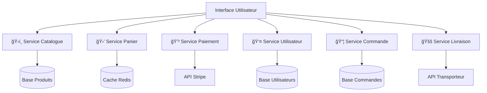

<a name="CI/CD" id="CI/CD"></a>

# Comprendre le CI/CD & les micro-services

---

# Comprendre le CI/CD 🔄

### Définition et contexte

Le **CI/CD** (Continuous Integration / Continuous Deployment) est devenu l'épine dorsale du développement logiciel moderne. Cette méthodologie permet d'automatiser entièrement le cycle de vie d'une application, de la phase de développement jusqu'à la mise en production.

---

# Pourquoi le CI/CD ? 🎯

### Pourquoi le CI/CD est-il essentiel en 2025 ?

- **Réduction des erreurs** : Détection précoce des bugs et problèmes d'intégration
- **Déploiements plus fréquents** : Livraison continue de nouvelles fonctionnalités
- **Feedback rapide** : Retour immédiat sur la qualité du code
- **Collaboration améliorée** : Synchronisation automatique entre les équipes

---

# CI/CD & IA en 2025 🤖

### L'impact de l'intelligence artificielle sur le CI/CD et la conteneurisation

En 2025, l'**IA** révolutionne la façon dont on met en place des pipelines CI/CD et des environnements Docker. De nombreux outils assistés par l'IA permettent de gagner un temps précieux et d'automatiser des tâches complexes.

---

# Métaphore automobile du CI/CD 🚗

### Intégration Continue (CI) 🔧

Imaginez que vous dirigez une usine automobile moderne produisant 500 voitures par jour. L'**Intégration Continue** consiste à :

- **Contrôler chaque pièce** avant de l'installer sur la chaîne de montage
- **Tester chaque assemblage** au fur et à mesure (moteur, freins, électronique)
- **Valider la qualité** à chaque poste de travail, pas seulement à la fin
- **Détecter immédiatement** si une pièce est défectueuse ou incompatible

---

# Déploiement Continu (CD) 🚀

Une fois que tous les composants sont validés et l'assemblage perfectionné, le **Déploiement Continu** permet de :

- **Finaliser automatiquement** la voiture sans intervention manuelle
- **Livrer immédiatement** dès que tous les tests sont passés
- **Maintenir la qualité** constante pour chaque véhicule produit
- **Répéter le processus** de manière fiable sur toute la chaîne de production

---

# Génération automatique de Dockerfile 🐳⚡

- **Outils IA** : Des plateformes comme [Docker AI](https://www.docker.com/products/docker-ai/), [GitHub Copilot](https://github.com/features/copilot),ou [ChatGPT](https://openai.com/) génèrent des Dockerfile optimisés à partir de simples descriptions de projet.
- Liste non exhaustive d'outils IA pour le CI/CD :

Pour générer du code , à utiliser avec la précaution de comprendre à 100% ce que vous générez.

  - [Cursor](https://www.cursor.com/)
  - [Claude](https://www.anthropic.com/products/claude)
  - [Gemini](https://gemini.google.com/)
  - [Grok](https://grok.com/)
  - [Perplexity](https://www.perplexity.ai/)

---

Pour simplifier Docker, il existe des outils qui génèrent des Dockerfile optimisés à partir de simples descriptions de projet.

- [nixpacks](https://nixpacks.com/) : Génère un Dockerfile à partir de la description d'un projet.
- [coolify](https://coolify.io/) : Gère en grosse partie lui même l'intégration continue et le déploiement.
- [railway](https://railway.app/) : Créez vous même votre Dockerfile, il vous propose d'heberger gratuitement votre container en quelques clics.

---

### Plateformes de déploiement simplifié 🚀

- [render](https://render.com/) : Créez vous même votre Dockerfile, il vous propose d'heberger gratuitement votre container en quelques clics.
- [netlify](https://netlify.com/) : Gère en grosse partie lui même l'intégration continue et le déploiement.
- [vercel](https://vercel.com/) : Gère en grosse partie lui même l'intégration continue et le déploiement.

- **Avantages** :
  - Génération instantanée de Dockerfile adaptés à votre stack
  - Suggestions de bonnes pratiques de sécurité et d'optimisation
  - Détection automatique des dépendances et des ports à exposer

---

# Plateformes de déploiement simplifié 🚀

- **Coolify** : Plateforme open-source qui permet de déployer des applications Docker, Node.js, PHP, etc. en quelques clics, avec gestion automatique des certificats SSL, des bases de données et du scaling.
- **Netlify** : Déploiement ultra-rapide de sites statiques et d'APIs serverless, intégration continue native, preview automatiques.
- **Vercel** : Déploiement instantané d'applications front-end et back-end, preview automatiques pour chaque pull request.
- **Render, Railway, Fly.io** : Alternatives modernes pour déployer des containers ou des microservices sans gestion manuelle de l'infrastructure.

---

# L'IA pour automatiser et sécuriser le pipeline 🛡️

- **Détection automatique de failles** dans les images Docker grâce à des outils comme Snyk, Trivy, ou les scanners intégrés aux plateformes CI/CD modernes.
- **Optimisation des builds** : L'IA propose des étapes de build plus rapides, détecte les redondances et suggère des améliorations.
- **Monitoring intelligent** : Analyse prédictive des incidents, alertes proactives, et recommandations de scaling automatique.

---

# En résumé

L'IA et les plateformes modernes transforment le CI/CD et la conteneurisation en 2025 :
- Génération de Dockerfile et de pipelines en quelques secondes
- Déploiement simplifié sur des plateformes comme Coolify, Netlify, Vercel, etc.
- Sécurité et optimisation automatisées
- Plus de temps pour l'innovation, moins pour la configuration manuelle !

---
routeAlias: 'utiliser-des-pipelines-cicd'
---

<a name="PIPELINES" id="PIPELINES"></a>

# Les Pipelines CI/CD en Pratique 🛠️

### Qu'est-ce qu'un pipeline ?

Un **pipeline CI/CD** est une chaîne automatisée d'étapes qui transforme votre code source en application déployée et opérationnelle.

---

# Schéma d'un pipeline 📊


---

# Phases essentielles 🔄

### Les phases essentielles d'un pipeline moderne

- **Source** : Récupération du code depuis le repository (Git)
- **Build** : Compilation et construction de l'application
- **Test** : Exécution des tests unitaires, d'intégration et de sécurité
- **Package** : Création des artefacts déployables (containers Docker)
- **Deploy** : Déploiement automatisé vers les environnements cibles

---

# Outils et technologies de pipeline 2025 🔧

### Plateformes CI/CD populaires

- **GitHub Actions** : Intégration native avec GitHub, YAML-based
- **GitLab CI/CD** : Solution complète intégrée à GitLab
- **Jenkins** : Solution open-source extensible et mature
- **Azure DevOps** : Écosystème Microsoft complet
- **CircleCI** : Pipeline cloud optimisé pour la vitesse

---
layout: new-section
routeAlias: 'comprendre-les-microservices'
---

<a name="MICROSERVICES" id="MICROSERVICES"></a>

# Les microservices ⚙️

---

# Architecture Microservices 🏗️

### Définition et philosophie

L'**architecture microservices** consiste à décomposer une application monolithique en services indépendants, chacun ayant une responsabilité spécifique et pouvant être développé, déployé et mis à l'échelle de manière autonome.

---

# Métaphore du supermarché 🛒

### Métaphore du supermarché 🛒

Imaginez un supermarché moderne où chaque rayon fonctionne comme un microservice :

- **Rayon fruits & légumes** : Gestion des produits frais, stocks, prix
- **Boulangerie** : Production, cuisson, vente de produits de boulangerie
- **Caisse** : Traitement des paiements, fidélité client
- **Stock** : Approvisionnement, inventaire, logistique

---

# Indépendance des rayons 🔄

### Chaque rayon peut :

- **Fonctionner indépendamment** des autres rayons
- **Avoir ses propres employés** et processus
- **Être mis à jour** sans affecter les autres
- **Communiquer** avec les autres via des interfaces définies

---

# Avantages des Microservices 💡

### Bénéfices techniques

- **Scalabilité granulaire** : Mise à l'échelle service par service selon les besoins
- **Technologie polyglotte** : Chaque service peut utiliser la technologie la plus adaptée
- **Isolation des pannes** : Une défaillance n'affecte pas l'ensemble du système
- **Déploiements indépendants** : Livraison continue sans impact sur les autres services

---

# Bénéfices organisationnels 👥

### Bénéfices organisationnels

- **Équipes autonomes** : Chaque équipe possède et maintient ses services
- **Développement parallèle** : Accélération du développement global
- **Responsabilité claire** : Ownership et accountability bien définis
- **Innovation technique** : Liberté d'expérimenter sur des services isolés

---
routeAlias: 'pourquoi-utiliser-les-microservices'
---

<a name="MICROSERVICES" id="MICROSERVICES"></a>

# Exemple Concret : E-commerce 🛍️

### Architecture microservices d'une plateforme e-commerce

---

# Architecture e-commerce 📊



---

# Service Catalogue Produits 🛍️

### **🛍️ Service Catalogue Produits**
- **Responsabilité** : Gestion des produits, catégories, prix, promotions
- **Technologie** : Node.js + MongoDB pour flexibilité des données
- **API** : REST pour consultation, GraphQL pour recherche complexe

---

# Service Panier 🛒

### **🛒 Service Panier**
- **Responsabilité** : Gestion des paniers clients, calculs de totaux
- **Technologie** : Redis pour performance et session management
- **API** : WebSocket pour mise à jour temps réel

---

# Service Paiement 💳

### **💳 Service Paiement**
- **Responsabilité** : Traitement sécurisé des transactions
- **Technologie** : Java Spring Boot pour robustesse et sécurité
- **Intégrations** : Stripe, PayPal, Apple Pay, Google Pay

---

# Communication entre microservices 🔗

### Patterns de communication

- **Synchrone** : API REST/HTTP pour les opérations immédiates
- **Asynchrone** : Message queues (RabbitMQ, Kafka) pour les tâches en arrière-plan
- **Event-driven** : Publication/souscription pour les notifications système

---

# Relation avec Docker 🐳

### Relation avec Docker

**Pourquoi cette architecture nous mène vers Docker ?**

- **Isolation** : Chaque microservice dans son propre container
- **Portabilité** : Déploiement identique sur tous les environnements
- **Scalabilité** : Multiplication des containers selon la charge
- **Orchestration** : Kubernetes pour gérer l'ensemble des services

Cette approche microservices constitue le fondement parfait pour comprendre l'intérêt de la conteneurisation avec Docker ! 🐳

---

# 🎯 Live Tuto : Déployer en 5 minutes

### Projets minimalistes pour tester Vercel et Render.com

Mettons les mains dans le cambouis avec 2 exemples ultra-simples !

---

# 📝 Projet 1 : Site statique pour Vercel

```bash
# 1. Créer le dossier
mkdir mon-site-vercel
cd mon-site-vercel

# 2. Créer le fichier HTML : index.html
<!DOCTYPE html>
<html>
<head>
    <title>Mon site déployé avec Vercel !</title>
    <style>
        body { font-family: Arial; text-align: center; padding: 50px; background: linear-gradient(135deg, #667eea 0%, #764ba2 100%); color: white; }
        .card { background: rgba(255,255,255,0.1); padding: 30px; border-radius: 15px; backdrop-filter: blur(10px); }
    </style>
</head>
<body>
    <div class="card">
        <h1>🚀 Félicitations !</h1>
        <p>Votre site est déployé sur Vercel</p>
        <p>⏰ Temps de déploiement : ~1 minute</p>
        <p>💡 Powered by CI/CD automatique</p>
    </div>
</body>
</html>


# 3. Initialiser Git
git init
git add .
git commit -m "feat: add simple static site"
```

---

# 🚀 Déployer sur Vercel (2 minutes)

### Étapes ultra-simples

1. **Push sur GitHub** :
```bash
# Créer un repo sur github.com et récupérer l'URL
git remote add origin https://github.com/VOTRE-USERNAME/mon-site-vercel.git
git push -u origin main
```

2. **Aller sur vercel.com** → Se connecter avec GitHub

3. **Cliquer "New Project"** → Sélectionner votre repo

4. **Cliquer "Deploy"** → C'est tout ! 🎉

**Résultat** : Site live en 1 minute à `https://mon-site-vercel-xxx.vercel.app`

---

# 📝 Projet 2 : API Node.js pour Render.com

```bash
# 1. Créer le projet
mkdir mon-api-render
cd mon-api-render

# 2. Initialiser Node.js
npm init -y

# 3. Installer Express
npm install express

# 4. Créer l'API
# 2. Créer le fichier server.js
const express = require('express');
const app = express();
const PORT = process.env.PORT || 3000;

app.get('/', (req, res) => {
  res.json({
    message: '🎉 API déployée sur Render.com !',
    timestamp: new Date().toISOString(),
    status: 'running',
    platform: 'render'
  });
});

app.get('/health', (req, res) => {
  res.json({ status: 'healthy' });
});

app.listen(PORT, () => {
  console.log(`🚀 Serveur running sur port ${PORT}`);
});

# 5. Ajouter le script de démarrage
npm pkg set scripts.start="node server.js"
```

---

# 📦 Dockerfile pour Render.com

```dockerfile
FROM node:18-alpine

WORKDIR /app

# Copier et installer les dépendances
COPY package*.json ./
RUN npm ci --only=production

# Copier le code
COPY . .

# Créer un utilisateur non-root
RUN addgroup -S appgroup && adduser -S appuser -G appgroup
USER appuser

# Configuration
EXPOSE 3000
HEALTHCHECK --interval=30s CMD curl -f http://localhost:3000/health || exit 1

# Démarrage
CMD ["npm", "start"]
```

---

# 🚀 Déployer sur Render.com (3 minutes)

### Étapes simples

1. **Push sur GitHub** :
```bash
git init
git add .
git commit -m "feat: add simple API with Docker"
git remote add origin https://github.com/VOTRE-USERNAME/mon-api-render.git
git push -u origin main
```

---

2. **Aller sur render.com** → Se connecter avec GitHub

3. **New Web Service** → Connecter votre repo

4. **Configuration** :
   - **Environment** : Docker
   - **Region** : Frankfurt (plus proche)
   - **Instance Type** : Free

5. **Deploy** → Attendre 2-3 minutes 🎉

---

# ✅ Test des déploiements

### Vérifier que tout fonctionne

**Vercel** - Tester le site :
```bash
# Ouvrir dans le navigateur
open https://mon-site-vercel-xxx.vercel.app
```

**Render.com** - Tester l'API :
```bash
# Test avec curl
curl https://mon-api-render-xxx.onrender.com/

# Réponse attendue :
{
  "message": "🎉 API déployée sur Render.com !",
  "timestamp": "2025-01-XX...",
  "status": "running",
  "platform": "render"
}
```

---

# 🔄 CI/CD automatique activé !

### Ce qui se passe automatiquement

**À chaque push sur GitHub** :

✅ **Vercel** :
- Build automatique du site
- Déploiement en ~30 secondes
- Preview URL pour chaque branch

✅ **Render.com** :
- Build de l'image Docker
- Déploiement en ~2 minutes
- Health checks automatiques

**Plus besoin de déploiement manuel !** 🎉

---

# 💡 Aller plus loin

### Améliorations possibles

**Vercel** :
- Ajouter `vercel.json` pour la configuration
- Variables d'environnement via le dashboard
- Domaine personnalisé

**Render.com** :
- Base de données PostgreSQL (gratuite)
- Variables d'environnement
- Monitoring et logs

**Les deux utilisent le même principe : Git push = Déploiement automatique !** 