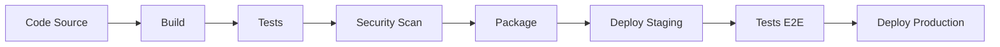
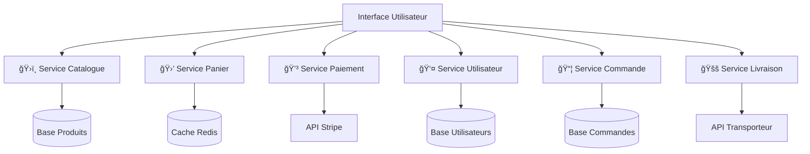

# Comprendre le CI/CD 🔄

### Définition et contexte

Le **CI/CD** (Continuous Integration / Continuous Deployment) est devenu l'épine dorsale du développement logiciel moderne. Cette méthodologie permet d'automatiser entièrement le cycle de vie d'une application, de la phase de développement jusqu'à la mise en production.

---

# Pourquoi le CI/CD ? 🎯

### Pourquoi le CI/CD est-il essentiel en 2025 ?

- **Réduction des erreurs** : Détection précoce des bugs et problèmes d'intégration
- **Déploiements plus fréquents** : Livraison continue de nouvelles fonctionnalités
- **Feedback rapide** : Retour immédiat sur la qualité du code
- **Collaboration améliorée** : Synchronisation automatique entre les équipes

---

# Métaphore automobile du CI/CD 🚗

### Intégration Continue (CI) 🔧

Imaginez que vous dirigez une usine automobile moderne produisant 500 voitures par jour. L'**Intégration Continue** consiste à :

- **Contrôler chaque pièce** avant de l'installer sur la chaîne de montage
- **Tester chaque assemblage** au fur et à mesure (moteur, freins, électronique)
- **Valider la qualité** à chaque poste de travail, pas seulement à la fin
- **Détecter immédiatement** si une pièce est défectueuse ou incompatible

---

# Déploiement Continu (CD) 🚀

Une fois que tous les composants sont validés et l'assemblage perfectionné, le **Déploiement Continu** permet de :

- **Finaliser automatiquement** la voiture sans intervention manuelle
- **Livrer immédiatement** dès que tous les tests sont passés
- **Maintenir la qualité** constante pour chaque véhicule produit
- **Répéter le processus** de manière fiable sur toute la chaîne de production

---
routeAlias: 'utiliser-des-pipelines-cicd'
---

# Les Pipelines CI/CD en Pratique 🛠️

### Qu'est-ce qu'un pipeline ?

Un **pipeline CI/CD** est une chaîne automatisée d'étapes qui transforme votre code source en application déployée et opérationnelle.

---

# Schéma d'un pipeline 📊

---

# Phases essentielles 🔄

### Les phases essentielles d'un pipeline moderne

- **Source** : Récupération du code depuis le repository (Git)
- **Build** : Compilation et construction de l'application
- **Test** : Exécution des tests unitaires, d'intégration et de sécurité
- **Package** : Création des artefacts déployables (containers Docker)
- **Deploy** : Déploiement automatisé vers les environnements cibles

---

# Outils et technologies de pipeline 2025 🔧

### Plateformes CI/CD populaires

- **GitHub Actions** : Intégration native avec GitHub, YAML-based
- **GitLab CI/CD** : Solution complète intégrée à GitLab
- **Jenkins** : Solution open-source extensible et mature
- **Azure DevOps** : Écosystème Microsoft complet
- **CircleCI** : Pipeline cloud optimisé pour la vitesse

---

# Nouveautés 2025 ✨

### Nouveautés 2025

- **AI-Powered Testing** : Tests automatiques générés par IA
- **Progressive Deployment** : Déploiements graduels avec rollback automatique
- **GitOps** : Gestion d'infrastructure déclarative via Git
- **Supply Chain Security** : Sécurisation complète de la chaîne de build

---
routeAlias: 'comprendre-les-microservices'
---

# Architecture Microservices 🏗️

### Définition et philosophie

L'**architecture microservices** consiste à décomposer une application monolithique en services indépendants, chacun ayant une responsabilité spécifique et pouvant être développé, déployé et mis à l'échelle de manière autonome.

---

# Métaphore du supermarché 🛒

### Métaphore du supermarché 🛒

Imaginez un supermarché moderne où chaque rayon fonctionne comme un microservice :

- **Rayon fruits & légumes** : Gestion des produits frais, stocks, prix
- **Boulangerie** : Production, cuisson, vente de produits de boulangerie
- **Caisse** : Traitement des paiements, fidélité client
- **Stock** : Approvisionnement, inventaire, logistique

---

# Indépendance des rayons 🔄

### Chaque rayon peut :

- **Fonctionner indépendamment** des autres rayons
- **Avoir ses propres employés** et processus
- **Être mis à jour** sans affecter les autres
- **Communiquer** avec les autres via des interfaces définies

---

# Avantages des Microservices 💡

### Bénéfices techniques

- **Scalabilité granulaire** : Mise à l'échelle service par service selon les besoins
- **Technologie polyglotte** : Chaque service peut utiliser la technologie la plus adaptée
- **Isolation des pannes** : Une défaillance n'affecte pas l'ensemble du système
- **Déploiements indépendants** : Livraison continue sans impact sur les autres services

---

# Bénéfices organisationnels 👥

### Bénéfices organisationnels

- **Équipes autonomes** : Chaque équipe possède et maintient ses services
- **Développement parallèle** : Accélération du développement global
- **Responsabilité claire** : Ownership et accountability bien définis
- **Innovation technique** : Liberté d'expérimenter sur des services isolés

---
routeAlias: 'pourquoi-utiliser-les-microservices'
---

# Exemple Concret : E-commerce 🛍️

### Architecture microservices d'une plateforme e-commerce

---

# Architecture e-commerce 📊

---

# Service Catalogue Produits 🛍️

### **🛍️ Service Catalogue Produits**
- **Responsabilité** : Gestion des produits, catégories, prix, promotions
- **Technologie** : Node.js + MongoDB pour flexibilité des données
- **API** : REST pour consultation, GraphQL pour recherche complexe

---

# Service Panier 🛒

### **🛒 Service Panier**
- **Responsabilité** : Gestion des paniers clients, calculs de totaux
- **Technologie** : Redis pour performance et session management
- **API** : WebSocket pour mise à jour temps réel

---

# Service Paiement 💳

### **💳 Service Paiement**
- **Responsabilité** : Traitement sécurisé des transactions
- **Technologie** : Java Spring Boot pour robustesse et sécurité
- **Intégrations** : Stripe, PayPal, Apple Pay, Google Pay

---

# Communication entre microservices 🔗

### Patterns de communication

- **Synchrone** : API REST/HTTP pour les opérations immédiates
- **Asynchrone** : Message queues (RabbitMQ, Kafka) pour les tâches en arrière-plan
- **Event-driven** : Publication/souscription pour les notifications système

---

# Relation avec Docker 🐳

### Relation avec Docker

**Pourquoi cette architecture nous mène vers Docker ?**

- **Isolation** : Chaque microservice dans son propre container
- **Portabilité** : Déploiement identique sur tous les environnements
- **Scalabilité** : Multiplication des containers selon la charge
- **Orchestration** : Kubernetes pour gérer l'ensemble des services

Cette approche microservices constitue le fondement parfait pour comprendre l'intérêt de la conteneurisation avec Docker ! 🐳