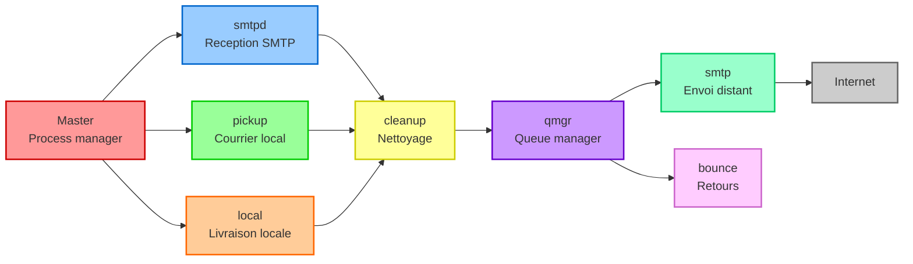
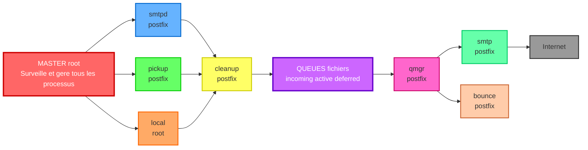

<a name="architecture-fonctionnement" id="architecture-fonctionnement"></a>

# Architecture et Fonctionnement

<div class="mt-2">
  🏗️ Comprendre les entrailles de Postfix
</div>

---

# Introduction à l'architecture

Postfix n'est pas un simple programme, c'est une **orchestration** de plusieurs processus indépendants travaillant ensemble.

Pensez à une usine où chaque ouvrier a une tâche précise : c'est exactement comme ça que Postfix fonctionne !

---

## La philosophie de conception

### 🎯 Principes fondamentaux

**Séparation des privilèges** : Chaque processus tourne avec le minimum de droits nécessaires - Si un processus est compromis, les dégâts sont limités

**Architecture modulaire** : Chaque tâche est gérée par un processus dédié - Facile de remplacer ou désactiver un composant - Isolation des pannes

**Communication par files d'attente** : Les processus ne se parlent pas directement - Ils communiquent via des fichiers dans des répertoires - Robustesse : si un processus crash, les messages ne sont pas perdus

---

## Vue d'ensemble de l'architecture



---
layout: text-image
---


---

## Le processus Master

Le **master** est le chef d'orchestre. C'est lui qui lance tous les autres processus, surveille leur santé, les redémarre en cas de crash et gère leur cycle de vie.

### 📋 Configuration du master

Le fichier `/etc/postfix/master.cf` définit tous les services :

```bash
# service type  private unpriv  chroot  wakeup  maxproc command
smtp      inet  n       -       y       -       -       smtpd
pickup    unix  n       -       y       60      1       pickup
cleanup   unix  n       -       y       -       0       cleanup
qmgr      unix  n       -       n       300     1       qmgr
```

Si vous voulez utiliser un environnement chrooté, vous pouvez le faire en ajoutant `y` à la place de `-` dans la colonne `chroot`.

**exemple :**

```bash
smtp      inet  n       -       y       -       -       smtpd
```

---

Décryptons une ligne :

```bash
smtp      inet  n       -       y       -       -       smtpd
```

- **service** : `smtp` - nom du service
- **type** : `inet` - socket internet (vs `unix` pour socket Unix)
- **private** : `n` - accessible de l'extérieur
- **unpriv** : `-` - tourne avec les privilèges par défaut
- **chroot** : `y` - tourne dans un environnement chrooté (isolé)
- **wakeup** : `-` - pas de réveil automatique
- **maxproc** : `-` - nombre max de processus (défaut)
- **command** : `smtpd` - programme à exécuter

---

## Les processus principaux

### 📨 smtpd (SMTP daemon)

**Rôle** : Recevoir les emails depuis Internet ou les clients

**Responsabilités** : Écoute sur le port 25 (ou 587 pour submission) - Dialogue SMTP avec les clients

- Applique les restrictions et politiques
- Accepte ou rejette les messages
- Passe les messages acceptés à `cleanup`

**Analogie** : C'est le réceptionniste de l'hôtel qui accueille les clients et vérifie leurs réservations.

---

### 📬 pickup

**Rôle** : Récupérer les emails déposés localement

**Responsabilités** : Surveille le répertoire `maildrop/`

- Récupère les emails déposés par les programmes locaux (via `sendmail`)

- Passe les messages à `cleanup`

**Analogie** : C'est l'employé qui ramasse le courrier déposé dans la boîte aux lettres interne.

```bash
pickup    unix  n       -       y       60      1       pickup
```

---

### 🧹 cleanup

**Rôle** : Nettoyer et normaliser les messages

**Responsabilités** : Ajoute les en-têtes manquants (Date, Message-ID, etc.)

- Complète les adresses (user → user@domain.com)

- Extrait les destinataires des en-têtes

- Écrit le message dans la file `incoming/` - Notifie le `qmgr`

**Analogie** : C'est le service qualité qui vérifie que le courrier est conforme avant expédition.

```bash
cleanup   unix  n       -       y       -       0       cleanup
```

---

### 📊 qmgr (Queue manager)

**Rôle** : Gérer les files d'attente - C'est le **cœur** de Postfix !

**Responsabilités** : Surveille les files d'attente

- Décide quand envoyer les messages

- Choisit le bon processus de livraison

- Gère les tentatives et les délais - Optimise l'envoi (regroupe par destination)

**Analogie** : C'est le chef de gare qui décide quels trains partent, quand, et vers où.

```bash
qmgr      unix  n       -       n       300     1       qmgr
```

---

### 🚀 smtp (SMTP client)

**Rôle** : Envoyer les emails vers d'autres serveurs

**Responsabilités** : Se connecte aux serveurs destinataires

- Négocie TLS si possible

- Transmet le message

- Gère les erreurs temporaires (retry) et permanentes - Notifie le `qmgr` du résultat

**Analogie** : C'est le facteur qui livre le courrier chez le destinataire.

---

### 📮 local

**Rôle** : Livrer les emails locaux

**Responsabilités** : Livre les emails dans les boîtes locales

- Gère les fichiers `.forward`

- Applique les alias

- Peut invoquer des programmes externes (filtres)

**Analogie** : C'est le facteur qui distribue le courrier dans les boîtes aux lettres de l'immeuble.

```bash
smtp      inet  n       -       y       -       -       smtpd
```

---

### ↩️ bounce

**Rôle** : Gérer les rebonds (emails non délivrés)

**Responsabilités** : Génère les messages de non-délivrance (bounce)

- Notifie l'expéditeur en cas d'échec définitif

- Gère les messages d'avertissement (delay warning)

**Analogie** : C'est le service retour qui renvoie le courrier avec la mention "n'habite pas à l'adresse indiquée".

```bash
bounce    unix  n       -       n       -       0       bounce
```

---

### 🔧 trivial-rewrite

**Rôle** : Réécriture d'adresses

**Responsabilités** : Résout les adresses (lookup DNS)

- Applique les règles de réécriture

- Détermine le transport approprié

**Analogie** : C'est le service qui réécrit les adresses, par exemple si vous avez un alias sur votre domaine, Postfix va réécrire l'adresse pour que l'email arrive à la bonne personne.

```bash
trivial-rewrite unix  -       -       -       -       -       trivial-rewrite
```

---

## Les files d'attente

<small>

Postfix utilise plusieurs files d'attente dans `/var/spool/postfix/` :

### 📂 maildrop

**Contenu** : Messages déposés localement par les programmes

**Processus responsable** : `pickup`

**Durée de vie** : Très courte (quelques secondes)

### 📂 incoming

**Contenu** : Messages reçus, en cours de nettoyage

**Processus responsable** : `cleanup`

**Durée de vie** : Courte (secondes à minutes)

</small>

---

<small>

### 📂 active

**Contenu** : Messages en cours de livraison

**Processus responsable** : `qmgr`

**Taille limite** : Contrôlée (évite la saturation mémoire)

### 📂 deferred

**Contenu** : Messages en échec temporaire

**Processus responsable** : `qmgr`

**Durée de vie** : Jusqu'à 5 jours par défaut

Les messages en `deferred` sont retentés selon un algorithme exponentiel : 1ère tentative immédiate, 2ème après quelques minutes, 3ème après 15-30 minutes, 4ème après 1 heure, etc.

</small>

---

<small>

### 📂 hold

**Contenu** : Messages mis en attente manuellement

**Processus responsable** : Admin (vous !)

**Durée de vie** : Jusqu'à libération manuelle

</small>

---

### 📂 corrupt

**Contenu** : Messages corrompus

**Processus responsable** : Aucun (pour investigation)

**Durée de vie** : Jusqu'à suppression manuelle

---

## Le parcours d'un email

### 📧 Email entrant (réception)


---

### 📤 Email sortant (envoi)


---

### ❌ Email en échec


---

## Communication

Les processus communiquent via :
- **Sockets Unix** dans `/var/spool/postfix/`
- **Fichiers** dans les files d'attente
- **Verrous (locks)** pour éviter la corruption

💡 C'est transparent, pas besoin de configurer !

---

## Modes de fonctionnement

### 📬 Mode "null client"

Postfix configuré uniquement pour **envoyer**, pas recevoir :

```bash
inet_interfaces = loopback-only
mydestination =
relayhost = [smtp.andromed.cloud]
```

---

**Cas d'usage** :
- Serveur web qui envoie des notifications
- **Application qui ne reçoit jamais d'emails** => le fameux **"Ne répondez pas à cet email"**
- Machine dans un LAN sans exposition Internet

---

### 🌐 Mode "Internet site"

Configuration classique, reçoit et envoie :

```bash
inet_interfaces = all
mydestination = $myhostname, $mydomain, localhost
mynetworks = 127.0.0.0/8
```

---

### 🔄 Mode "relay"

Relais entre réseaux :

```bash
inet_interfaces = all
relay_domains = $mydestination, domain1.com, domain2.com
relayhost = [mail.backend.com]
```

---

## Sécurité par conception

### 🛡️ Chroot

La plupart des processus tournent dans un chroot :

> Le **chroot** est un mécanisme de sécurité qui enferme un processus dans un "enclos" dédié, empêchant tout accès au reste du système hôte. On peut l’imaginer comme une cage vitrée dans un laboratoire : même si le processus essaie de s’échapper, il ne pourra toucher qu’à ce qui se trouve dans son espace limité, protégeant ainsi le véritable environnement du serveur.

<div class="mt-6">

```bash
/var/spool/postfix/  # Racine du chroot
├── etc/            # Fichiers de config nécessaires
├── lib/            # Bibliothèques
├── usr/
│   └── lib/
└── [process directories]
```
</div>

Le processus ne peut pas accéder à `/etc/passwd`, `/root`, etc.

Même si compromis, les dégâts sont limités au chroot !

---

### 🔐 Séparation des privilèges

| Processus | Utilisateur | Droits |
|-----------|-------------|--------|
| master | root | Supervision uniquement |
| smtpd | postfix | Lecture réseau |
| cleanup | postfix | Écriture queue |
| qmgr | postfix | Gestion queue |
| local | root | Écriture mailbox (nécessaire) |
| smtp | postfix | Écriture réseau |

---

Même si `smtpd` est compromis, l'attaquant ne peut pas :
- Modifier les fichiers de config
- Lire les mailbox des utilisateurs
- Écrire ailleurs que dans la queue

---

## Processus auxiliaires

### 🔍 anvil

**Rôle** : Compteur de connexions

Surveille et limite :
- Nombre de connexions par IP
- Taux de connexions
- Détection de comportements suspects

---

### 🗑️ proxymap

**Rôle** : Proxy pour les lookups (DB, LDAP)

Centralise les connexions aux bases externes :
- Évite trop de connexions simultanées
- Cache les résultats
- Optimise les performances

---

### 🔑 tlsproxy

**Rôle** : Proxy TLS

Gère les connexions TLS :
- Négociation SSL/TLS
- Vérification des certificats
- Chiffrement/déchiffrement

### 📝 postlog

**Rôle** : Logger centralisé

Reçoit les logs de tous les processus chrootés et les écrit dans syslog.

---

## Visualiser l'architecture en action

### 🔍 Voir les processus actifs

```bash
ps aux | grep postfix
```

Vous devriez voir :

```
root     postfix  master
postfix  postfix  qmgr
postfix  postfix  pickup
postfix  postfix  cleanup
postfix  postfix  smtpd
...
```

---

### 📊 Surveiller les connexions

```bash
sudo postfix status
```

```bash
# Connexions actives sur le port 25
sudo ss -tnp | grep :25
```

### 📬 Voir l'activité des queues

```bash
watch -n 1 'mailq | head -n 20'
```

---

## Debugging de l'architecture

### 🐛 Mode verbose

Activer les logs détaillés :

```bash
sudo postconf -e "debug_peer_list = example.com"
sudo postconf -e "debug_peer_level = 2"
sudo systemctl reload postfix
```

---

### 🔬 Suivre un message spécifique

Dans les logs, chaque message a un **Queue ID** unique :

```
postfix/smtpd[1234]: ABC123: client=example.com[1.2.3.4]
postfix/cleanup[1235]: ABC123: message-id=<test@example.com>
postfix/qmgr[1236]: ABC123: from=<sender@example.com>, size=1234
postfix/smtp[1237]: ABC123: to=<dest@example.com>, status=sent
```

---

Pour suivre le message `ABC123` :

```bash
sudo grep ABC123 /var/log/mail.log
```

### 📈 Statistiques en temps réel

```bash
# Statistiques globales
sudo postqueue -p | tail -n 1

# Statistiques par destination
sudo qshape active
sudo qshape deferred
```

---

## Schéma récapitulatif complet



---

## Points clés à retenir

**Architecture modulaire** :
- Master = chef d'orchestre
- Processus spécialisés : smtpd, smtp, qmgr, cleanup, local
- Communication via sockets et fichiers

---

**Files d'attente** :
- maildrop → incoming → active → livraison
- deferred pour les échecs
- hold pour mise en attente manuelle

---

**Sécurité** :
- Séparation des privilèges
- Chroot pour isoler les processus

---

## Exercices pratiques

### 🎯 Exercice 1 : Observer les processus

```bash
ps aux | grep postfix
sudo postconf -d | grep default_process_limit
```

---

### 🎯 Exercice 2 : Suivre un message

```bash
echo "Test" | mail -s "Suivi" user@example.com
sudo tail -f /var/log/mail.log | grep "Queue ID"
```

---

## Prochaine étape

Maintenant que vous comprenez **comment** Postfix fonctionne, nous allons plonger dans le **fichier de configuration principale** : `main.cf`

<div class="pt-12">
  <span @click="next" class="px-2 p-3 rounded cursor-pointer hover:bg-white hover:bg-opacity-10 neon-border">
    Module suivant : Configuration du main.cf <carbon:arrow-right class="inline"/>
  </span>
</div>

