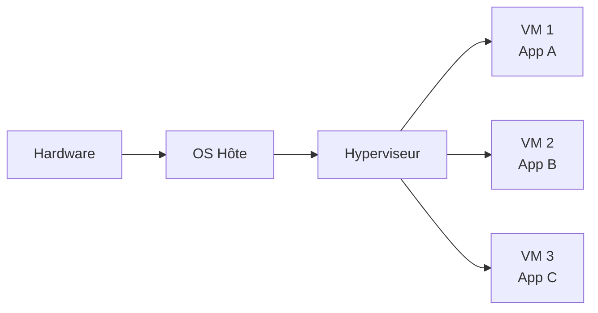
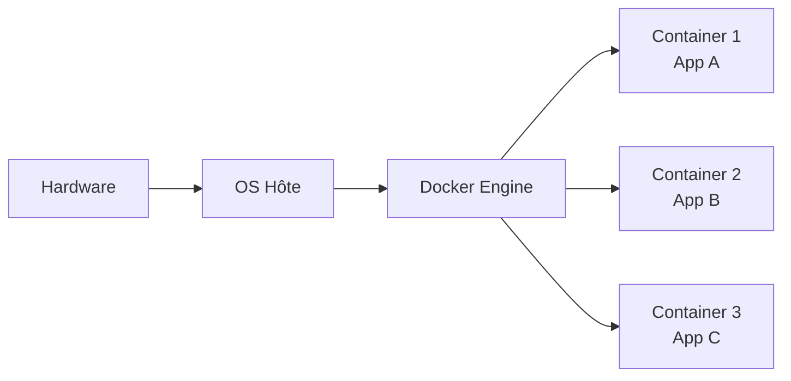

# Virtualisation vs conteneurisation

---
routeAlias: 'virtualisation-vs-conteneurisation'
---

# Virtualisation vs Conteneurisation 🏗️

### Comprendre les différentes approches d'isolation

Pour bien saisir la révolution que représente Docker, il est essentiel de comprendre les différences fondamentales entre la virtualisation traditionnelle et la conteneurisation moderne.

---

# Virtualisation Traditionnelle 💻

### Architecture avec machines virtuelles

---

# Conteneurisation Docker 🐳

### Architecture avec containers

---

# Comparaison des ressources 📊

### Performance et utilisation

| Critère | Virtualisation | Conteneurisation |
|---------|---------------|------------------|
| **Taille** | 1-20 GB par VM | 10-500 MB par container |
| **RAM** | 512MB-8GB minimum | 10-100MB typique |
| **Démarrage** | 30s-5min | 0.1-2s |
| **CPU Overhead** | 5-15% | <1% |

---

# Avantages/Inconvénients 📊

### Virtualisation

**✅ Avantages** : Isolation maximale, différents OS
**❌ Inconvénients** : Lourd, lent, consomme beaucoup

### Conteneurisation

**✅ Avantages** : Léger, rapide, efficace
**❌ Inconvénients** : Même OS requis, isolation moindre

---

# Quand utiliser la virtualisation ? 🎯

### Cas d'usage pour les VMs

- **Applications legacy** nécessitant un OS spécifique
- **Sécurité critique** : Isolation maximale requise
- **Environnements multi-OS** : Windows + Linux
- **Compliance réglementaire** stricte

---

# Quand utiliser les containers ? 🐳

### Cas d'usage pour Docker

- **Applications modernes** cloud-native
- **Microservices** et architecture découplée
- **Développement agile** avec déploiements fréquents
- **CI/CD** et automatisation

---

# L'avenir : Container-First 🌟

### Tendance 2025

- **85%** des nouvelles applications utilisent des containers
- **40%** de réduction des coûts d'infrastructure
- **3x** amélioration de la vélocité de déploiement
- **Container-First** devient la norme par défaut 