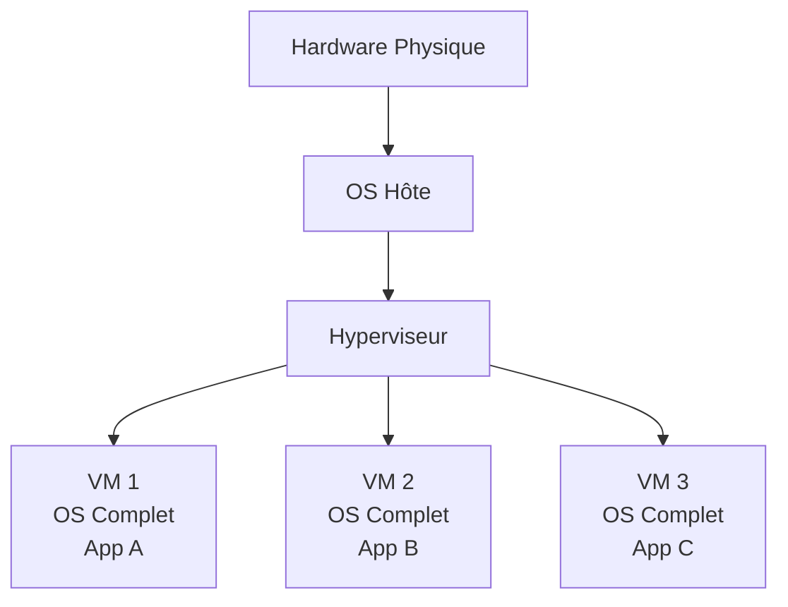
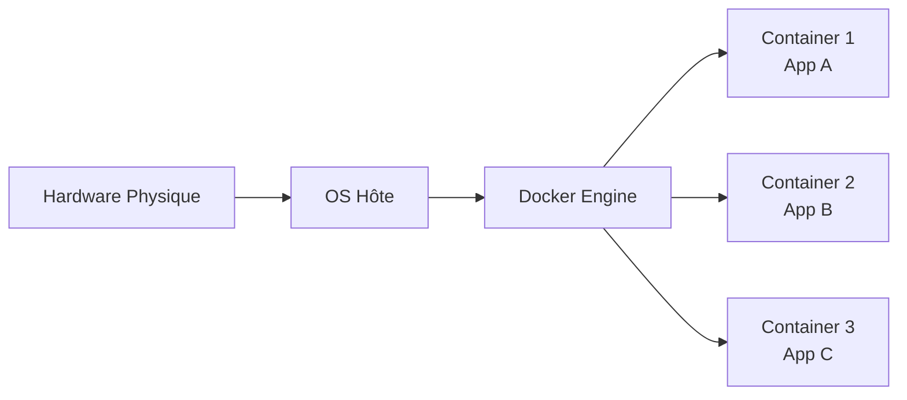

# Virtualisation vs Conteneurisation 🏗️

### Comprendre les différentes approches d'isolation

Pour bien saisir la révolution que représente Docker, il est essentiel de comprendre les différences fondamentales entre la virtualisation traditionnelle et la conteneurisation moderne.

---

# Schéma virtualisation traditionnelle 📊

---

# La Virtualisation Traditionnelle 💻

### Principe de fonctionnement

La virtualisation traditionnelle crée des machines virtuelles complètes, chacune embarquant :

- **Système d'exploitation complet** : Windows, Linux, etc. avec tous leurs composants
- **Couche d'hyperviseur** : VMware, VirtualBox, Hyper-V qui gère les ressources
- **Ressources dédiées** : CPU, RAM, stockage alloués de manière fixe
- **Isolation forte** : Séparation complète entre les VMs

---

# Avantages virtualisation 💡

### Avantages de la virtualisation

- **Sécurité maximale** : Isolation complète entre environnements
- **Compatibilité OS** : Possibilité d'exécuter différents systèmes d'exploitation
- **Migration facile** : Déplacement de VMs entre serveurs physiques
- **Snapshot complet** : Sauvegarde de l'état entier du système

---

# Conteneurisation avec Docker 🐳

### Architecture des containers

---

# Révolution conteneurisation 🚀

### Révolution de la conteneurisation

La conteneurisation avec Docker adopte une approche radicalement différente :

- **Partage du noyau** : Tous les containers utilisent le même kernel de l'OS hôte
- **Isolation des processus** : Séparation au niveau processus plutôt qu'au niveau système
- **Légèreté extrême** : Pas de duplication des composants système
- **Démarrage instantané** : Pas de boot d'OS, juste lancement de processus

---

# Comparaison performances 📊

### Performance et ressources

| Critère | Virtualisation | Conteneurisation |
|---------|---------------|------------------|
| **Taille** | 1-20 GB par VM | 10-500 MB par container |
| **RAM** | 512MB-8GB minimum | 10-100MB typique |
| **Démarrage** | 30s-5min | 0.1-2s |

---

# Comparaison ressources 📊

### Performance et ressources (suite)

| Critère | Virtualisation | Conteneurisation |
|---------|---------------|------------------|
| **CPU Overhead** | 5-15% | <1% |
| **Densité** | 5-20 VMs/serveur | 100-1000 containers/serveur |

---

# Comparaison gestion 🛠️

### Gestion et maintenance

| Aspect | Virtualisation | Conteneurisation |
|--------|---------------|------------------|
| **Mise à jour OS** | Chaque VM individuellement | Une seule fois sur l'hôte |
| **Patching** | Multiplié par le nombre de VMs | Simplifié et centralisé |

---

# Comparaison monitoring 📈

### Gestion et maintenance (suite)

| Aspect | Virtualisation | Conteneurisation |
|--------|---------------|------------------|
| **Monitoring** | Outils complexes | Natif et léger |
| **Backup** | Images volumineuses | Layers incrémentiels |

---

# Cas d'utilisation optimaux 🎯

### Quand choisir la virtualisation ?

- **Applications legacy** nécessitant un OS spécifique ou ancien
- **Environnements multi-OS** : Windows + Linux sur le même serveur
- **Sécurité critique** : Isolation maximale requise (finance, santé)
- **Compliance réglementaire** : Exigences d'isolation strictes
- **Applications monolithiques** difficiles à moderniser

---

# Privilégier la conteneurisation 🐳

### Quand privilégier la conteneurisation ?

- **Applications cloud-native** conçues pour la scalabilité
- **Architecture microservices** avec services découplés
- **Développement agile** avec cycles de déploiement fréquents
- **CI/CD moderne** avec pipelines automatisés
- **Orchestration à grande échelle** (Kubernetes)

---

# Évolution et tendances 2025 🚀

### Convergence des technologies

Les frontières s'estompent avec l'émergence de nouvelles approches :

- **Kata Containers** : Containers avec isolation VM-level
- **gVisor** : Sandbox sécurisé pour containers
- **Firecracker** : MicroVMs ultra-légères pour la sécurité
- **WebAssembly** : Nouvelle approche d'isolation portable

---

# Adoption en entreprise 📈

### Adoption en entreprise

**Statistiques 2025** :
- **85%** des nouvelles applications utilisent des containers
- **60%** des entreprises migrent vers une approche hybride
- **40%** réduction des coûts d'infrastructure avec les containers
- **3x** amélioration de la vélocité de déploiement

---

# L'avenir : Container-First 🌟

### L'avenir : Container-First

La conteneurisation devient la norme par défaut :

- **Développement** : Environments de dev dockerisés
- **Testing** : Tests en containers isolés
- **Production** : Orchestration Kubernetes native
- **Edge Computing** : Containers ultra-légers sur IoT 