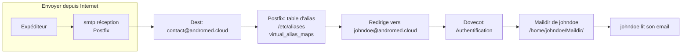
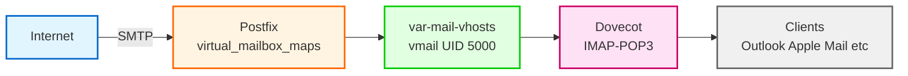

<a name="alias-tables-virtuelles" id="alias-tables-virtuelles"></a>

# Alias et Tables Virtuelles

<div class="mt-2">
  📋 Gérer des adresses email SANS créer d'utilisateurs système
</div>

---

# Introduction

**Situation réelle** : Vous avez un serveur avec juste `root` et `ubuntu`.

Vous voulez gérer des centaines d'adresses email :
- `johndoe@andromed.cloud`
- `janedoe@andromed.cloud`
- `contact@andromed.cloud`
- etc.

---

**Question** : Faut-il créer 100 utilisateurs système ? 🤔

**Réponse** : **NON !** On utilise les **domaines virtuels** ! 🎯

---

## Notre cas concret

**Serveur OVH** : Debian/Ubuntu avec :
- Utilisateur `root`
- Utilisateur `ubuntu` (créé par OVH)
- **C'est tout !**

---

**Domaine** : `andromed.cloud`

**Emails à gérer** :
- `johndoe@andromed.cloud`
- `janedoe@andromed.cloud`
- `contact@andromed.cloud`
- `support@andromed.cloud`

---

**Tous ces emails SANS créer johndoe, janedoe comme utilisateurs système !**

---

# Les 3 façons de gérer les boîtes mail

Avant de commencer, comprenons bien les **3 méthodes** possibles avec Postfix.

---

## 1️⃣ Comptes système réels (utilisateurs Unix)

**Principe** : Chaque adresse mail = 1 utilisateur Unix

```bash
# User Unix : johndoe
# Maildir : /home/johndoe/Maildir/
johndoe@andromed.cloud → /home/johndoe/Maildir/
```

Dans ce cas il faut créer manuellement le dossier Maildir pour chaque utilisateur.
```bash
sudo mkdir -p /home/johndoe/Maildir/
sudo chown -R johndoe:johndoe /home/johndoe/Maildir/
sudo chmod -R 700 /home/johndoe/Maildir/
```

ou avec Dovecot :

```bash
sudo doveadm exec doveadm mailbox list -u johndoe
```

---

**Avantages** :
- Simple à mettre en place
- Postfix + Dovecot en mode "system users"

**Inconvénients** :
- 25 boîtes mail → 25 comptes Unix 😬
- Risques de sécurité (accès SSH à gérer)
- Pas scalable
- Gestion lourde

---

**Verdict** : ❌ OK pour 1-2 boîtes perso, **pas pour un serveur professionnel**

---

## 2️⃣ Aliases (redirections simples)

**Principe** : Pas de boîte mail, juste une redirection

```bash
# Dans /etc/aliases ou virtual_alias_maps
contact@andromed.cloud → johndoe@andromed.cloud
```

**Un schéma d'explication :**


> **Explication** :
> - Postfix reçoit un mail pour `contact@andromed.cloud`
> - Il regarde dans la table d'alias : "Oh, cet alias redirige vers `johndoe@andromed.cloud`"
> - Le mail est donc remis dans la boîte de johndoe.
> - johndoe relève sa boîte (par IMAP/POP3)
> - Il n’y a **pas** de Maildir pour `contact@andromed.cloud` : c’est juste une redirection.

---

**Usage** :
- Redirections internes (`contact@`, `support@`)
- Regroupements
- Renvois externes

**Important** : ⚠️ Un alias **n'est PAS une boîte mail**

Il n'y a **pas de Maildir séparé**, c'est juste une **règle de redirection**.

**Verdict** : ✅ Utile, mais **complémentaire**, pas une solution complète

---

## 3️⃣ Virtual users (domaines virtuels)

**Principe** : Séparer les comptes mail des comptes Unix

```bash
# johndoe@andromed.cloud existe comme boîte mail
# MAIS pas comme utilisateur Unix !
johndoe@andromed.cloud → /var/mail/vhosts/andromed.cloud/johndoe/
```

---

**Architecture** :

- Adresses stockées dans Postfix (fichiers ou BDD)
- **1 seul utilisateur Unix** : `vmail` (UID 5000)
- `vmail` possède **TOUS** les Maildirs
- Dovecot + Postfix gèrent l'authentification

---

**Avantages** :
- ✅ Scalable (centaines d'adresses)
- ✅ Sécurisé (pas de comptes Unix multiples)
- ✅ Gestion centralisée
- ✅ Multi-domaines facile

---

**Verdict** : 🏆 **C'est la méthode professionnelle !**

---

## 📊 Tableau récapitulatif

| Méthode | Utilisateur Unix ? | Boîte mail réelle ? | Quand l'utiliser |
|---------|-------------------|---------------------|------------------|
| User système | Oui | Oui | Petits serveurs perso |
| Alias | Non | Non (redirige) | `contact@`, redirections |
| Virtual users | Non (1 seul `vmail`) | Oui | **Serveurs pro** ⭐ |

---

## 🎯 Notre choix : Virtual users !

Dans ce module, nous allons utiliser la **3ème méthode** :

✅ Des centaines d'adresses SANS créer d'utilisateurs système

✅ Un seul user technique : `vmail`

✅ Architecture propre et scalable

---

## Ce qu'on va faire

1. Vérifier les utilisateurs existants
2. Créer l'utilisateur technique `vmail`
3. Configurer les domaines virtuels
4. Créer des boîtes mail virtuelles
5. Tester avec Postfix + Dovecot

---

# PARTIE 1 : État des lieux du serveur

## Lister les utilisateurs actuels

```bash
# Voir tous les utilisateurs
cat /etc/passwd
```

---

Sur un serveur OVH, vous verrez :

```
root:x:0:0:root:/root:/bin/bash
ubuntu:x:1000:1000:Ubuntu:/home/ubuntu:/bin/bash
...
(utilisateurs système : daemon, bin, sys, etc.)
```

---

## Utilisateurs humains

```bash
# Lister uniquement les vrais utilisateurs (UID >= 1000)
awk -F: '$3 >= 1000 {print $1, "UID:", $3}' /etc/passwd
```

Résultat typique :

```
ubuntu UID: 1000
```

---

**C'est parfait !** On ne veut PAS polluer le système avec des dizaines d'utilisateurs.

---

# PARTIE 2 : Créer l'utilisateur technique vmail

## Pourquoi vmail ?

`vmail` est un utilisateur technique qui va :
- Posséder TOUTES les boîtes mail virtuelles
- Permettre à Postfix et Dovecot d'y accéder
- Sécuriser les permissions

---

## Création de vmail

```bash
# Créer le groupe vmail avec GID 5000
sudo groupadd -g 5000 vmail
```

---

```bash
# Créer l'utilisateur vmail avec UID 5000
sudo useradd -g vmail -u 5000 vmail \
  -d /var/mail/vhosts \
  -s /sbin/nologin \
  -c "Virtual Mail User"
```

**Paramètres expliqués** :

- `-g vmail` : Groupe principal
- `-u 5000` : UID fixe (important pour Dovecot)
- `-d /var/mail/vhosts` : Répertoire home
- `-s /sbin/nologin` : **PAS de login possible** (sécurité)
- `-c` : Commentaire

---

### ✅ Vérifier la création

```bash
id vmail
```

Résultat attendu :

```
uid=5000(vmail) gid=5000(vmail) groups=5000(vmail)
```

---

```bash
# Vérifier qu'on ne peut pas se connecter
su - vmail
```

Résultat attendu :

```
This account is currently not available.
```

**Parfait !** `vmail` existe mais personne ne peut s'y connecter. ✅

---

## Créer la structure de répertoires

```bash
# Créer le répertoire principal
sudo mkdir -p /var/mail/vhosts
```

```bash
# Créer le sous-répertoire pour notre domaine
sudo mkdir -p /var/mail/vhosts/andromed.cloud
```

```bash
# Donner la propriété à vmail
sudo chown -R vmail:vmail /var/mail/vhosts
```

```bash
# Permissions restrictives
sudo chmod -R 770 /var/mail/vhosts
```

---

### ✅ Vérifier

```bash
ls -ld /var/mail/vhosts
ls -ld /var/mail/vhosts/andromed.cloud
```

Résultat attendu :

```
drwxrwx--- 3 vmail vmail 4096 Jan 15 14:00 /var/mail/vhosts
drwxrwx--- 2 vmail vmail 4096 Jan 15 14:00 /var/mail/vhosts/andromed.cloud
```

---

# PARTIE 3 : Configuration Postfix

## Fichier des domaines virtuels

On va créer un fichier qui liste nos domaines gérés.

```bash
sudo nano /etc/postfix/virtual_domains
```

**Dans : /etc/postfix/virtual_domains**

Contenu :

```bash
# Domaines virtuels gérés par ce serveur
andromed.cloud
```

---

## Fichier des boîtes virtuelles

C'est ici qu'on déclare les adresses email et leur emplacement.

```bash
sudo nano /etc/postfix/vmailbox
```

**Dans : /etc/postfix/vmailbox**

Contenu :

```bash
# Format : adresse@domaine    chemin/relatif/
#
# Domaine : andromed.cloud
johndoe@andromed.cloud       andromed.cloud/johndoe/
janedoe@andromed.cloud       andromed.cloud/janedoe/
contact@andromed.cloud       andromed.cloud/contact/
support@andromed.cloud       andromed.cloud/support/
admin@andromed.cloud         andromed.cloud/admin/
```

**Important** : Le chemin est **relatif** à `/var/mail/vhosts/`

Donc `andromed.cloud/johndoe/` → `/var/mail/vhosts/andromed.cloud/johndoe/`

---

## Compiler les fichiers

```bash
# Compiler vmailbox
sudo postmap /etc/postfix/vmailbox
```

> postmap est un outil de postfix qui compile les fichiers de configuration.

Vérifier :

```bash
ls -l /etc/postfix/vmailbox.db
```

---

## Configuration dans main.cf

```bash
sudo nano /etc/postfix/main.cf
```

Ajouter à la fin :

```bash
# ============================================
# DOMAINES VIRTUELS (Virtual Mailbox)
# ============================================

# Domaines virtuels avec vraies boîtes mail
virtual_mailbox_domains = andromed.cloud

# Mapping adresse → chemin mailbox
virtual_mailbox_maps = hash:/etc/postfix/vmailbox

# Répertoire de base pour les mailbox
virtual_mailbox_base = /var/mail/vhosts

# UID et GID de vmail
virtual_uid_maps = static:5000
virtual_gid_maps = static:5000

# Transport pour les emails (important)
virtual_transport = virtual
```

---

# N'oubliez pas !

**N'oubliez pas de retirer home_mailbox dans main.cf**

```bash
# N'oubliez pas de retirer home_mailbox dans main.cf
#home_mailbox = Maildir/
```

Car on va utiliser le transport virtual pour les emails.

**N'oubliez pas d'enlever `$mydomain` dans `mydestination` du fichier `main.cf`**

Si non vous aurez :

> 2025-11-17T11:56:08.083137+00:00 vps-02de336b postfix/trivial-rewrite[74147]: warning: do not list domain andromed.cloud in BOTH mydestination and virtual_mailbox_domains

---

Bonus de sécurité :

```bash
# Taille maximum d'une boîte mail (100 Mo)
virtual_mailbox_limit = 104857600

# UID minimum (sécurité)
virtual_minimum_uid = 5000
```

---

**Explication** :

- `virtual_mailbox_domains` : Domaines avec boîtes réelles
- `virtual_mailbox_maps` : Fichier de mapping
- `virtual_mailbox_base` : Racine des boîtes
- `virtual_uid_maps` / `virtual_gid_maps` : Propriétaire (vmail)
- `virtual_mailbox_limit` : Quota par boîte
- `virtual_transport` : Transport pour les emails, si non précisé par défaut : `local`

---

## Vérifier la configuration

```bash
postfix check
```

Si pas d'erreur, c'est bon ! ✅

## Recharger Postfix

```bash
sudo systemctl reload postfix
```

```bash
sudo systemctl status postfix
```

---

# PARTIE 4 : Tests avec Postfix seul

## Envoyer un email de test

```bash
echo "Ceci est un test pour johndoe" | \
  mail -s "Test Virtual Mailbox" johndoe@andromed.cloud
```

## Suivre les logs

```bash
sudo tail -f /var/log/mail.log
```

---

Vous devriez voir :

```
postfix/virtual[1234]: delivered to mailbox
to=<johndoe@andromed.cloud>,
relay=virtual,
status=sent (delivered to maildir)
```

---

## Vérifier que le fichier existe

```bash
sudo ls -la /var/mail/vhosts/andromed.cloud/johndoe/
```

---

Vous devriez voir :

```
drwx------ 5 vmail vmail 4096 Jan 15 14:30 .
drwxrwx--- 3 vmail vmail 4096 Jan 15 14:00 ..
drwx------ 2 vmail vmail 4096 Jan 15 14:30 cur
drwx------ 2 vmail vmail 4096 Jan 15 14:30 new
drwx------ 2 vmail vmail 4096 Jan 15 14:30 tmp
```

---

**Format Maildir** : 3 dossiers
- `new/` : Nouveaux emails
- `cur/` : Emails lus
- `tmp/` : Temporaire

---

## Voir l'email reçu

```bash
sudo ls /var/mail/vhosts/andromed.cloud/johndoe/new/
```

puis : **cat** pour voir le contenu de l'email

```bash
sudo cat /var/mail/vhosts/andromed.cloud/johndoe/new/*
```

Vous verrez le contenu brut de l'email ! 📧

---

# PARTIE 5 : Alias et redirections

## Rediriger plusieurs adresses vers une boîte

**Besoin** : `contact@` et `info@` vont vers la même boîte

---

### Fichier virtual_alias

```bash
sudo nano /etc/postfix/virtual_alias
```

---

Contenu :

```bash
# Redirections d'alias vers boîtes virtuelles
#
# Domaine : andromed.cloud
info@andromed.cloud          johndoe@andromed.cloud
webmaster@andromed.cloud     admin@andromed.cloud
```

---

### Compiler

```bash
sudo postmap /etc/postfix/virtual_alias
```

### Configuration main.cf

```bash
sudo nano /etc/postfix/main.cf
```

**Ajouter à la fin :**

```bash
# Alias virtuels (redirections)
virtual_alias_maps = hash:/etc/postfix/virtual_alias
```

---

```bash
sudo systemctl reload postfix
```

### 🧪 Tester

```bash
echo "Test alias" | mail -s "Info" info@andromed.cloud
```

---

```bash
# Doit arriver dans la boîte de johndoe
sudo ls /var/mail/vhosts/andromed.cloud/johndoe/new/
```

---

## Redirection vers email externe

**Besoin** : `facturation@andromed.cloud` → votre comptable externe

---

### Éditer virtual_alias

```bash
sudo nano /etc/postfix/virtual_alias
```

Ajouter :

```bash
# Redirection externe
facturation@andromed.cloud    comptable@cabinet-expert.fr
```

```bash
sudo postmap /etc/postfix/virtual_alias
sudo systemctl reload postfix
```

---

### 🧪 Tester

```bash
echo "Facture" | mail -s "Facture #123" facturation@andromed.cloud
```

Le comptable doit recevoir l'email ! ✅

---

## Redirection multiple

**Besoin** : `support@` envoie à plusieurs personnes

```bash
sudo nano /etc/postfix/virtual_alias
```

Ajouter :

```bash
# Support vers plusieurs boîtes
support@andromed.cloud       johndoe@andromed.cloud, janedoe@andromed.cloud, admin@andromed.cloud
```

```bash
sudo postmap /etc/postfix/virtual_alias
sudo systemctl reload postfix
```

### 🧪 Tester

```bash
echo "Question support" | mail -s "Ticket #456" support@andromed.cloud
```

---

Les 3 boîtes doivent recevoir l'email :

```bash
sudo ls /var/mail/vhosts/andromed.cloud/johndoe/new/
sudo ls /var/mail/vhosts/andromed.cloud/janedoe/new/
sudo ls /var/mail/vhosts/andromed.cloud/admin/new/
```

---

# PARTIE 6 : Catch-all (bonus)

## Attraper toutes les adresses non définies

**Besoin** : Toute adresse `*@andromed.cloud` non définie va chez admin

> Comme je vous le précise plus tard, c'est du bonus, nous n'allons pas nous attarder sur cette partie car elle est sujette à recevoir beaucoup de spam.

---

### Éditer virtual_alias

```bash
sudo nano /etc/postfix/virtual_alias
```

---

Ajouter **À LA FIN** :

```bash
# Catch-all pour andromed.cloud (DOIT être à la fin)
@andromed.cloud              admin@andromed.cloud
```

---

⚠️ **Important** : Les règles spécifiques AVANT le catch-all !

```bash
# ✅ BON ORDRE
contact@andromed.cloud       johndoe@andromed.cloud
info@andromed.cloud          johndoe@andromed.cloud
@andromed.cloud              admin@andromed.cloud

# ❌ MAUVAIS ORDRE (catch-all écrase tout)
@andromed.cloud              admin@andromed.cloud
contact@andromed.cloud       johndoe@andromed.cloud  # jamais atteint !
```

---

```bash
sudo postmap /etc/postfix/virtual_alias
sudo systemctl reload postfix
```

---

### 🧪 Tester

```bash
echo "Test catch-all" | mail -s "Test" nimportequoi@andromed.cloud
```

---

```bash
# Doit arriver chez admin
sudo ls /var/mail/vhosts/andromed.cloud/admin/new/
```

---

⚠️ **Danger** : Les catch-all attirent **BEAUCOUP de spam** !

```
randomspam@andromed.cloud → admin
phishing@andromed.cloud → admin
test@andromed.cloud → admin
...
```

---

**Recommandation** : Évitez les catch-all ou utilisez un bon anti-spam (Rspamd)

---

# PARTIE 7 : Gérer plusieurs domaines

## Ajouter un deuxième domaine

**Nouveau domaine** : `ascent.cloud`

Même serveur, domaine différent.

---

### Éditer virtual_domains

```bash
sudo nano /etc/postfix/virtual_domains
```

---

Ajouter :

```bash
# Domaines virtuels gérés
andromed.cloud
ascent.cloud
```

---

### Créer le répertoire

```bash
sudo mkdir -p /var/mail/vhosts/ascent.cloud
sudo chown vmail:vmail /var/mail/vhosts/ascent.cloud
sudo chmod 770 /var/mail/vhosts/ascent.cloud
```

---

### Ajouter les boîtes dans vmailbox

```bash
sudo nano /etc/postfix/vmailbox
```

---

Ajouter :

```bash
# Domaine : ascent.cloud
contact@ascent.cloud         ascent.cloud/contact/
admin@ascent.cloud           ascent.cloud/admin/
```

---

```bash
sudo postmap /etc/postfix/vmailbox
```

---

### Mettre à jour main.cf

```bash
sudo nano /etc/postfix/main.cf
```

Modifier :

```bash
# Domaines virtuels avec vraies boîtes mail
virtual_mailbox_domains = andromed.cloud, ascent.cloud
```

```bash
sudo systemctl reload postfix
```

### 🧪 Tester

```bash
echo "Test Ascent" | mail -s "Test" contact@ascent.cloud
```

```bash
sudo ls /var/mail/vhosts/ascent.cloud/contact/new/
```

---

# PARTIE 8 : Alias système (root, postmaster)

## Gérer les alias système

Les alias comme `root@`, `postmaster@` doivent être redirigés.

---

### Fichier /etc/aliases

```bash
sudo nano /etc/aliases
```

Modifier/Ajouter :

```bash
# Redirections des comptes système
postmaster: root
hostmaster: root
webmaster: root
abuse: root
security: root
noc: root
```

---

```bash
# Rediriger root vers une vraie boîte
root: admin@andromed.cloud
```

Puis : 

```bash
sudo newaliases
```

### 🧪 Tester

```bash
echo "Test postmaster" | mail -s "Test" postmaster
```

---

```bash
# Doit arriver dans admin@andromed.cloud
sudo ls /var/mail/vhosts/andromed.cloud/admin/new/
```

---

# PARTIE 9 : Intégration avec Dovecot

(Veuillez lire avant le module Dovecot)

<Link class="dark:!text-purple-300" to="dovecot">
  Lire le module Dovecot
</Link>

⚠️ **Point important à comprendre** :

Jusqu'ici, avec Postfix seul, on peut **RECEVOIR** des emails dans les boîtes virtuelles.

Mais les utilisateurs ne peuvent **PAS encore les lire** !

---

**Pourquoi ?**

- Postfix = Facteur qui dépose le courrier ✅
- **Pas besoin de mot de passe** pour recevoir des emails
- Les emails arrivent automatiquement dans `/var/mail/vhosts/`

---

**Maintenant avec Dovecot** :

- Dovecot = La clé de la boîte aux lettres 🔑
- **Besoin d'un mot de passe** pour ouvrir la boîte
- Permet la lecture via IMAP/POP3
- Fournit l'authentification SMTP pour l'envoi

Passons à la configuration !

---

## Configuration Dovecot

### Fichier 10-mail.conf

```bash
sudo nano /etc/dovecot/conf.d/10-mail.conf
```

Configurer :

```bash
# Location des boîtes mail
mail_location = maildir:/var/mail/vhosts/%d/%n

# Utilisateur et groupe
mail_uid = vmail
mail_gid = vmail
first_valid_uid = 5000
first_valid_gid = 5000
```

---

**Variables Dovecot** :
- `%d` = domaine (andromed.cloud)
- `%n` = utilisateur local (johndoe)
- `%u` = adresse complète (johndoe@andromed.cloud)

---

### Fichier 10-auth.conf

```bash
sudo nano /etc/dovecot/conf.d/10-auth.conf
```

```bash
# Mécanismes d'authentification
auth_mechanisms = plain login

# Désactiver l'auth en clair (sauf SSL)
disable_plaintext_auth = yes
```

---

### Créer le fichier d'utilisateurs virtuels

```bash
sudo nano /etc/dovecot/users
```

Contenu :

```bash
# Format : utilisateur@domaine:{PLAIN}motdepasse
johndoe@andromed.cloud:{PLAIN}MotDePasse123!
janedoe@andromed.cloud:{PLAIN}MotDePasse456!
contact@andromed.cloud:{PLAIN}MotDePasse789!
admin@andromed.cloud:{PLAIN}AdminPass123!
```

---

⚠️ **Important** : En production, utilisez des hash (SHA512-CRYPT) !

```bash
# Générer un hash
doveadm pw -s SHA512-CRYPT
```

---

### Configuration de l'authentification

```bash
sudo nano /etc/dovecot/conf.d/auth-passwdfile.conf.ext
```

---

Créer/Modifier :

```bash
passdb {
  driver = passwd-file
  args = scheme=PLAIN username_format=%u /etc/dovecot/users
}

userdb {
  driver = static
  args = uid=vmail gid=vmail home=/var/mail/vhosts/%d/%n
}
```

---

### Activer cette authentification

```bash
sudo nano /etc/dovecot/conf.d/10-auth.conf
```

---

Commenter les auth par défaut et ajouter :

```bash
# Désactiver
#!include auth-system.conf.ext

# Activer
!include auth-passwdfile.conf.ext
```

> Vous pouvez aussi tout faire dans le auth-system.conf d'ailleurs, libre à vous en terme de propreté ou non. 

---

### Permissions

```bash
sudo chmod 640 /etc/dovecot/users
sudo chown root:dovecot /etc/dovecot/users
```

---

### Redémarrer Dovecot

```bash
sudo systemctl restart dovecot
sudo systemctl status dovecot
```

---

## 🧪 Tester l'authentification

```bash
doveadm auth test johndoe@andromed.cloud MotDePasse123!
```


Résultat attendu :

```bash
passdb: johndoe@andromed.cloud auth succeeded
userdb: johndoe@andromed.cloud
  home      : /var/mail/vhosts/andromed.cloud/johndoe
  uid       : 5000
  gid       : 5000
```

---

## Tester avec un client email

### Paramètres de configuration

**Serveur IMAP** :
- Serveur : `mail.andromed.cloud`
- Port : `993` (IMAPS)
- SSL/TLS : Activé
- Utilisateur : `johndoe@andromed.cloud`
- Mot de passe : `MotDePasse123!`

---

**Serveur SMTP** :
- Serveur : `mail.andromed.cloud`
- Port : `587` (Submission)
- STARTTLS : Activé
- Authentification : Oui
- Utilisateur : `johndoe@andromed.cloud`
- Mot de passe : `MotDePasse123!`

---

# PARTIE 10 : Commandes utiles

## Lister les boîtes mail

```bash
# Toutes les boîtes
sudo find /var/mail/vhosts -name "new" -type d
```

## Compter les emails par boîte

```bash
# Emails de johndoe
sudo ls /var/mail/vhosts/andromed.cloud/johndoe/new/ | wc -l
```

## Lire un email

```bash
# Lister les emails
sudo ls /var/mail/vhosts/andromed.cloud/johndoe/new/
```

```bash
# Lire un email spécifique
sudo cat /var/mail/vhosts/andromed.cloud/johndoe/new/1234567890.V1I2M3.mail
```

---

## Vérifier une adresse

```bash
# Vérifier si l'adresse existe dans vmailbox
postmap -q johndoe@andromed.cloud /etc/postfix/vmailbox
```

Résultat :

```
andromed.cloud/johndoe/
```

---

## Vérifier un alias

```bash
# Vérifier une redirection
postmap -q info@andromed.cloud /etc/postfix/virtual_alias
```

Résultat :

```
johndoe@andromed.cloud
```

---

## Purger une boîte

```bash
# Supprimer tous les emails de johndoe
sudo rm -rf /var/mail/vhosts/andromed.cloud/johndoe/new/*
sudo rm -rf /var/mail/vhosts/andromed.cloud/johndoe/cur/*
```

---

## Taille des boîtes

```bash
# Taille de toutes les boîtes
sudo du -sh /var/mail/vhosts/andromed.cloud/*/
```

---

```bash
# Taille d'une boîte spécifique
sudo du -sh /var/mail/vhosts/andromed.cloud/johndoe/
```

---

# PARTIE 11 : Scripts d'administration

## Script : Créer une nouvelle adresse

```bash
sudo nano /usr/local/bin/add-virtual-mailbox.sh
```

---

Contenu :

```bash
#!/bin/bash
# add-virtual-mailbox.sh

if [ "$#" -ne 2 ]; then
    echo "Usage: $0 email@domain password"
    exit 1
fi

EMAIL=$1
PASSWORD=$2
DOMAIN=$(echo $EMAIL | cut -d@ -f2)
USER=$(echo $EMAIL | cut -d@ -f1)
```

---

```bash
# Ajouter à vmailbox
echo "$EMAIL    $DOMAIN/$USER/" | sudo tee -a /etc/postfix/vmailbox
sudo postmap /etc/postfix/vmailbox

# Ajouter à Dovecot users
echo "$EMAIL:{PLAIN}$PASSWORD" | sudo tee -a /etc/dovecot/users
```

---

```bash
# Créer le répertoire
sudo mkdir -p /var/mail/vhosts/$DOMAIN/$USER/{new,cur,tmp}
sudo chown -R vmail:vmail /var/mail/vhosts/$DOMAIN/$USER
sudo chmod -R 700 /var/mail/vhosts/$DOMAIN/$USER

# Recharger
sudo systemctl reload postfix
sudo systemctl reload dovecot

echo "✅ Boîte mail $EMAIL créée !"
```

---

```bash
# Rendre exécutable
sudo chmod +x /usr/local/bin/add-virtual-mailbox.sh
```

---

### 🧪 Utiliser le script

```bash
sudo /usr/local/bin/add-virtual-mailbox.sh test@andromed.cloud Password123
```

---

## Script : Supprimer une adresse

```bash
sudo nano /usr/local/bin/remove-virtual-mailbox.sh
```

---

Contenu :

```bash
#!/bin/bash
# remove-virtual-mailbox.sh

if [ "$#" -ne 1 ]; then
    echo "Usage: $0 email@domain"
    exit 1
fi

EMAIL=$1
DOMAIN=$(echo $EMAIL | cut -d@ -f2)
USER=$(echo $EMAIL | cut -d@ -f1)
```

---

```bash
# Supprimer de vmailbox
sudo sed -i "/^$EMAIL[[:space:]]/d" /etc/postfix/vmailbox
sudo postmap /etc/postfix/vmailbox

# Supprimer de Dovecot users
sudo sed -i "/^$EMAIL:/d" /etc/dovecot/users
```

---

```bash
# Supprimer le répertoire
sudo rm -rf /var/mail/vhosts/$DOMAIN/$USER

# Recharger
sudo systemctl reload postfix
sudo systemctl reload dovecot

echo "✅ Boîte mail $EMAIL supprimée !"
```

---

```bash
sudo chmod +x /usr/local/bin/remove-virtual-mailbox.sh
```

---

## Script : Lister toutes les adresses

```bash
sudo nano /usr/local/bin/list-virtual-mailboxes.sh
```

---

Contenu :

```bash
#!/bin/bash
# list-virtual-mailboxes.sh

echo "========================================="
echo "  BOÎTES MAIL VIRTUELLES"
echo "========================================="
echo ""

grep -v '^#' /etc/postfix/vmailbox | grep -v '^$' | while read line; do
    email=$(echo $line | awk '{print $1}')
    path=$(echo $line | awk '{print $2}')
    count=$(sudo ls /var/mail/vhosts/$path/new 2>/dev/null | wc -l)
    size=$(sudo du -sh /var/mail/vhosts/$path 2>/dev/null | awk '{print $1}')
    printf "%-40s [%3d emails] [%s]\n" "$email" "$count" "$size"
done

echo ""
echo "========================================="
```

---

```bash
sudo chmod +x /usr/local/bin/list-virtual-mailboxes.sh
```

---

### 🧪 Utiliser le script

```bash
sudo /usr/local/bin/list-virtual-mailboxes.sh
```

Résultat :

```
=========================================
  BOÎTES MAIL VIRTUELLES
=========================================

johndoe@andromed.cloud                  [  5 emails] [128K]
janedoe@andromed.cloud                  [  2 emails] [64K]
contact@andromed.cloud                  [ 12 emails] [256K]
admin@andromed.cloud                    [  8 emails] [192K]

=========================================
```

---

# PARTIE 12 : Troubleshooting

## ❌ Problème : Email non délivré

### Vérifier les logs

```bash
sudo tail -50 /var/log/mail.log | grep ERROR
```

---

### Erreur courante 1

```
User unknown in virtual mailbox table
```

**Cause** : L'adresse n'existe pas dans vmailbox

---

**Solution** :

```bash
# Vérifier
postmap -q johndoe@andromed.cloud /etc/postfix/vmailbox

# Si vide, ajouter
sudo nano /etc/postfix/vmailbox
# Ajouter la ligne
sudo postmap /etc/postfix/vmailbox
```

---

### Erreur courante 2

```
Unable to create file /var/mail/vhosts/.../new/: Permission denied
```

**Cause** : Problème de permissions

---

**Solution** :

```bash
# Vérifier les permissions
ls -ld /var/mail/vhosts/
ls -ld /var/mail/vhosts/andromed.cloud/
```

---

```bash
# Corriger
sudo chown -R vmail:vmail /var/mail/vhosts
sudo chmod -R 770 /var/mail/vhosts
```

---

### Erreur courante 3

```
fatal: parameter virtual_uid_maps: unknown user name: vmail
```

**Cause** : L'utilisateur vmail n'existe pas

---

**Solution** :

```bash
# Vérifier
id vmail

# Si erreur, recréer
sudo groupadd -g 5000 vmail
sudo useradd -g vmail -u 5000 vmail -d /var/mail/vhosts -s /sbin/nologin
```

---

## ❌ Problème : Authentification Dovecot échoue

### Vérifier les logs

```bash
sudo tail -50 /var/log/dovecot/dovecot.log | grep auth
```

---

### Tester l'authentification

```bash
doveadm auth test johndoe@andromed.cloud MotDePasse123!
```

---

Si erreur :

```
auth failed
```

---

**Vérifier le fichier users** :

```bash
sudo cat /etc/dovecot/users | grep johndoe
```

---

**Format correct** :

```
johndoe@andromed.cloud:{PLAIN}MotDePasse123!
```

---

**Permissions** :

```bash
sudo chmod 640 /etc/dovecot/users
sudo chown root:dovecot /etc/dovecot/users
```

---

## 🔍 Mode debug Postfix

```bash
# Activer
sudo postconf -e "debug_peer_list=127.0.0.1"
sudo postconf -e "debug_peer_level=3"
sudo systemctl reload postfix
```

---

```bash
# Tester
echo "Debug test" | mail -s "Test" johndoe@andromed.cloud
```

---

```bash
# Voir les logs détaillés
sudo tail -f /var/log/mail.log
```

---

```bash
# Désactiver
sudo postconf -e "debug_peer_list="
sudo postconf -e "debug_peer_level=0"
sudo systemctl reload postfix
```

---

# PARTIE 13 : Exercices pratiques

## 🎯 Exercice 1 : Première boîte virtuelle

**Objectif** : Créer votre première adresse complète

---

**Tâches** :

1. Créer `alice@andromed.cloud` dans vmailbox
2. Ajouter le mot de passe dans Dovecot users
3. Compiler et recharger
4. Envoyer un email de test
5. Vérifier que l'email est arrivé
6. Tester l'authentification avec doveadm

---

### ✅ Solution Exercice 1

```bash
# 1. Ajouter dans vmailbox
sudo nano /etc/postfix/vmailbox

# Ajouter
alice@andromed.cloud        andromed.cloud/alice/
```

---

```bash
# 2. Compiler
sudo postmap /etc/postfix/vmailbox
```

---

```bash
# 3. Créer le répertoire
sudo mkdir -p /var/mail/vhosts/andromed.cloud/alice/{new,cur,tmp}
sudo chown -R vmail:vmail /var/mail/vhosts/andromed.cloud/alice
sudo chmod -R 700 /var/mail/vhosts/andromed.cloud/alice
```

---

```bash
# 4. Ajouter dans Dovecot
sudo nano /etc/dovecot/users

# Ajouter
alice@andromed.cloud:{PLAIN}AlicePass123!
```

---

```bash
# 5. Recharger
sudo systemctl reload postfix
sudo systemctl reload dovecot
```

---

```bash
# 6. Tester envoi
echo "Bonjour Alice" | mail -s "Bienvenue" alice@andromed.cloud
```

---

```bash
# 7. Vérifier
sudo ls /var/mail/vhosts/andromed.cloud/alice/new/
sudo cat /var/mail/vhosts/andromed.cloud/alice/new/*
```

---

```bash
# 8. Tester auth
doveadm auth test alice@andromed.cloud AlicePass123!
```

---

## 🎯 Exercice 2 : Alias et redirections

**Objectif** : Créer des redirections complexes

---

**Tâches** :

1. Créer `info@andromed.cloud` qui redirige vers alice
2. Créer `team@andromed.cloud` vers alice + johndoe
3. Créer `billing@andromed.cloud` vers votre email externe
4. Tester les 3 redirections

---

### ✅ Solution Exercice 2

```bash
# 1. Éditer virtual_alias
sudo nano /etc/postfix/virtual_alias
```

---

Ajouter :

```bash
# Exercice 2
info@andromed.cloud         alice@andromed.cloud
team@andromed.cloud         alice@andromed.cloud, johndoe@andromed.cloud
billing@andromed.cloud      votre@email.com
```

---

```bash
# 2. Compiler et recharger
sudo postmap /etc/postfix/virtual_alias
sudo systemctl reload postfix
```

---

```bash
# 3. Tests
echo "Test info" | mail -s "Info" info@andromed.cloud
echo "Test team" | mail -s "Team" team@andromed.cloud
echo "Test billing" | mail -s "Billing" billing@andromed.cloud
```

---

```bash
# 4. Vérifier
sudo ls /var/mail/vhosts/andromed.cloud/alice/new/
sudo ls /var/mail/vhosts/andromed.cloud/johndoe/new/
# Vérifier votre boîte externe
```

---

## 🎯 Exercice 3 : Deuxième domaine

**Objectif** : Gérer un second domaine

---

**Tâches** :

1. Ajouter le domaine `exemple.local`
2. Créer `contact@exemple.local`
3. Créer `admin@exemple.local`
4. Configurer un catch-all vers admin
5. Tester

---

### ✅ Solution Exercice 3

```bash
# 1. Créer le répertoire
sudo mkdir -p /var/mail/vhosts/exemple.local
sudo chown vmail:vmail /var/mail/vhosts/exemple.local
sudo chmod 770 /var/mail/vhosts/exemple.local
```

---

```bash
# 2. Ajouter dans vmailbox
sudo nano /etc/postfix/vmailbox

# Ajouter
contact@exemple.local       exemple.local/contact/
admin@exemple.local         exemple.local/admin/
```

---

```bash
sudo postmap /etc/postfix/vmailbox
```

---

```bash
# 3. Créer les répertoires
sudo mkdir -p /var/mail/vhosts/exemple.local/contact/{new,cur,tmp}
sudo mkdir -p /var/mail/vhosts/exemple.local/admin/{new,cur,tmp}
sudo chown -R vmail:vmail /var/mail/vhosts/exemple.local
sudo chmod -R 700 /var/mail/vhosts/exemple.local/contact
sudo chmod -R 700 /var/mail/vhosts/exemple.local/admin
```

---

```bash
# 4. Ajouter les mots de passe Dovecot
sudo nano /etc/dovecot/users

# Ajouter
contact@exemple.local:{PLAIN}ContactPass!
admin@exemple.local:{PLAIN}AdminPass!
```

---

```bash
# 5. Configurer catch-all
sudo nano /etc/postfix/virtual_alias

# Ajouter À LA FIN
@exemple.local              admin@exemple.local
```

---

```bash
sudo postmap /etc/postfix/virtual_alias
```

---

```bash
# 6. Mettre à jour main.cf
sudo nano /etc/postfix/main.cf

# Modifier
virtual_mailbox_domains = andromed.cloud, exemple.local
```

---

```bash
# 7. Recharger
sudo systemctl reload postfix
sudo systemctl reload dovecot
```

---

```bash
# 8. Tests
echo "Test 1" | mail -s "Contact" contact@exemple.local
echo "Test 2" | mail -s "Admin" admin@exemple.local
echo "Test 3" | mail -s "Random" random@exemple.local
```

---

```bash
# 9. Vérifier
sudo ls /var/mail/vhosts/exemple.local/contact/new/
sudo ls /var/mail/vhosts/exemple.local/admin/new/
```

---

## 🎯 Exercice 4 : Script automatisé

**Objectif** : Utiliser les scripts d'administration

---

**Tâches** :

1. Utiliser le script pour créer `bob@andromed.cloud`
2. Lister toutes les boîtes avec le script de listing
3. Envoyer un email à bob
4. Vérifier avec le script que bob a 1 email
5. Supprimer bob avec le script

---

### ✅ Solution Exercice 4

```bash
# 1. Créer bob
sudo /usr/local/bin/add-virtual-mailbox.sh bob@andromed.cloud BobPass123
```

---

```bash
# 2. Lister
sudo /usr/local/bin/list-virtual-mailboxes.sh
```

```bash
# 3. Envoyer email
echo "Salut Bob" | mail -s "Test" bob@andromed.cloud
```

```bash
# 4. Relister (bob doit avoir 1 email)
sudo /usr/local/bin/list-virtual-mailboxes.sh
```

```bash
# 5. Supprimer
sudo /usr/local/bin/remove-virtual-mailbox.sh bob@andromed.cloud
```

```bash
# 6. Vérifier que bob est supprimé
sudo /usr/local/bin/list-virtual-mailboxes.sh
```

---

# PARTIE 14 : Récapitulatif

## 🎯 Ce que vous savez maintenant

### ✅ Vous savez gérer des centaines d'emails SANS utilisateurs système

```
johndoe@andromed.cloud → /var/mail/vhosts/andromed.cloud/johndoe/
janedoe@andromed.cloud → /var/mail/vhosts/andromed.cloud/janedoe/
...
```

---

### ✅ Architecture complète



---

### 💡 Points clés

**1. Un seul utilisateur technique : vmail**
- UID/GID 5000
- Pas de login possible
- Possède toutes les boîtes

---

**2. Fichiers Postfix**

```bash
/etc/postfix/vmailbox        # Boîtes virtuelles
/etc/postfix/virtual_alias   # Redirections
/etc/postfix/virtual_domains # Domaines gérés
```

---

**3. Fichiers Dovecot**

```bash
/etc/dovecot/users           # Utilisateurs + mots de passe
/etc/dovecot/conf.d/10-mail.conf   # Configuration maildir
/etc/dovecot/conf.d/10-auth.conf   # Configuration auth
```

---

**4. Structure des répertoires**

```
/var/mail/vhosts/
├── andromed.cloud/
│   ├── johndoe/
│   │   ├── new/    (nouveaux emails)
│   │   ├── cur/    (emails lus)
│   │   └── tmp/    (temporaire)
│   ├── janedoe/
│   └── contact/
└── exemple.local/
    ├── contact/
    └── admin/
```

---

**5. Commandes essentielles**

```bash
# Ajouter une boîte
sudo nano /etc/postfix/vmailbox
sudo postmap /etc/postfix/vmailbox

# Ajouter un alias
sudo nano /etc/postfix/virtual_alias
sudo postmap /etc/postfix/virtual_alias
```

---

```bash
# Vérifier
postmap -q EMAIL /etc/postfix/vmailbox
postmap -q EMAIL /etc/postfix/virtual_alias

# Recharger
sudo systemctl reload postfix
sudo systemctl reload dovecot
```

---

**6. Ordre de résolution**

```
1. virtual_alias_maps (redirections)
2. virtual_mailbox_maps (boîtes réelles)
3. Livraison
```

---

## 🔐 Sécurité

### ✅ Bonnes pratiques

- Utilisateur vmail sans login
- Permissions 770 sur /var/mail/vhosts
- Hash des mots de passe (SHA512-CRYPT)
- SSL/TLS obligatoire
- Pas de catch-all (ou avec anti-spam)

---

### ⚠️ À éviter

- ❌ Créer des utilisateurs système pour chaque email
- ❌ Permissions trop permissives (777)
- ❌ Mots de passe en clair visibles
- ❌ Catch-all sans protection
- ❌ Pas de quota (risque de saturation disque)

---

## 🚀 Pour aller plus loin

### Base de données MySQL/PostgreSQL

Au lieu de fichiers texte, utiliser une BDD :

```bash
virtual_mailbox_maps = mysql:/etc/postfix/mysql-virtual-mailbox.cf
virtual_alias_maps = mysql:/etc/postfix/mysql-virtual-alias.cf
```

---

### Interface web de gestion

- **Postfixadmin** : Gérer les domaines/boîtes via web
- **Roundcube** : Webmail
- **iRedMail** : Solution complète

---

### Quotas avancés

```bash
# Dans Dovecot
plugin {
  quota = maildir:User quota
  quota_rule = *:storage=1GB
}
```

---

## 🎉 Félicitations !

Vous savez maintenant :

✅ Gérer des centaines d'adresses email sans polluer le système

✅ Créer des boîtes virtuelles avec Postfix + Dovecot

✅ Faire des redirections simples et complexes

✅ Gérer plusieurs domaines sur un serveur

✅ Automatiser avec des scripts

✅ Déboguer les problèmes courants

---

## Prochaine étape

Maintenant que vous maîtrisez les domaines virtuels, passons à la **protection anti-spam** ! 🛡️

<div class="pt-12">
  <span @click="next" class="px-2 p-3 rounded cursor-pointer hover:bg-white hover:bg-opacity-10 neon-border">
    Module suivant : Protection anti-spam <carbon:arrow-right class="inline"/>
  </span>
</div>
