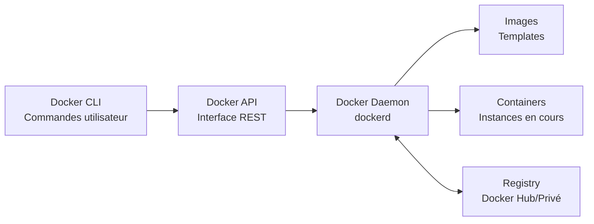
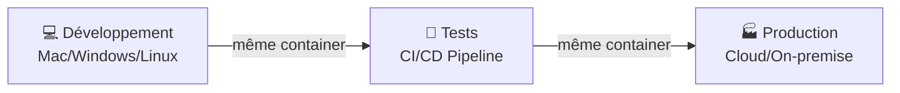

<a name="INTRO-DOCKER" id="INTRO-DOCKER"></a>

# Introduction à Docker 🐳

---

# Définition simple 📝

### Qu'est-ce que Docker exactement ?

Docker est une **plateforme de conteneurisation** qui permet d'empaqueter une application et toutes ses dépendances dans un conteneur portable, léger et autonome qui peut s'exécuter de manière cohérente sur n'importe quel environnement.

---

# Vocabulaire Docker Essentiel 📚

### Les concepts de base à maîtriser

Avant de plonger dans la pratique, il est crucial de comprendre le vocabulaire Docker.

Ces termes reviendront constamment dans votre utilisation quotidienne.

---

# Définitions fondamentales 📝

### Container vs Image

- **Container** : Un environnement d'exécution isolé et portable qui contient tout ce dont une application a besoin pour fonctionner (code, runtime, outils système, bibliothèques)

- **Image** : Un modèle en lecture seule qui sert de blueprint pour créer des containers. C'est un snapshot figé d'un système de fichiers avec toutes les dépendances

---

# Dockerfile & Écosystème 🐳

### Composants essentiels

- **Dockerfile** : Un fichier texte contenant une série d'instructions pour construire automatiquement une image Docker personnalisée

- **Docker Hub** : Le registre public officiel où sont stockées et partagées des millions d'images Docker prêtes à l'emploi

- **Docker Registry** : Un service de stockage et de distribution d'images Docker, peut être privé ou public

---

# Écosystème complet 2025 🌟

### Plateforme moderne

- **Communauté active** : Plus de 10 millions de développeurs dans le monde
- **Docker Desktop** : Interface graphique et outils de développement
- **Plus de 6 millions d'images** disponibles sur Docker Hub
- **85% des nouvelles applications** utilisent Docker ou Podman , son implémentation 100% open source en 2025

Car oui Docker n'est pas à 100% open source, il y a des licences propriétaires.
C'est une entreprise qui cherche a capitaliser un minimum sur son produit.

Podman est une alternative open source à Docker, il est plus léger et plus rapide.

Il est possible de faire tourner Docker sur un serveur Linux sans Docker Desktop, pareil sur macOS via orbstack etc.

---

# Architecture Docker moderne 🏗️

### Composants principaux

- **Docker Engine** : Le cœur de Docker qui gère le cycle de vie des containers (création, exécution, arrêt, suppression)

- **Docker Daemon (dockerd)** : Service système qui s'exécute en arrière-plan et gère les objets Docker

- **Docker CLI** : L'interface en ligne de commande qui permet d'interagir avec le Docker Daemon via des commandes

---

# Vue d'ensemble du système 🔧



---

# Pourquoi Docker révolutionne ? 🚀

### Le problème des dépendances

**Avant Docker** : "Ça marche sur ma machine" 😅
- Conflits de versions entre environnements
- Configuration manuelle complexe
- Incompatibilités système
- Déploiements imprévisibles

---

# La solution Docker ✅

**Avec Docker** : "Ça marche partout" ✅
- Environnements identiques garantis
- Dépendances encapsulées
- Déploiement reproductible
- Isolation parfaite

---

# Les super-pouvoirs de Docker 💪

### Portabilité absolue



---

# Avantages techniques concrets 📊

### Performance et efficacité

- **Démarrage ultra-rapide** : 0.1 à 2 secondes vs 30s-5min pour une VM
- **Densité élevée** : 100-1000 containers vs 5-20 VMs par serveur
- **Utilisation mémoire optimisée** : 10-100MB vs 512MB-8GB par instance
- **Performance native** : Overhead <1% vs 5-15% pour la virtualisation

---

# Principes fondamentaux 💡

### Isolation et sécurité

- **Isolation** : Chaque container s'exécute dans son propre environnement isolé, séparé des autres containers et du système hôte

- **Namespaces** : Mécanisme Linux qui isole les ressources système (PID, réseau, système de fichiers)

- **Cgroups** : Limitation et contrôle des ressources système (CPU, mémoire, I/O) allouées aux containers

---

# Philosophie Container-First 🎯

### Stateless par défaut

Les containers Docker suivent le principe **stateless** :

- **Données éphémères** : Le container peut être détruit et recréé sans perte de fonctionnalité
- **État externalisé** : Les données persistantes sont stockées dans des volumes ou bases de données externes
- **Configuration externalisée** : Variables d'environnement et fichiers de configuration montés depuis l'extérieur

---

# Portabilité et reproductibilité 🔄

### Garanties Docker

- **Portabilité** : Les containers s'exécutent de manière identique sur tous les environnements supportant Docker (développement, test, production)

- **Immutabilité** : Les images Docker sont immuables, garantissant la reproductibilité des déploiements

- **Infrastructure as Code** : La configuration de l'infrastructure est définie dans du code versionnable et reproductible

---

# Premier contact avec Docker 🎯

### Installation rapide 2025

```bash
# Linux (Ubuntu/Debian)
curl -fsSL https://get.docker.com | sh
sudo usermod -aG docker $USER

# macOS/Windows : Docker Desktop sur leur site ou :
wsl --install
```

Puis à nouveau la 1ère commande pour installer docker

---

# Vérification installation ✅

### Test de votre environnement

```bash
# Version et informations système
docker --version
docker info

# Test classique : créer un container hello-world
docker run hello-world
```

---

# Exemple concret : Nginx en action 🌐

### Déploiement d'un serveur web en une commande

```bash
# Lancement d'un serveur Nginx
docker run -d -p 8080:80 --name mon-nginx nginx:alpine

# Vérification du container
docker ps

# Consultation des logs
docker logs mon-nginx
```

---

# Ce qui se passe en coulisses 🔍

### Analyse du processus

1. **Pull automatique** : Téléchargement de l'image nginx:alpine
2. **Création du container** : Instance isolée avec Nginx
3. **Mapping de port** : Port 8080 de l'hôte → Port 80 du container
4. **Démarrage** : Nginx opérationnel en quelques secondes

**Résultat** : Serveur web accessible sur http://localhost:8080

---

# Images vs Containers en pratique 📋

### Relation fondamentale

**Images Docker** 📦
- Templates **immuables** et **versionnés**
- Architecture en **couches** (layers) pour l'optimisation
- Stockées dans des **registries** (Docker Hub, privés)
- Peuvent être **taguées** pour le versioning

**Containers Docker** 🏃‍♂️
- **Instances vivantes** créées à partir d'images
- **Environnements isolés** avec leur propre filesystem
- **États mutables** : peuvent être démarrés, arrêtés, modifiés
- **Éphémères** : données perdues à la suppression (sauf volumes)

---

# Concepts avancés 🚀

### Réseautage et stockage

- **Docker Network** : Réseau virtuel permettant la communication sécurisée entre containers

- **Docker Volume** : Mécanisme de persistance des données qui survit au cycle de vie des containers

- **Docker Secret** : Gestion sécurisée des informations sensibles (mots de passe, clés API, certificats)

---

# Orchestration moderne 🎭

### Solutions d'orchestration

- **Docker Swarm** : Solution d'orchestration native pour gérer des clusters de containers

- **Kubernetes** : Plateforme d'orchestration avancée pour le déploiement et la gestion de containers à grande échelle

- **Docker Stack** : Déploiement d'applications multi-services dans un cluster Swarm

---

# Avantages pratiques pour les développeurs ✅

### Bénéfices quotidiens

- **Scalabilité horizontale** : Multiplication facile des instances
- **Mise à jour sans interruption** : Remplacement transparent des containers
- **Récupération rapide** : Redémarrage instantané en cas de problème
- **Testing simplifié** : Environnements de test identiques à la production
- **Déploiement uniforme** : Même artefact du développement à la production 