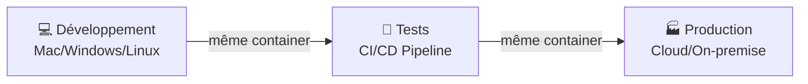
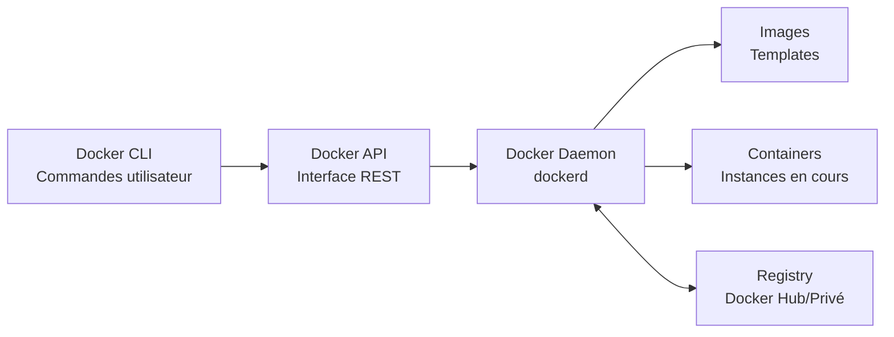

# Introduction à Docker

---
routeAlias: 'intro-Docker'
---

<a name="INTRO-DOCKER" id="INTRO-DOCKER"></a>

# Introduction à Docker 🐳

### La révolution de la conteneurisation

Docker a révolutionné la façon dont nous développons, déployons et gérons les applications modernes. Cette plateforme de conteneurisation est devenue l'épine dorsale de l'infrastructure cloud moderne.

---

# Définition simple 📝

### Définition simple

Docker est une **plateforme de conteneurisation** qui permet d'empaqueter une application et toutes ses dépendances dans un conteneur portable, léger et autonome qui peut s'exécuter de manière cohérente sur n'importe quel environnement.

---

# Qu'est-ce que Docker exactement ? 🔍

### Plateforme open-source moderne

- **Communauté active** : Plus de 10 millions de développeurs dans le monde
- **Code source ouvert** : Développement transparent sur GitHub
- **Contributions massives** : Milliers de contributeurs actifs
- **Innovation continue** : Nouvelles fonctionnalités régulières

---

# Écosystème complet 2025 🌟

### Écosystème complet 2025

- **Docker Desktop** : Interface graphique et outils de développement
- **Docker Hub** : Plus de 6 millions d'images de containers disponibles
- **Docker Build Cloud** : Service de build dans le cloud pour performances optimales
- **Docker Scout** : Analyse de sécurité et vulnérabilités intégrée

---

# Histoire et évolution 📚

### Les débuts (2013-2016)

- **2013** : Création par Solomon Hykes chez dotCloud
- **Open source** : Libération du code et adoption explosive
- **Standardisation** : Devient rapidement le standard de facto

---

# Maturité et adoption 📈

### Maturité et adoption massive (2017-2025)

- **Entreprises** : Adoption par Google, Microsoft, Amazon, Netflix
- **Cloud native** : Fondation de la CNCF (Cloud Native Computing Foundation)
- **Kubernetes** : Intégration et orchestration à grande échelle
- **2025** : Plus de 85% des nouvelles applications utilisent Docker

---

# Pourquoi Docker révolutionne ? 🚀

### Le problème des dépendances

**Avant Docker** : "Ça marche sur ma machine" 😅
- Conflits de versions entre environnements
- Configuration manuelle complexe
- Incompatibilités système
- Déploiements imprévisibles

---

# La solution Docker ✅

**Avec Docker** : "Ça marche partout" ✅
- Environnements identiques garantis
- Dépendances encapsulées
- Déploiement reproductible
- Isolation parfaite

---

# Les super-pouvoirs de Docker 💪

### Portabilité absolue



---

# Avantages techniques concrets 📊

### Avantages techniques concrets

- **Démarrage ultra-rapide** : 0.1 à 2 secondes vs 30s-5min pour une VM
- **Densité élevée** : 100-1000 containers vs 5-20 VMs par serveur
- **Utilisation mémoire optimisée** : 10-100MB vs 512MB-8GB par instance
- **Performance native** : Overhead <1% vs 5-15% pour la virtualisation

---

# Architecture Docker moderne 🏗️

### Vue d'ensemble du système



---

# Composants essentiels 2025 🔧

### Composants essentiels 2025

- **Docker Engine** : Cœur de la plateforme avec optimisations performances
- **containerd** : Runtime de container haute performance
- **runc** : Exécuteur de container conforme OCI
- **Docker Desktop** : Interface complète avec extensions et plugins

---

# L'écosystème Docker en 2025 🌟

### Outils de développement

- **Docker Compose** : Orchestration multi-containers avec YAML
- **Docker Build Cloud** : Build distribué dans le cloud
- **Docker Extensions** : Plugins pour étendre les fonctionnalités
- **Dev Environments** : Environnements de développement cloud

---

# Solutions d'entreprise 🏢

### Solutions d'entreprise

- **Docker Business** : Sécurité avancée et gestion centralisée
- **Supply Chain Security** : Vérification de l'intégrité des images
- **Single Sign-On** : Intégration avec les systèmes d'authentification
- **Air-Gapped Deployments** : Déploiements en environnements isolés

---

# Premier contact avec Docker 🎯

### Installation rapide 2025

```bash
# Linux (Ubuntu/Debian)
curl -fsSL https://get.docker.com | sh
sudo usermod -aG docker $USER

# macOS/Windows : Docker Desktop sur leur site ou :
wsl --install
```

Puis à nouveau la 1ère commande pour installer docker

---

# Vérification installation ✅

### Vérification de l'installation

```bash
# Version et informations système
docker --version
docker info

# Test classique, vous allez créer un container avec l'image hello-world
# pour vérifier que docker est bien installé et tout est ok
docker run hello-world
```

---

# Exemple concret : Nginx en action 🌐

### Déploiement d'un serveur web en une commande

```bash
# Lancement d'un serveur Nginx
docker run -d -p 8080:80 --name mon-nginx nginx:alpine

# Vérification du container
docker ps

# Consultation des logs
docker logs mon-nginx
```

---

# Ce qui se passe en coulisses 🔍

### Ce qui se passe en coulisses

1. **Pull automatique** : Téléchargement de l'image nginx:alpine
2. **Création du container** : Instance isolée avec Nginx
3. **Mapping de port** : Port 8080 de l'hôte → Port 80 du container
4. **Démarrage** : Nginx opérationnel en quelques secondes

**Résultat** : Serveur web accessible sur http://localhost:8080

---

# Concepts fondamentaux 📋

### Images vs Containers

**Images Docker** 📦
- Templates **immuables** et **versionnés**
- Architecture en **couches** (layers) pour l'optimisation
- Stockées dans des **registries** (Docker Hub, privés)
- Peuvent être **taguées** pour le versioning

---

# Containers Docker 🏃‍♂️

**Containers Docker** 🏃‍♂️
- **Instances en cours d'exécution** d'une image
- Possèdent un **état modifiable** (filesystem, mémoire)
- **Isolation complète** des processus et ressources
- Peuvent être **démarrés, arrêtés, supprimés**

---

# Analogie pratique 🍳

### Analogie pratique

- **Image** = Recette de cuisine (instructions)
- **Container** = Plat cuisiné (résultat exécutable) 