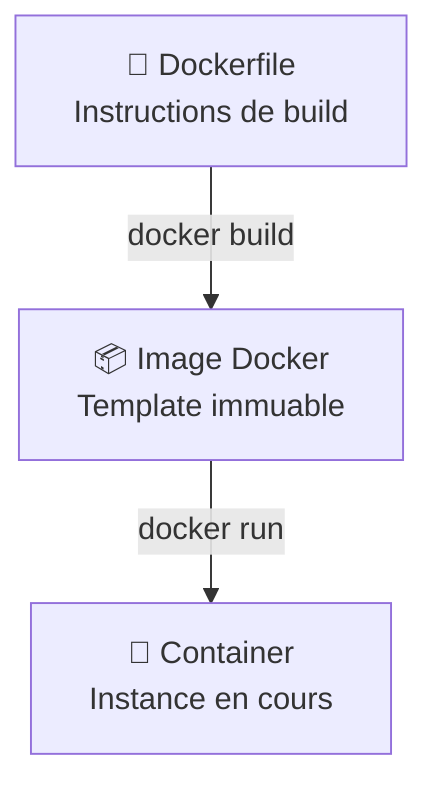

<a name="dockerfile" id="dockerfile"></a>

# Dockerfile & Images Docker

---

# Dockerfile & Images Docker 🏗️

### Créer vos propres images personnalisées

Un **Dockerfile** est un fichier de recette qui automatise la création d'images Docker. Maîtrisons la création d'images optimisées pour la production.

---

# Relation Image ↔ Container 🔄



---

# Dockerfile moderne - Structure type 📝

```dockerfile
# 1. Image de base optimisée
FROM node:20-alpine

# 2. Métadonnées
LABEL maintainer="dev@myapp.com" version="1.0.0"

# 3. Variables d'environnement
ENV NODE_ENV=production \
    PORT=3000

# 4. Répertoire de travail
WORKDIR /app

# 5. Dépendances (ordre optimal pour le cache)
COPY package*.json ./
RUN npm ci --only=production && npm cache clean --force

# 6. Code source
COPY . .

# 7. Sécurité : utilisateur non-root
RUN addgroup -S appgroup && adduser -S appuser -G appgroup
USER appuser

# 8. Configuration
EXPOSE 3000
HEALTHCHECK --interval=30s CMD curl -f http://localhost:3000/health || exit 1

# 9. Démarrage
CMD ["npm", "start"]
```

---

# Instructions essentielles 🔧

### FROM - Images de base recommandées 2025

```dockerfile
FROM node:20-alpine          # Node.js optimisé
FROM python:3.12-slim        # Python production-ready
FROM openjdk:21-jre-slim     # Java moderne
FROM nginx:1.25-alpine       # Serveur web performant
FROM postgres:16-alpine      # Base de données légère
```

**Évitez** `ubuntu:latest` - préférez des images spécialisées et taguées !

---

# COPY vs ADD - Bonnes pratiques 📁

### COPY (recommandé dans 95% des cas)

```dockerfile
# ✅ Ordre optimal pour le cache Docker
COPY package*.json ./        # Dépendances d'abord
RUN npm install
COPY . .                     # Code source après

# ✅ Copie avec permissions
COPY --chown=appuser:appgroup . .
```

### ADD (cas spéciaux uniquement)

```dockerfile
# Pour extraire des archives automatiquement
ADD release.tar.gz /app/
```

---

# RUN - Optimisation des couches ⚡

### Mauvais exemple ❌

```dockerfile
RUN apt-get update
RUN apt-get install -y curl
RUN apt-get install -y git
RUN rm -rf /var/lib/apt/lists/*
```

### Bon exemple ✅

```dockerfile
RUN apt-get update && \
    apt-get install -y curl git && \
    rm -rf /var/lib/apt/lists/* && \
    apt-get clean
```

**Une seule couche = image plus légère !**

---

# ENV et ARG - Configuration 🔧

```dockerfile
# ARG : Variables de build uniquement
ARG BUILD_VERSION=1.0.0
ARG NODE_ENV=production

# ENV : Variables disponibles au runtime
ENV VERSION=$BUILD_VERSION \
    NODE_ENV=$NODE_ENV \
    PORT=3000 \
    DATABASE_URL=""

# Configuration multi-environnements
ENV TZ=Europe/Paris \
    LANG=en_US.UTF-8
```

---

# Sécurité avec USER 🔒

### Toujours utiliser un utilisateur non-root

```dockerfile
# Alpine Linux
RUN addgroup -S appgroup && adduser -S appuser -G appgroup
USER appuser

# Debian/Ubuntu
RUN groupadd -r appuser && useradd -r -g appuser appuser
USER appuser
```

**Jamais de `USER root` en production !**

---

# CMD vs ENTRYPOINT 🚀

### CMD - Peut être surchargé

```dockerfile
CMD ["npm", "start"]              # Défaut
CMD ["python", "app.py"]          # Surchargeable avec docker run
```

### ENTRYPOINT - Point d'entrée fixe

```dockerfile
ENTRYPOINT ["./docker-entrypoint.sh"]
CMD ["--help"]                    # Arguments par défaut

# Ou combinaison
ENTRYPOINT ["java", "-jar", "app.jar"]
CMD ["--spring.profiles.active=prod"]
```

---

# Multi-stage builds 🏭

### Optimisation drastique : de 1GB à 200MB

```dockerfile
# Stage 1: Build (image lourde avec outils)
FROM node:20-alpine AS builder
WORKDIR /app
COPY package*.json ./
RUN npm install
COPY . .
RUN npm run build && npm prune --production

# Stage 2: Production (image minimale)
FROM node:20-alpine AS production
WORKDIR /app

# Copie sélective depuis le stage précédent
COPY --from=builder /app/dist ./dist
COPY --from=builder /app/node_modules ./node_modules
COPY --from=builder /app/package.json ./

RUN addgroup -S appgroup && adduser -S appuser -G appgroup
USER appuser

EXPOSE 3000
CMD ["node", "dist/server.js"]
```

---

# HEALTHCHECK - Monitoring intégré 🩺

```dockerfile
# HTTP healthcheck
HEALTHCHECK --interval=30s --timeout=10s --start-period=5s --retries=3 \
    CMD curl -f http://localhost:3000/health || exit 1

# Avec wget (si curl indisponible)
HEALTHCHECK --interval=30s --timeout=10s --retries=3 \
    CMD wget --no-verbose --tries=1 --spider http://localhost:8080/ping || exit 1
```

**Les containers avec healthcheck redémarrent automatiquement !**

---

# Dockerfile optimal - Template 2025 ✅

```dockerfile
FROM node:20-alpine

LABEL maintainer="dev@example.com" \
      version="1.0.0" \
      description="Production-ready Node.js app"

ENV NODE_ENV=production \
    PORT=3000 \
    LOG_LEVEL=info

WORKDIR /app

# Optimisation cache : dépendances d'abord
COPY package*.json ./
RUN npm ci --only=production && \
    npm cache clean --force

COPY . .

# Sécurité obligatoire
RUN addgroup -S appgroup && adduser -S appuser -G appgroup
USER appuser

# Monitoring intégré
HEALTHCHECK --interval=30s --timeout=3s \
    CMD curl -f http://localhost:3000/health || exit 1

EXPOSE 3000
CMD ["npm", "start"]
```

---

# Construction et analyse 🔧

### Commandes de build avancées

```bash
# Build optimisé avec cache
docker build --no-cache -t mon-app:latest .

# Build avec arguments
docker build --build-arg NODE_ENV=production -t mon-app:prod .

# Multi-plateforme (ARM + x86)
docker buildx build --platform linux/amd64,linux/arm64 -t mon-app:multi .

# Analyse des couches
docker history mon-app:latest

# Inspection complète
docker inspect mon-app:latest
```

---

# .dockerignore - Performance ⚡

### Exclure les fichiers inutiles

```bash
# .dockerignore
node_modules
npm-debug.log
.git
.gitignore
README.md
.env
.nyc_output
coverage
.vscode
*.log
```

**Un .dockerignore optimal = builds plus rapides !**

---

# Erreurs courantes à éviter ❌

### Anti-patterns

```dockerfile
# ❌ Image sans version
FROM ubuntu:latest

# ❌ Installation inutile
RUN apt-get update && apt-get install -y vim nano

# ❌ Copie inefficace
COPY . .
RUN npm install

# ❌ Pas de nettoyage
RUN apt-get install -y curl
# (laisse les caches)

# ❌ Reste en root
# USER root
```

---

# Bonnes pratiques résumées 📋

### Checklist pour un Dockerfile professionnel

✅ **Image de base** : Alpine, slim, ou spécialisée avec version  
✅ **Ordre des COPY** : Dépendances avant code source  
✅ **RUN optimisé** : Une seule couche avec nettoyage  
✅ **USER non-root** : Sécurité obligatoire  
✅ **HEALTHCHECK** : Monitoring automatique  
✅ **.dockerignore** : Exclusions optimisées  
✅ **Multi-stage** : Images de production minimales  

---

# Exemples par stack technique 💻

### Python Flask

```dockerfile
FROM python:3.12-slim
WORKDIR /app
COPY requirements.txt .
RUN pip install --no-cache-dir -r requirements.txt
COPY . .
RUN adduser --disabled-password appuser
USER appuser
EXPOSE 5000
CMD ["python", "app.py"]
```

### Java Spring Boot

```dockerfile
FROM openjdk:21-jre-slim
WORKDIR /app
COPY target/*.jar app.jar
RUN addgroup --system spring && adduser --system --group spring
USER spring
EXPOSE 8080
ENTRYPOINT ["java", "-jar", "app.jar"]