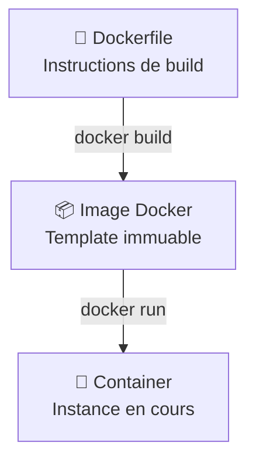

<a name="dockerfile" id="dockerfile"></a>

# Dockerfile & Images Docker

---

# Dockerfile & Images Docker 🏗️

### Créer vos propres images personnalisées

Un **Dockerfile** est un fichier de recette qui automatise la création d'images Docker. Maîtrisons la création d'images optimisées pour la production.

---

# Qu'est-ce qu'un Dockerfile ? 📄

### La recette de cuisine pour votre application

Un **Dockerfile** est un fichier texte contenant des instructions :

- 📝 **Recette** : Liste d'étapes pour construire votre application
- 🔧 **Instructions** : Commandes automatisées (installer, copier, configurer...)
- 🏗️ **Reproductible** : Même résultat sur n'importe quel serveur
- 📦 **Packager** : Transforme votre code en image Docker prête à l'emploi

**Analogie** : C'est comme une recette de cuisine détaillée que n'importe qui peut suivre pour obtenir le même plat !

---

# Qu'est-ce qu'une Image Docker ? 📦

> A vrai dire nous l'avons déjà vu , mais petit rappel :

<br/>

### Le modèle prêt à utiliser

Une **Image Docker** est un template immuable :

- 🎯 **Template** : Modèle figé de votre application
- 📚 **Couches** : Empilage d'instructions du Dockerfile
- 💾 **Stockage** : Sauvegardée et réutilisable
- 🚀 **Base** : Sert à créer des containers

**Analogie** : C'est comme un moule à gâteau - une fois créé, vous pouvez faire autant de gâteaux identiques que vous voulez !

---

# Relation Image ↔ Container 🔄



---

# Qu'est-ce qu'une Couche (Layer) ? 🥞

### L'empilement intelligent

Chaque instruction Dockerfile crée une **couche** :

- 🥞 **Empilement** : Chaque RUN, COPY, ADD = une nouvelle couche
- 💾 **Cache** : Les couches non modifiées sont réutilisées
- ⚡ **Performance** : Builds plus rapides grâce au cache
- 📏 **Taille** : Moins de couches = image plus légère

**Analogie** : C'est comme un mille-feuille - chaque instruction ajoute une couche, et on peut réutiliser les couches du bas !

---

# Dockerfile moderne - Structure type 📝

```dockerfile
# 1. Image de base optimisée
FROM node:20-alpine

# 2. Métadonnées
LABEL maintainer="dev@myapp.com" version="1.0.0"

# 3. Variables d'environnement
ENV NODE_ENV=production \
    PORT=3000

# 4. Répertoire de travail
WORKDIR /app

# 5. Dépendances (ordre optimal pour le cache)
COPY package*.json ./
RUN npm ci --only=production && npm cache clean --force

# 6. Code source
COPY . .

# 7. Sécurité : utilisateur non-root
RUN addgroup -S appgroup && adduser -S appuser -G appgroup
USER appuser

# 8. Configuration
EXPOSE 3000
HEALTHCHECK --interval=30s CMD curl -f http://localhost:3000/health || exit 1

# 9. Démarrage
CMD ["npm", "start"]
```

---

# Pourquoi FROM ? 🏠

### La fondation de votre application

**FROM** définit l'image de base sur laquelle construire :

- 🏠 **Fondation** : Le système d'exploitation de base
- 🧰 **Outils** : Environnement et outils pré-installés
- 🎯 **Spécialisée** : Choisir selon votre technologie
- ⚡ **Optimisée** : Images Alpine = plus légères et sécurisées

**Analogie** : C'est comme choisir un terrain avec ou sans maison dessus pour construire !

---

# Instructions essentielles 🔧

### FROM - Images de base recommandées 2025

```dockerfile
FROM node:20-alpine          # Node.js optimisé
FROM python:3.12-slim        # Python production-ready
FROM openjdk:21-jre-slim     # Java moderne
FROM nginx:1.25-alpine       # Serveur web performant
FROM postgres:16-alpine      # Base de données légère
```

**Évitez** `ubuntu:latest` - préférez des images spécialisées et taguées !

---

# Pourquoi COPY vs ADD ? 📁

### La différence importante

**COPY** et **ADD** transfèrent des fichiers, mais différemment :

- 📋 **COPY** : Simple transfert de fichiers (recommandé)
- 🎁 **ADD** : Transfert + fonctions spéciales (archives, URLs)
- 🎯 **Clarté** : COPY est plus explicite et prévisible
- 🔒 **Sécurité** : COPY évite les surprises

**Analogie** : COPY = photocopieuse simple, ADD = photocopieuse avec scanner et fax intégrés !

---

# COPY vs ADD - Bonnes pratiques 📁

### COPY (recommandé dans 95% des cas)

```dockerfile
# ✅ Ordre optimal pour le cache Docker
COPY package*.json ./        # Dépendances d'abord
RUN npm install
COPY . .                     # Code source après

# ✅ Copie avec permissions
COPY --chown=appuser:appgroup . .
```

### ADD (cas spéciaux uniquement)

```dockerfile
# Pour extraire des archives automatiquement
ADD release.tar.gz /app/
```

---

# Pourquoi optimiser RUN ? ⚡

### L'importance des couches

Chaque **RUN** crée une nouvelle couche :

- 🥞 **Multiplication** : Plus de RUN = plus de couches = image plus lourde
- 💾 **Cache** : Grouper les commandes optimise le cache
- 🧹 **Nettoyage** : Supprimer les fichiers temporaires dans la même couche
- ⚡ **Performance** : Images plus légères = déploiements plus rapides

**Analogie** : C'est comme ranger sa chambre - mieux vaut tout faire d'un coup que laisser traîner !

---

# RUN - Optimisation des couches ⚡

### Mauvais exemple ❌

```dockerfile
RUN apt-get update
RUN apt-get install -y curl
RUN apt-get install -y git
RUN rm -rf /var/lib/apt/lists/*
```

### Bon exemple ✅

```dockerfile
RUN apt-get update && \
    apt-get install -y curl git && \
    rm -rf /var/lib/apt/lists/* && \
    apt-get clean
```

**Une seule couche = image plus légère !**

---

# Pourquoi ENV et ARG ? 🔧

### La configuration flexible

**ENV** et **ARG** permettent la personnalisation :

- 🔧 **ARG** : Variables temporaires pour le build uniquement
- 🌍 **ENV** : Variables persistantes dans le container
- 🎯 **Flexibilité** : Même Dockerfile pour différents environnements
- 🔄 **Réutilisabilité** : Paramétrer sans modifier le code

**Analogie** : ARG = note temporaire pour le cuisinier, ENV = réglage permanent du four !

---

# ENV et ARG - Configuration 🔧

```dockerfile
# ARG : Variables de build uniquement
ARG BUILD_VERSION=1.0.0
ARG NODE_ENV=production

# ENV : Variables disponibles au runtime
ENV VERSION=$BUILD_VERSION \
    NODE_ENV=$NODE_ENV \
    PORT=3000 \
    DATABASE_URL=""

# Configuration multi-environnements
ENV TZ=Europe/Paris \
    LANG=en_US.UTF-8
```

---

# Pourquoi USER non-root ? 🔒

### La sécurité avant tout

Utiliser **USER** pour la sécurité :

- 🔒 **Principe** : Moindre privilège = meilleure sécurité
- 🚫 **Root = Danger** : Accès total au système en cas de faille
- 👤 **Utilisateur limité** : Accès restreint aux ressources
- 🛡️ **Production** : Obligation pour la sécurité en production

**Analogie** : C'est comme donner un badge visiteur au lieu des clés de la maison !

---

# Sécurité avec USER 🔒

### Toujours utiliser un utilisateur non-root

```dockerfile
# Alpine Linux
RUN addgroup -S appgroup && adduser -S appuser -G appgroup
USER appuser

# Debian/Ubuntu
RUN groupadd -r appuser && useradd -r -g appuser appuser
USER appuser
```

**Jamais de `USER root` en production !**

---

# Pourquoi CMD vs ENTRYPOINT ? 🚀

### Les deux façons de démarrer

**CMD** et **ENTRYPOINT** définissent le démarrage :

- 🔄 **CMD** : Commande par défaut, surchargeable facilement
- 🔒 **ENTRYPOINT** : Point d'entrée fixe, plus difficile à modifier
- 🎯 **Flexibilité** : CMD pour des containers polyvalents
- 🛡️ **Sécurité** : ENTRYPOINT pour forcer un comportement

**Analogie** : CMD = suggestion de menu, ENTRYPOINT = plat du jour imposé !

---

# CMD vs ENTRYPOINT 🚀

### CMD - Peut être surchargé

```dockerfile
CMD ["npm", "start"]              # Défaut
CMD ["python", "app.py"]          # Surchargeable avec docker run
```

### ENTRYPOINT - Point d'entrée fixe

```dockerfile
ENTRYPOINT ["./docker-entrypoint.sh"]
CMD ["--help"]                    # Arguments par défaut

# Ou combinaison
ENTRYPOINT ["java", "-jar", "app.jar"]
CMD ["--spring.profiles.active=prod"]
```

---

# Qu'est-ce qu'un Multi-stage Build ? 🏭

### L'art de l'optimisation

Le **multi-stage build** sépare construction et production :

- 🏗️ **Stage Build** : Image lourde avec tous les outils de développement
- 🚀 **Stage Production** : Image légère avec seulement l'application
- 📏 **Taille** : Réduction drastique (de 1GB à 200MB possible)
- 🔒 **Sécurité** : Pas d'outils de build en production

**Analogie** : C'est comme construire dans un atelier et ne livrer que le produit fini !

---

### Multi-stage builds 🏭 - Optimisation drastique : de 1GB à 200MB

```dockerfile
# Stage 1: Build (image lourde avec outils)
FROM node:20-alpine AS builder
WORKDIR /app
COPY package*.json ./
RUN npm install
COPY . .
RUN npm run build && npm prune --production

# Stage 2: Production (image minimale)
FROM node:20-alpine AS production
WORKDIR /app

# Copie sélective depuis le stage précédent
COPY --from=builder /app/dist ./dist
COPY --from=builder /app/node_modules ./node_modules
COPY --from=builder /app/package.json ./

RUN addgroup -S appgroup && adduser -S appuser -G appgroup
USER appuser

EXPOSE 3000
CMD ["node", "dist/server.js"]
```

---

# Pourquoi HEALTHCHECK ? 🩺

### Le monitoring automatique

**HEALTHCHECK** surveille la santé du container :

- 🩺 **Surveillance** : Vérification automatique de l'état
- 🔄 **Auto-repair** : Redémarrage automatique si problème
- 📊 **Monitoring** : Intégration avec les orchestrateurs
- ⚡ **Réactivité** : Détection rapide des pannes

**Analogie** : C'est comme un détecteur de fumée qui appelle automatiquement les pompiers !

---

# HEALTHCHECK - Monitoring intégré 🩺

```dockerfile
# HTTP healthcheck
HEALTHCHECK --interval=30s --timeout=10s --start-period=5s --retries=3 \
    CMD curl -f http://localhost:3000/health || exit 1

# Avec wget (si curl indisponible)
HEALTHCHECK --interval=30s --timeout=10s --retries=3 \
    CMD wget --no-verbose --tries=1 --spider http://localhost:8080/ping || exit 1
```

**Les containers avec healthcheck redémarrent automatiquement !**

---

# Dockerfile optimal - Template 2025 ✅

```dockerfile
FROM node:20-alpine

LABEL maintainer="dev@example.com" \
      version="1.0.0" \
      description="Production-ready Node.js app"

ENV NODE_ENV=production \
    PORT=3000 \
    LOG_LEVEL=info

WORKDIR /app

# Optimisation cache : dépendances d'abord
COPY package*.json ./
RUN npm ci --only=production && \
    npm cache clean --force

COPY . .

# Sécurité obligatoire
RUN addgroup -S appgroup && adduser -S appuser -G appgroup
USER appuser

# Monitoring intégré
HEALTHCHECK --interval=30s --timeout=3s \
    CMD curl -f http://localhost:3000/health || exit 1

EXPOSE 3000
CMD ["npm", "start"]
```

---

# Construction et analyse 🔧

### Commandes de build avancées

```bash
# Build optimisé avec cache
docker build --no-cache -t mon-app:latest .

# Build avec arguments
docker build --build-arg NODE_ENV=production -t mon-app:prod .

# Multi-plateforme (ARM + x86)
docker buildx build --platform linux/amd64,linux/arm64 -t mon-app:multi .

# Analyse des couches
docker history mon-app:latest

# Inspection complète
docker inspect mon-app:latest
```

---

# Qu'est-ce qu'un .dockerignore ? 🚫

### Le filtre intelligent

Le **.dockerignore** exclut les fichiers inutiles :

- 🚫 **Exclusion** : Évite de copier des fichiers non nécessaires
- ⚡ **Performance** : Builds plus rapides
- 📏 **Taille** : Images plus légères
- 🔒 **Sécurité** : Évite de copier des secrets par accident

**Analogie** : C'est comme une liste de ce qu'il ne faut PAS mettre dans sa valise !

---

# .dockerignore - Performance ⚡

### Exclure les fichiers inutiles

```bash
# .dockerignore
node_modules
npm-debug.log
.git
.gitignore
README.md
.env
.nyc_output
coverage
.vscode
*.log
```

**Un .dockerignore optimal = builds plus rapides !**

---

# Erreurs courantes à éviter ❌

### Anti-patterns

```dockerfile
# ❌ Image sans version
FROM ubuntu:latest

# ❌ Installation inutile
RUN apt-get update && apt-get install -y vim nano

# ❌ Copie inefficace
COPY . .
RUN npm install

# ❌ Pas de nettoyage
RUN apt-get install -y curl
# (laisse les caches)

# ❌ Reste en root
# USER root
```

---

# Bonnes pratiques résumées 📋

### Checklist pour un Dockerfile professionnel

✅ **Image de base** : Alpine, slim, ou spécialisée avec version

✅ **Ordre des COPY** : Dépendances avant code source

✅ **RUN optimisé** : Une seule couche avec nettoyage

✅ **USER non-root** : Sécurité obligatoire

✅ **HEALTHCHECK** : Monitoring automatique

✅ **.dockerignore** : Exclusions optimisées

✅ **Multi-stage** : Images de production minimales

---

### Exemples par stack technique 💻 - Python Flask - Multi-stage optimisé

```dockerfile
# Stage 1: Build dependencies avec compilateurs
FROM python:3.12-slim AS builder
WORKDIR /app

# Installation des outils de build
RUN apt-get update && apt-get install -y \
    build-essential \
    gcc \
    && rm -rf /var/lib/apt/lists/*

# Installation des dépendances
COPY requirements.txt .
RUN pip install --user --no-cache-dir -r requirements.txt

# Stage 2: Runtime optimisé
FROM python:3.12-slim
WORKDIR /app

# Copier seulement les packages installés
COPY --from=builder /root/.local /root/.local

# Copier le code source
COPY . .

# Créer utilisateur non-root
RUN adduser --disabled-password --gecos "" appuser
USER appuser

# Variables d'environnement
ENV PATH=/root/.local/bin:$PATH
ENV FLASK_APP=app.py
ENV FLASK_ENV=production

# Monitoring
HEALTHCHECK --interval=30s --timeout=3s \
    CMD curl -f http://localhost:5000/health || exit 1

EXPOSE 5000
CMD ["python", "-m", "flask", "run", "--host=0.0.0.0"]
```

---

### Alternative Flask simple (pour développement)

```dockerfile
FROM python:3.12-slim
WORKDIR /app
COPY requirements.txt .
RUN pip install --no-cache-dir -r requirements.txt
COPY . .
RUN adduser --disabled-password appuser
USER appuser
EXPOSE 5000
HEALTHCHECK --interval=30s --timeout=3s \
    CMD curl -f http://localhost:5000/health || exit 1
CMD ["python", "app.py"]
```

---

# Exemple Java Spring Boot

### Java Spring Boot - Multi-stage build complet

```dockerfile
# Stage 1: Build du JAR avec Maven
FROM maven:3.9-openjdk-21-slim AS build
WORKDIR /app
COPY pom.xml .
COPY src ./src
RUN mvn clean package -DskipTests

# Stage 2: Runtime optimisé
FROM openjdk:21-jre-slim
WORKDIR /app
COPY --from=build /app/target/*.jar app.jar
RUN addgroup --system spring && adduser --system --group spring
USER spring
EXPOSE 8080
HEALTHCHECK --interval=30s --timeout=3s \
    CMD curl -f http://localhost:8080/actuator/health || exit 1
ENTRYPOINT ["java", "-jar", "app.jar"]
```

---

### Alternative avec Gradle

```dockerfile
# Stage 1: Build avec Gradle
FROM gradle:8.5-jdk21-alpine AS build
WORKDIR /app
COPY build.gradle settings.gradle ./
COPY src ./src
RUN gradle build -x test --no-daemon

# Stage 2: Runtime
FROM openjdk:21-jre-slim
WORKDIR /app
COPY --from=build /app/build/libs/*.jar app.jar
RUN addgroup --system spring && adduser --system --group spring
USER spring
EXPOSE 8080
HEALTHCHECK --interval=30s --timeout=3s \
    CMD curl -f http://localhost:8080/actuator/health || exit 1
ENTRYPOINT ["java", "-jar", "app.jar"]