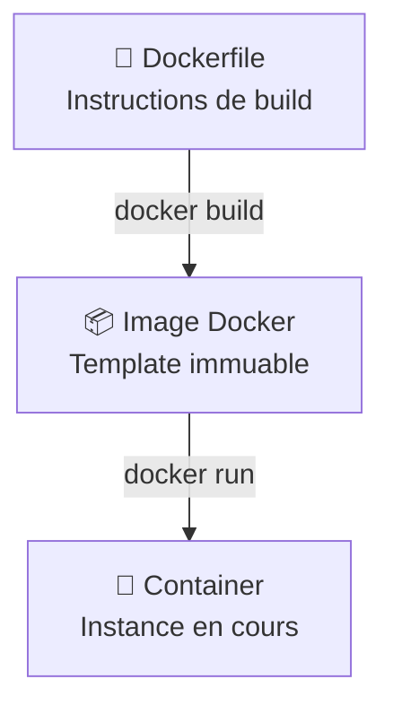

<a name="images-Docker" id="images-Docker"></a>

# Les Images Docker & Dockerfile 🏗️

### Comprendre les images et leur construction

Une **image Docker** est un template en lecture seule qui contient tout ce dont votre application a besoin pour s'exécuter. Le **Dockerfile** est le fichier de recette qui permet de construire ces images de manière automatisée et reproductible.

---

# Relation Image ↔ Container 🔄

### Relation Image ↔ Container



---

# Explication du diagramme 📊

- **Dockerfile** : Les instructions de construction
- **Image** : Le résultat compilé et prêt à l'emploi
- **Container** : L'instance en cours d'exécution

---

# Qu'est-ce qu'un Dockerfile ? 📋

### Définition et utilité

Un **Dockerfile** est un fichier texte qui contient une série d'instructions pour automatiser la création d'une image Docker. Il décrit étape par étape comment construire l'environnement d'exécution de votre application.

---

# Structure type d'un Dockerfile moderne 📝

### Structure type d'un Dockerfile moderne

```dockerfile
# 1. Image de base
FROM node:20-alpine

# 2. Métadonnées
LABEL maintainer="dev@monapp.com"
LABEL version="1.0.0"

# 3. Répertoire de travail
WORKDIR /app
```

---

# Structure Dockerfile - Suite 📝

```dockerfile
# 4. Copie des dépendances
COPY package*.json ./

# 5. Installation des dépendances
RUN npm ci --only=production

# 6. Copie du code source
COPY . .
```

---

# Structure Dockerfile - Finalisation 📝

```dockerfile
# 7. Configuration utilisateur
RUN addgroup -S appgroup && adduser -S appuser -G appgroup
USER appuser

# 8. Exposition des ports
EXPOSE 3000

# 9. Commande de démarrage
CMD ["npm", "start"]
```

---

# Instructions fondamentales 🔧

### FROM - L'image de base

L'instruction **FROM** définit l'image de base à partir de laquelle votre image sera construite. Elle doit toujours être la première instruction.

---

# FROM - Exemples d'images 🔧

```dockerfile
# Images officielles recommandées
FROM node:20-alpine          # Node.js sur Alpine Linux (léger)
FROM python:3.11-slim        # Python optimisé
FROM openjdk:17-jre-slim     # Java Runtime Environment
FROM nginx:alpine            # Serveur web Nginx
FROM ubuntu:22.04            # Ubuntu LTS pour cas spéciaux
```

---

# WORKDIR - Répertoire de travail 📁

### WORKDIR - Répertoire de travail

Définit le répertoire de travail pour toutes les instructions suivantes. Crée le répertoire s'il n'existe pas.

---

# WORKDIR - Exemples 📁

```dockerfile
WORKDIR /app                 # Standard pour applications
WORKDIR /usr/src/app         # Convention Node.js
WORKDIR /opt/myapp           # Applications custom
```

---

# Gestion des fichiers 📁

### COPY vs ADD - Différences importantes

**COPY** (recommandé dans la plupart des cas) :

---

# COPY - Exemples pratiques 📁

```dockerfile
COPY package*.json ./        # Copie fichiers package
COPY src/ ./src/             # Copie répertoire source
COPY --chown=appuser:appgroup . .  # Copie avec permissions
```

---

# ADD - Cas spéciaux 📁

**ADD** (pour cas spéciaux) :

```dockerfile
ADD archive.tar.gz /app/     # Extrait automatiquement les archives
ADD https://example.com/file.txt /app/  # Télécharge depuis URL
```

---

# Bonnes pratiques de copie ✅

### Bonnes pratiques de copie

```dockerfile
# ✅ Bon : Copier d'abord les dépendances pour optimiser le cache
COPY package*.json ./
RUN npm install

# ✅ Ensuite copier le code source
COPY . .
```

---

# Mauvaises pratiques de copie ❌

```dockerfile
# ❌ Éviter : Copier tout en une fois
# COPY . .
# RUN npm install
```

---

# Exécution de commandes 🚀

### RUN - Commandes de build

L'instruction **RUN** exécute des commandes pendant la construction de l'image. Chaque RUN crée une nouvelle couche.

---

# RUN - Mauvais exemple ❌

```dockerfile
# ❌ Mauvais : Plusieurs couches
RUN apt-get update
RUN apt-get install -y curl
RUN apt-get install -y git
RUN rm -rf /var/lib/apt/lists/*
```

---

# RUN - Bon exemple ✅

```dockerfile
# ✅ Bon : Une seule couche optimisée
RUN apt-get update && \
    apt-get install -y curl git && \
    rm -rf /var/lib/apt/lists/* && \
    apt-get clean
```

---

# Optimisation des commandes RUN 🔧

### Optimisation des commandes RUN

```dockerfile
# Installation Python avec nettoyage
RUN pip install --no-cache-dir -r requirements.txt && \
    pip cache purge
```

---

# Optimisation RUN - Node.js 🔧

```dockerfile
# Installation Node.js avec cache clean
RUN npm ci --only=production && \
    npm cache clean --force
```

---

# Optimisation RUN - Go 🔧

```dockerfile
# Compilation Go avec suppression des sources
RUN go build -o app . && \
    rm -rf /go/src/*
```

---

# Configuration et sécurité 🔒

### ENV - Variables d'environnement

```dockerfile
# Variables de production
ENV NODE_ENV=production
ENV PORT=3000
ENV DATABASE_URL=""
```

---

# ENV - Variables avec ARG 🔒

```dockerfile
# Variables de build avec ARG
ARG BUILD_VERSION
ENV VERSION=$BUILD_VERSION
```

---

# ENV - Configuration multi-lignes 🔒

```dockerfile
# Configuration multi-lignes
ENV TZ=Europe/Paris \
    LANG=fr_FR.UTF-8 \
    DEBIAN_FRONTEND=noninteractive
```

---

# USER - Sécurité avec utilisateur non-root 🔒

### USER - Sécurité avec utilisateur non-root

```dockerfile
# ✅ Créer un utilisateur non-root (Alpine)
RUN addgroup -S appgroup && adduser -S appuser -G appgroup
USER appuser
```

---

# USER - Debian/Ubuntu 🔒

```dockerfile
# ✅ Créer un utilisateur non-root (Debian/Ubuntu)
RUN groupadd -r appuser && useradd -r -g appuser appuser
USER appuser
```

---

# USER - Éviter le root ❌

```dockerfile
# ❌ Éviter de rester en root
# USER root  # Risque de sécurité !
```

---

# Exposition et démarrage 🌐

### EXPOSE - Documentation des ports

```dockerfile
# Exposition de ports standard
EXPOSE 3000              # Application Node.js
EXPOSE 8080              # Application Java
EXPOSE 80 443           # Serveur web HTTP/HTTPS
```

---

# EXPOSE - Protocoles spéciaux 🌐

```dockerfile
# Exposition avec protocole
EXPOSE 53/udp           # DNS
EXPOSE 3000/tcp         # HTTP (par défaut)
```

---

# CMD vs ENTRYPOINT 🌐

### CMD vs ENTRYPOINT - Commandes de démarrage

**CMD** (peut être surchargé) :

```dockerfile
CMD ["npm", "start"]              # Format tableau (recommandé)
CMD ["python", "app.py"]          # Application Python
CMD ["java", "-jar", "app.jar"]   # Application Java
```

---

# ENTRYPOINT - Point d'entrée fixe 🌐

**ENTRYPOINT** (point d'entrée fixe) :

```dockerfile
ENTRYPOINT ["./docker-entrypoint.sh"]
CMD ["--help"]                    # Arguments par défaut
```

---

# ENTRYPOINT + CMD 🌐

```dockerfile
# Combinaison ENTRYPOINT + CMD
ENTRYPOINT ["java", "-jar", "app.jar"]
CMD ["--spring.profiles.active=prod"]
```

---

# Multi-stage builds avancés 🏭

### Principe et avantages

Les **multi-stage builds** permettent d'optimiser la taille des images en séparant les phases de build et de runtime.

---

# Exemple multi-stage Node.js - Stage 1 🏗️

### Exemple multi-stage Node.js

```dockerfile
# Stage 1: Build (image lourde avec outils de dev)
FROM node:20-alpine AS builder
WORKDIR /app
COPY package*.json ./
RUN npm install
COPY . .
RUN npm run build
RUN npm prune --production
```

---

# Exemple multi-stage Node.js - Stage 2 🏗️

### Suite multi-stage Node.js

```dockerfile
# Stage 2: Production (image légère)
FROM node:20-alpine AS production
WORKDIR /app

# Copier seulement les fichiers nécessaires du stage précédent
COPY --from=builder /app/dist ./dist
COPY --from=builder /app/node_modules ./node_modules
COPY --from=builder /app/package.json ./
```

---

# Multi-stage Node.js - Configuration finale 🏗️

```dockerfile
# Configuration production
RUN addgroup -S appgroup && adduser -S appuser -G appgroup
USER appuser

EXPOSE 3000
CMD ["node", "dist/server.js"]
```

---

# Exemple Go ultra-optimisé 🔥

### De 800MB à 15MB !

```dockerfile
# Stage 1: Build
FROM golang:1.21-alpine AS builder
WORKDIR /app

# Installation des dépendances SSL pour les requêtes HTTPS
RUN apk --no-cache add ca-certificates
```

---

# Go ultra-optimisé - Build 🔥

```dockerfile
# Copie et build
COPY . .
RUN CGO_ENABLED=0 GOOS=linux go build -a -installsuffix cgo -o main .
```

---

# Go ultra-optimisé - Runtime minimal 🔥

```dockerfile
# Stage 2: Runtime minimal
FROM scratch

# Copier les certificats SSL
COPY --from=builder /etc/ssl/certs/ca-certificates.crt /etc/ssl/certs/

# Copier seulement l'exécutable
COPY --from=builder /app/main /main
```

---

# Go ultra-optimisé - Configuration finale 🔥

```dockerfile
# Exposer le port
EXPOSE 8080

# Point d'entrée
ENTRYPOINT ["/main"]
```

---

# Résultat de l'optimisation Go 🎯

### Résultat de l'optimisation Go

**Résultat** : Image finale de seulement ~15MB au lieu des 800MB+ de l'image Go complète !

---

# Dockerfile Python optimisé 🐍

### Bonnes pratiques pour Python

```dockerfile
# Image de base slim
FROM python:3.11-slim

# Métadonnées
LABEL maintainer="team@myapp.com"
LABEL description="Application Python optimisée"
```

---

# Python - Variables d'environnement 🐍

```dockerfile
# Variables d'environnement Python
ENV PYTHONUNBUFFERED=1 \
    PYTHONDONTWRITEBYTECODE=1 \
    PIP_NO_CACHE_DIR=1 \
    PIP_DISABLE_PIP_VERSION_CHECK=1
```

---

# Python - Dépendances système 🐍

```dockerfile
# Installation des dépendances système
RUN apt-get update && \
    apt-get install -y --no-install-recommends \
        build-essential \
        && rm -rf /var/lib/apt/lists/*
```

---

# Python - Installation dépendances 🐍

```dockerfile
# Répertoire de travail
WORKDIR /app

# Installation des dépendances Python
COPY requirements.txt .
RUN pip install --no-cache-dir -r requirements.txt
```

---

# Python - Finalisation 🐍

```dockerfile
# Copie de l'application
COPY . .

# Utilisateur non-root
RUN useradd -m -u 1000 appuser && chown -R appuser:appuser /app
USER appuser
```

---

# Python - Configuration finale 🐍

```dockerfile
# Configuration
EXPOSE 8000
HEALTHCHECK --interval=30s --timeout=3s --start-period=5s --retries=3 \
    CMD curl -f http://localhost:8000/health || exit 1

CMD ["python", "app.py"]
```

---

# HEALTHCHECK et monitoring 🩺

### Vérification de l'état des containers

```dockerfile
# Healthcheck HTTP simple
HEALTHCHECK --interval=30s --timeout=10s --start-period=5s --retries=3 \
    CMD curl -f http://localhost:3000/health || exit 1
```

---

# HEALTHCHECK avec wget 🩺

```dockerfile
# Healthcheck avec wget (si curl n'est pas disponible)
HEALTHCHECK --interval=30s --timeout=10s --retries=3 \
    CMD wget --no-verbose --tries=1 --spider http://localhost:8080/ping || exit 1
```

---

# Script healthcheck personnalisé 🩺

### Script healthcheck personnalisé

```dockerfile
# Healthcheck custom script
COPY healthcheck.sh /usr/local/bin/
RUN chmod +x /usr/local/bin/healthcheck.sh
HEALTHCHECK --interval=30s --timeout=10s --retries=3 \
    CMD /usr/local/bin/healthcheck.sh
```

---

# Contenu du script healthcheck.sh 📝

### Contenu du script healthcheck.sh

```bash
#!/bin/sh
# Vérifier que l'application répond
response=$(curl -s -o /dev/null -w "%{http_code}" http://localhost:3000/health)
if [ $response -eq 200 ]; then
    exit 0
else
    exit 1
fi
```

---

# Les erreurs à éviter ❌

### Anti-patterns courants

```dockerfile
# ❌ Image de base trop lourde
FROM ubuntu:latest

# ❌ Pas de version spécifique (instabilité)
FROM node:latest

# ❌ Instructions obsolètes
MAINTAINER "dev@example.com"  # Utiliser LABEL
```

---

# Autres erreurs courantes ❌

```dockerfile
# ❌ Multiples RUN inutiles
RUN apt-get update
RUN apt-get install -y curl
RUN apt-get install -y git
```

---

# Erreurs de workflow ❌

```dockerfile
# ❌ Copie avant installation des dépendances
COPY . .
RUN npm install

# ❌ Rester en root
USER root

# ❌ Exposition de ports inutiles
EXPOSE 22 3306 5432
```

---

# Erreur de CMD ❌

```dockerfile
# ❌ CMD qui ne démarre pas l'application
CMD ["echo", "Hello World"]
```

---

# Les bonnes pratiques ✅

### Checklist pour un Dockerfile optimal

```dockerfile
# ✅ Image de base légère et versionnée
FROM node:20-alpine

# ✅ Métadonnées modernes
LABEL maintainer="dev@example.com" \
      version="1.0.0" \
      description="Mon application Node.js"
```

---

# Bonnes pratiques - Variables ✅

```dockerfile
# ✅ Variables d'environnement regroupées
ENV NODE_ENV=production \
    PORT=3000 \
    LOG_LEVEL=info
```

---

# Bonnes pratiques - Workflow ✅

```dockerfile
# ✅ Répertoire de travail défini
WORKDIR /app

# ✅ Installation des dépendances en premier (cache optimisé)
COPY package*.json ./
RUN npm ci --only=production && \
    npm cache clean --force

# ✅ Copie du code après les dépendances
COPY . .
```

---

# Bonnes pratiques - Sécurité ✅

```dockerfile
# ✅ Utilisateur non-root pour la sécurité
RUN addgroup -S appgroup && adduser -S appuser -G appgroup
USER appuser

# ✅ Healthcheck pour le monitoring
HEALTHCHECK --interval=30s --timeout=3s \
    CMD curl -f http://localhost:3000/health || exit 1
```

---

# Bonnes pratiques - Finalisation ✅

```dockerfile
# ✅ Port applicatif seulement
EXPOSE 3000

# ✅ Commande de démarrage appropriée
CMD ["npm", "start"]
```

---

# Construction et optimisation 🔧

### Commandes de build essentielles

```bash
# Build simple
docker build -t mon-app:1.0 .

# Build avec arguments
docker build --build-arg NODE_ENV=production -t mon-app:prod .
```

---

# Build multi-plateforme 🔧

```bash
# Build multi-plateforme (ARM + x86)
docker buildx build --platform linux/amd64,linux/arm64 -t mon-app:multi .
```

---

# Commandes avancées de build 🔧

### Commandes avancées de build

```bash
# Build avec cache externe
docker build --cache-from mon-app:cache -t mon-app:latest .
```

---

# Analyse des images 🔧

```bash
# Analyse de l'historique des couches
docker history mon-app:latest

# Inspection détaillée de l'image
docker inspect mon-app:latest
```

---

# Exercice pratique : Application complète 🎯

### Mission : Dockeriser une app Node.js/React

**Objectif** : Créer un Dockerfile multi-stage pour une application full-stack

---

# Structure du projet 🎯

**Structure du projet** :
```
my-app/
├── frontend/          # Application React
│   ├── package.json
│   └── src/
├── backend/           # API Node.js
│   ├── package.json
│   └── src/
└── Dockerfile
```

---

# Contraintes techniques 🎯

**Contraintes** :
- Image finale < 100MB
- Utilisateur non-root
- Healthcheck intégré
- Variables d'environnement configurables
- Support multi-architecture

---

# Bonus de l'exercice 🎯

**Bonus** :
- Intégration d'un reverse proxy Nginx
- Gestion des logs structurés
- Optimisation pour Kubernetes