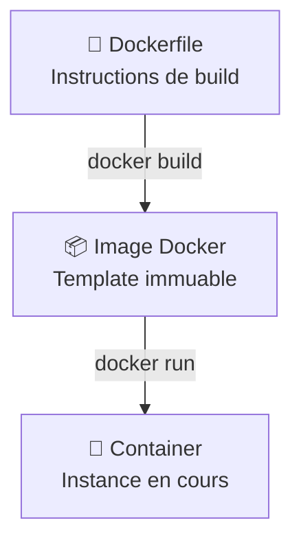

# Les Images Docker & Dockerfile

---
routeAlias: 'images-Docker'
---

<a name="images-Docker" id="images-Docker"></a>

# Les Images Docker & Dockerfile 🏗️

### Comprendre les images et leur construction

Une **image Docker** est un template en lecture seule qui contient tout ce dont votre application a besoin pour s'exécuter. Le **Dockerfile** est le fichier de recette qui permet de construire ces images de manière automatisée et reproductible.

---

# Relation Image ↔ Container 🔄

### Relation Image ↔ Container



---

# Explication du diagramme 📊

- **Dockerfile** : Les instructions de construction
- **Image** : Le résultat compilé et prêt à l'emploi
- **Container** : L'instance en cours d'exécution

---

# Qu'est-ce qu'un Dockerfile ? 📋

### Définition et utilité

Un **Dockerfile** est un fichier texte qui contient une série d'instructions pour automatiser la création d'une image Docker. Il décrit étape par étape comment construire l'environnement d'exécution de votre application.

---

# Structure type d'un Dockerfile moderne 📝

### Structure type d'un Dockerfile moderne

```dockerfile
# 1. Image de base
FROM node:20-alpine

# 2. Métadonnées
LABEL maintainer="dev@monapp.com"
LABEL version="1.0.0"

# 3. Répertoire de travail
WORKDIR /app
```

---

# Structure Dockerfile - Suite 📝

```dockerfile
# 4. Copie des dépendances
COPY package*.json ./

# 5. Installation des dépendances
RUN npm ci --only=production

# 6. Copie du code source
COPY . .
```

---

# Structure Dockerfile - Finalisation 📝

```dockerfile
# 7. Configuration utilisateur
RUN addgroup -S appgroup && adduser -S appuser -G appgroup
USER appuser

# 8. Exposition des ports
EXPOSE 3000

# 9. Commande de démarrage
CMD ["npm", "start"]
```

---

# Instructions fondamentales 🔧

### FROM - L'image de base

L'instruction **FROM** définit l'image de base à partir de laquelle votre image sera construite. Elle doit toujours être la première instruction.

---

# FROM - Exemples d'images 🔧

```dockerfile
# Images officielles recommandées
FROM node:20-alpine          # Node.js sur Alpine Linux (léger)
FROM python:3.11-slim        # Python optimisé
FROM openjdk:17-jre-slim     # Java Runtime Environment
FROM nginx:alpine            # Serveur web Nginx
FROM ubuntu:22.04            # Ubuntu LTS pour cas spéciaux
```

---

# WORKDIR - Répertoire de travail 📁

### WORKDIR - Répertoire de travail

Définit le répertoire de travail pour toutes les instructions suivantes. Crée le répertoire s'il n'existe pas.

---

# WORKDIR - Exemples 📁

```dockerfile
WORKDIR /app                 # Standard pour applications
WORKDIR /usr/src/app         # Convention Node.js
WORKDIR /opt/myapp           # Applications custom
```

---

# Gestion des fichiers 📁

### COPY vs ADD - Différences importantes

**COPY** (recommandé dans la plupart des cas) :

---

# COPY - Exemples pratiques 📁

```dockerfile
COPY package*.json ./        # Copie fichiers package
COPY src/ ./src/             # Copie répertoire source
COPY --chown=appuser:appgroup . .  # Copie avec permissions
```

---

# ADD - Cas spéciaux 📁

**ADD** (pour cas spéciaux) :

```dockerfile
ADD archive.tar.gz /app/     # Extrait automatiquement les archives
ADD https://example.com/file.txt /app/  # Télécharge depuis URL
```

---

# Bonnes pratiques de copie ✅

### Bonnes pratiques de copie

```dockerfile
# ✅ Bon : Copier d'abord les dépendances pour optimiser le cache
COPY package*.json ./
RUN npm install

# ✅ Ensuite copier le code source
COPY . .
```

---

# Mauvaises pratiques de copie ❌

```dockerfile
# ❌ Éviter : Copier tout en une fois
# COPY . .
# RUN npm install
```

---

# Exécution de commandes 🚀

### RUN - Commandes de build

L'instruction **RUN** exécute des commandes pendant la construction de l'image. Chaque RUN crée une nouvelle couche.

---

# RUN - Mauvais exemple ❌

```dockerfile
# ❌ Mauvais : Plusieurs couches
RUN apt-get update
RUN apt-get install -y curl
RUN apt-get install -y git
RUN rm -rf /var/lib/apt/lists/*
```

---

# RUN - Bon exemple ✅

```dockerfile
# ✅ Bon : Une seule couche optimisée
RUN apt-get update && \
    apt-get install -y curl git && \
    rm -rf /var/lib/apt/lists/* && \
    apt-get clean
```

---

# Configuration et sécurité 🔒

### ENV - Variables d'environnement

```dockerfile
# Variables de production
ENV NODE_ENV=production
ENV PORT=3000
ENV DATABASE_URL=""
```

---

# ENV - Variables avec ARG 🔒

```dockerfile
# Variables de build avec ARG
ARG BUILD_VERSION
ENV VERSION=$BUILD_VERSION
```

---

# ENV - Configuration multi-lignes 🔒

```dockerfile
# Configuration multi-lignes
ENV TZ=Europe/Paris \
    LANG=fr_FR.UTF-8 \
    DEBIAN_FRONTEND=noninteractive
```

---

# USER - Sécurité avec utilisateur non-root 🔒

### USER - Sécurité avec utilisateur non-root

```dockerfile
# ✅ Créer un utilisateur non-root (Alpine)
RUN addgroup -S appgroup && adduser -S appuser -G appgroup
USER appuser
```

---

# USER - Debian/Ubuntu 🔒

```dockerfile
# ✅ Créer un utilisateur non-root (Debian/Ubuntu)
RUN groupadd -r appuser && useradd -r -g appuser appuser
USER appuser
```

---

# USER - Éviter le root ❌

```dockerfile
# ❌ Éviter de rester en root
# USER root  # Risque de sécurité !
```

---

# Exposition et démarrage 🌐

### EXPOSE - Documentation des ports

```dockerfile
# Exposition de ports standard
EXPOSE 3000              # Application Node.js
EXPOSE 8080              # Application Java
EXPOSE 80 443           # Serveur web HTTP/HTTPS
```

---

# EXPOSE - Protocoles spéciaux 🌐

```dockerfile
# Exposition avec protocole
EXPOSE 53/udp           # DNS
EXPOSE 3000/tcp         # HTTP (par défaut)
```

---

# CMD vs ENTRYPOINT 🌐

### CMD vs ENTRYPOINT - Commandes de démarrage

**CMD** (peut être surchargé) :

```dockerfile
CMD ["npm", "start"]              # Format tableau (recommandé)
CMD ["python", "app.py"]          # Application Python
CMD ["java", "-jar", "app.jar"]   # Application Java
```

---

# ENTRYPOINT - Point d'entrée fixe 🌐

**ENTRYPOINT** (point d'entrée fixe) :

```dockerfile
ENTRYPOINT ["./docker-entrypoint.sh"]
CMD ["--help"]                    # Arguments par défaut
```

---

# ENTRYPOINT + CMD 🌐

```dockerfile
# Combinaison ENTRYPOINT + CMD
ENTRYPOINT ["java", "-jar", "app.jar"]
CMD ["--spring.profiles.active=prod"]
```

---

# Multi-stage builds avancés 🏭

### Principe et avantages

Les **multi-stage builds** permettent d'optimiser la taille des images en séparant les phases de build et de runtime.

---

# Exemple multi-stage Node.js 🏗️

### De 1GB à 200MB !

```dockerfile
# Stage 1: Build (image lourde avec outils de dev)
FROM node:20-alpine AS builder
WORKDIR /app
COPY package*.json ./
RUN npm install
COPY . .
RUN npm run build
RUN npm prune --production

# Stage 2: Production (image légère)
FROM node:20-alpine AS production
WORKDIR /app

# Copier seulement les fichiers nécessaires du stage précédent
COPY --from=builder /app/dist ./dist
COPY --from=builder /app/node_modules ./node_modules
COPY --from=builder /app/package.json ./

# Configuration production
RUN addgroup -S appgroup && adduser -S appuser -G appgroup
USER appuser

EXPOSE 3000
CMD ["node", "dist/server.js"]
```

---

# HEALTHCHECK et monitoring 🩺

### Vérification de l'état des containers

```dockerfile
# Healthcheck HTTP simple
HEALTHCHECK --interval=30s --timeout=10s --start-period=5s --retries=3 \
    CMD curl -f http://localhost:3000/health || exit 1

# Healthcheck avec wget (si curl n'est pas disponible)
HEALTHCHECK --interval=30s --timeout=10s --retries=3 \
    CMD wget --no-verbose --tries=1 --spider http://localhost:8080/ping || exit 1
```

---

# Les erreurs à éviter ❌

### Anti-patterns courants

```dockerfile
# ❌ Image de base trop lourde ou sans version
FROM ubuntu:latest

# ❌ Multiples RUN inutiles (chaque RUN = une layer)
RUN apt-get update
RUN apt-get install -y curl
RUN apt-get install -y git

# ❌ Copie avant installation des dépendances (cache inefficace)
COPY . .
RUN npm install

# ❌ Rester en root (sécurité)
USER root
```

---

# Les bonnes pratiques ✅

### Checklist pour un Dockerfile optimal

```dockerfile
# ✅ Image de base légère et versionnée
FROM node:20-alpine

# ✅ Métadonnées modernes
LABEL maintainer="dev@example.com" \
      version="1.0.0" \
      description="Mon application Node.js"

# ✅ Variables d'environnement regroupées
ENV NODE_ENV=production \
    PORT=3000 \
    LOG_LEVEL=info

# ✅ Répertoire de travail défini
WORKDIR /app

# ✅ Installation des dépendances en premier (cache optimisé)
COPY package*.json ./
RUN npm ci --only=production && \
    npm cache clean --force

# ✅ Copie du code après les dépendances
COPY . .

# ✅ Utilisateur non-root pour la sécurité
RUN addgroup -S appgroup && adduser -S appuser -G appgroup
USER appuser

# ✅ Healthcheck pour le monitoring
HEALTHCHECK --interval=30s --timeout=3s \
    CMD curl -f http://localhost:3000/health || exit 1

# ✅ Port applicatif seulement
EXPOSE 3000

# ✅ Commande de démarrage appropriée
CMD ["npm", "start"]
```

---

# Construction et optimisation 🔧

### Commandes de build essentielles

```bash
# Build simple
docker build -t mon-app:1.0 .

# Build avec arguments
docker build --build-arg NODE_ENV=production -t mon-app:prod .

# Build multi-plateforme (ARM + x86)
docker buildx build --platform linux/amd64,linux/arm64 -t mon-app:multi .

# Analyse de l'historique des couches
docker history mon-app:latest

# Inspection détaillée de l'image
docker inspect mon-app:latest
```

---

# Exercice pratique : Application complète 🎯

### Mission : Dockeriser une app Node.js/React

**Objectif** : Créer un Dockerfile multi-stage pour une application full-stack

---

# Structure du projet 🎯

**Structure du projet** :
```
my-app/
├── frontend/          # Application React
│   ├── package.json
│   └── src/
├── backend/           # API Node.js
│   ├── package.json
│   └── src/
└── Dockerfile
```

---

# Contraintes techniques 🎯

**Contraintes** :
- Image finale < 100MB
- Utilisateur non-root
- Healthcheck intégré
- Variables d'environnement configurables
- Support multi-architecture

---

# Bonus de l'exercice 🎯

**Bonus** :
- Intégration d'un reverse proxy Nginx
- Gestion des logs structurés
- Optimisation pour Kubernetes

    HOST[Host: 192.168.1.100]
    BRIDGE[Bridge Network<br/>172.17.0.0/16]

    HOST --> BRIDGE
    BRIDGE --> C1[Container 1<br/>172.17.0.2]