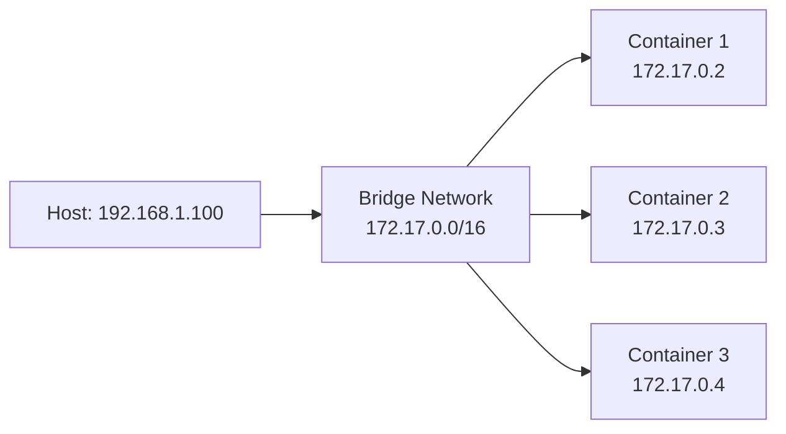

# Les Réseaux et Volumes Docker 🌐💾

---
routeAlias: 'reseaux-volumes-docker'
---

<a name="reseaux-volumes-docker" id="reseaux-volumes-docker"></a>

# Les Réseaux et Volumes Docker 🌐💾

### Communication et persistance des données

Les **réseaux Docker** permettent aux containers de communiquer entre eux, tandis que les **volumes** assurent la persistance des données au-delà du cycle de vie des containers.

---
layout: new-section
---

# PARTIE 1 : LES RÉSEAUX 🌐

---

### Pourquoi les réseaux ? 🤔

- **Isolation** : Séparation logique entre applications
- **Sécurité** : Contrôle des communications
- **Scalabilité** : Ajout facile de nouveaux services

---

# Réseau par défaut : Bridge 🌉

### Le réseau bridge



---

# Mapping de ports 🔌

### Exposer vos applications

```bash
# Exposer un port sur l'hôte
docker run -d -p 8080:80 nginx

# Exposition multiple
docker run -d -p 80:80 -p 443:443 nginx

# Port automatique
docker run -d -P nginx
```

---

# Réseaux personnalisés 🔧

### Créer ses propres réseaux

```bash
# Créer un réseau
docker network create mon-reseau

# Lister les réseaux
docker network ls

# Inspecter un réseau
docker network inspect mon-reseau
```

---

# Connecter des containers 🔗

### Communication entre containers

```bash
# Lancer des containers sur le même réseau
docker run -d --name db --network mon-reseau postgres
docker run -d --name web --network mon-reseau nginx

# Connecter un container existant
docker network connect mon-reseau mon-container
```

---

# Communication par nom 💬

### DNS automatique

```bash
# Dans le container 'web', on peut faire :
ping db
curl http://db:5432
```

Les containers peuvent se joindre par leur nom sur le même réseau !

---

# Types de réseaux essentiels 📋

### Les 3 types principaux

- **bridge** : Réseau par défaut (isolation modérée)
- **host** : Utilise le réseau de l'hôte (performance max)
- **none** : Aucun réseau (isolation totale)

---

# Exemple concret : App + DB 🗄️

### Stack web complète

```bash
# 1. Créer le réseau
docker network create app-net

# 2. Lancer la base de données
docker run -d --name postgres \
  --network app-net \
  -e POSTGRES_PASSWORD=secret \
  postgres

# 3. Lancer l'application
docker run -d --name webapp \
  --network app-net \
  -p 80:3000 \
  mon-app
```

---
layout: new-section
---

# PARTIE 2 : LES VOLUMES 💾

---

### Pourquoi les volumes ? 💡

- **Containers éphémères** : Données perdues à l'arrêt
- **Stateless par design** : Pas de stockage permanent
- **Besoin de persistance** : Bases de données, logs, uploads

Sans volumes, toutes vos données disparaissent ! 🔥

---

# Types de volumes 📂

### 3 types essentiels

1. **Named volumes** : Gérés par Docker (recommandé)
2. **Bind mounts** : Lier un dossier de l'hôte
3. **Anonymous volumes** : Temporaires et automatiques

---

# Named Volumes 🏷️

### Volumes gérés par Docker

```bash
# Créer un volume
docker volume create mon-volume

# Utiliser le volume
docker run -d -v mon-volume:/data postgres

# Lister les volumes
docker volume ls
```

Docker gère tout automatiquement !

---

# Bind Mounts 🔗

### Lier un dossier de l'hôte

```bash
# Lier un dossier local
docker run -d -v /home/user/data:/app/data nginx

# Avec chemin absolu obligatoire
docker run -d -v $(pwd)/src:/app/src node

# Mode lecture seule
docker run -d -v /host/config:/app/config:ro nginx
```

---

# Application complète : Web + DB + Volumes 🏗️

### Stack complète avec persistance

```bash
# 1. Créer le réseau et les volumes
docker network create webapp-net
docker volume create postgres-data
docker volume create webapp-logs

# 2. Lancer PostgreSQL avec persistance
docker run -d \
  --name database \
  --network webapp-net \
  -v postgres-data:/var/lib/postgresql/data \
  -e POSTGRES_PASSWORD=secret \
  postgres

# 3. Lancer l'app web connectée
docker run -d \
  --name frontend \
  --network webapp-net \
  -v webapp-logs:/var/log \
  -p 80:3000 \
  mon-app
```

---

# Docker Compose : Tout réuni 📝

### Gestion simplifiée avec Compose

```yaml
version: '3.8'
services:
  db:
    image: postgres
    networks:
      - backend
    volumes:
      - postgres-data:/var/lib/postgresql/data
    environment:
      POSTGRES_PASSWORD: secret
  
  web:
    image: nginx
    ports:
      - '80:80'
    networks:
      - backend
      - frontend
    volumes:
      - web-logs:/var/log/nginx

networks:
  frontend:
  backend:

volumes:
  postgres-data:
  web-logs:
```

---

# Débogage réseau et volumes 🔍

### Commandes utiles

```bash
# === RÉSEAUX ===
# Voir les ports d'un container
docker port mon-container

# Obtenir l'IP d'un container
docker inspect mon-container | grep IPAddress

# Tester la connectivité
docker exec container1 ping container2

# === VOLUMES ===
# Détails d'un volume
docker volume inspect mon-volume

# Voir les volumes d'un container
docker inspect mon-container | grep Mounts -A 10
```

---

# Nettoyage et maintenance 🧹

### Commands de nettoyage

```bash
# Supprimer un réseau
docker network rm mon-reseau

# Supprimer un volume
docker volume rm mon-volume

# Nettoyer les ressources non utilisées
docker network prune
docker volume prune

# ⚠️ Attention : perte de données définitive pour les volumes !
```

---

# Bonnes pratiques 🛡️

### Sécurité et performance

```bash
# Réseau interne (pas d'accès Internet)
docker network create --internal secure-net

# Déconnecter du réseau par défaut
docker network disconnect bridge mon-container

# Volumes en lecture seule quand possible
docker run -v /host/config:/app/config:ro app

# Named volumes pour la production
docker volume create --driver local app-data
``` 