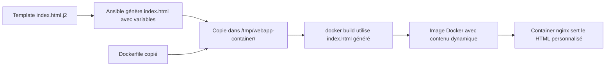
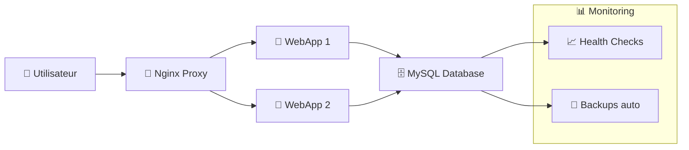

<a name="EXERCICES_ANSIBLE" id="EXERCICES_ANSIBLE"></a>

# Exercices Ansible 🤖

### 3 niveaux DevOps progressifs

Automatisez vos déploiements Docker avec Ansible !

---

## 🟢 Exercice Niveau Simple

### Installation Docker avec Ansible

**Objectif** : Utiliser Ansible pour installer Docker localement

**Consignes** :
1. Créer un inventaire local
2. Playbook d'installation Docker
3. Vérifier l'installation
4. Préparer l'environnement pour les containers

---

## 🟢 Correction Niveau Simple - Inventaire

```bash
# 1. Créer le projet Ansible
mkdir ansible-docker
cd ansible-docker

# 2. Inventaire local
all:
  hosts:
    localhost:
      ansible_connection: local
      ansible_python_interpreter: /usr/bin/python3
  vars:
    ansible_user: "{{ ansible_env.USER }}"
```

---

## 🟢 Correction Niveau Simple - Playbook

```yaml
- name: Installation Docker
  hosts: localhost
  become: true
  vars:
    docker_packages:
      - docker.io
      - docker-compose-plugin
      - python3-docker

  tasks:
    - name: Installation Docker
      apt:
        name:
          - docker.io
        state: present
        update_cache: true

    - name: Demarrage et activation Docker
      systemd:
        name: docker
        state: started
        enabled: true
      when: ansible_facts.virtualization_type != "docker"
```

---

## 🟢 Correction Niveau Simple - Exécution

```bash
# 5. Exécuter l'installation
ansible-playbook -i inventory.yml install-docker.yml
```

**✅ Résultat** : Docker installé et configuré automatiquement

Vous pouvez vérifier dans votre container avec un simple `docker ps` ou tout autre commande docker.

---

## 🟡 Exercice Niveau Intermédiaire

### Déploiement Dockerfile avec Ansible

**Objectif** : Utiliser Ansible pour déployer l'image créée dans les exercices Dockerfile

**Consignes** :
1. Créer un rôle Ansible pour le déploiement
2. Copier et builder un Dockerfile
3. Lancer le container avec configuration
4. Gérer le cycle de vie (start/stop/update)

---

## 🟡 Correction Niveau Intermédiaire - Structure

```bash
# 1. Créer la structure de rôle
mkdir -p roles/webapp/{tasks,files,templates,vars,handlers}

# 2. Copier le Dockerfile de l'exercice précédent
mkdir -p roles/webapp/files/app

FROM nginx:alpine

# Copier notre page
COPY index.html /usr/share/nginx/html/

# Healthcheck
HEALTHCHECK --interval=30s --timeout=3s \
  CMD wget --no-verbose --tries=1 --spider http://localhost/ || exit 1

EXPOSE 80

```

---

## 🟡 Niveau Intermédiaire - Template



<br/>

### Au lieu d'avoir une page web statique, vous avez une page qui affiche automatiquement :

- "Environnement: development" ou "production"
- "Version: 2.0.0"
- "Déployé le: 2025-01-09 à 14:30:25"
- Des couleurs différentes selon l'environnement

---

## 🟡 Correction Niveau Intermédiaire - Template

```bash
# 3. Template de page web avec variables Ansible

<!DOCTYPE html>
<html>
<head>
    <title>{{ app_name | default('WebApp Ansible') }}</title>
    <style>
        body {
            font-family: Arial;
            text-align: center;
            padding: 50px;
            background: {{ bg_color | default('#f0f8ff') }};
        }
        .container {
            background: white;
            padding: 30px;
            border-radius: 15px;
            box-shadow: 0 5px 15px rgba(0,0,0,0.1);
        }
    </style>
</head>
<body>
    <div class="container">
        <h1>🤖 {{ app_name | default('WebApp déployée par Ansible') }}</h1>
        <p>Environnement: {{ environment | default('development') }}</p>
        <p>Version: {{ app_version | default('1.0.0') }}</p>
        <p>Déployé le: {{ ansible_date_time.date }} à {{ ansible_date_time.time }}</p>
        <hr>
        <small>Automatisé avec Ansible 🚀</small>
    </div>
</body>
</html>

```

---

## 🟡 Correction Niveau Intermédiaire - Variables

```yaml
# 4. Variables du rôle

app_name: "Ma WebApp Ansible"
app_version: "2.0.0"
app_port: 8080
docker_image: "webapp-ansible"
docker_container: "webapp-container"
environment: "{{ env | default('development') }}"

# Configuration des couleurs par environnement
env_colors:
  development: "#e3f2fd"
  staging: "#fff3e0"
  production: "#e8f5e8"

bg_color: "{{ env_colors[environment] | default('#f0f8ff') }}"

```

---

## 🟡 Correction Niveau Intermédiaire - Tâches

```yaml
# 5. Tâches principales du rôle

---
- name: Créer le répertoire de travail
  file:
    path: "/tmp/{{ docker_container }}"
    state: directory
    mode: '0755'

- name: Copier le Dockerfile
  copy:
    src: "app/"
    dest: "/tmp/{{ docker_container }}/"
    mode: '0644'

- name: Générer la page HTML depuis le template
  template:
    src: index.html.j2
    dest: "/tmp/{{ docker_container }}/index.html"
    mode: '0644'
  notify: Rebuild image

- name: Construire l'image Docker
  docker_image:
    name: "{{ docker_image }}"
    tag: "{{ app_version }}"
    build:
      path: "/tmp/{{ docker_container }}"
    source: build
    state: present

- name: Arrêter le container existant (si présent)
  docker_container:
    name: "{{ docker_container }}"
    state: absent
  ignore_errors: true

- name: Lancer le nouveau container
  docker_container:
    name: "{{ docker_container }}"
    image: "{{ docker_image }}:{{ app_version }}"
    ports:
      - "{{ app_port }}:80"
    state: started
    restart_policy: always
    healthcheck:
      test: ["CMD", "wget", "--spider", "http://localhost/"]
      interval: 30s
      timeout: 10s
      retries: 3
  notify: Container deployed

```

---

## 🟡 Correction Niveau Intermédiaire - Handlers

```yaml
# 6. Handlers pour les notifications

---
- name: Rebuild image
  debug:
    msg: "Image sera reconstruite avec les nouveaux fichiers"

- name: Container deployed
  debug:
    msg: "Container {{ docker_container }} déployé sur le port {{ app_port }}"

- name: Display access info
  debug:
    msg: "Application accessible sur http://localhost:{{ app_port }}"

```

---

## 🟡 Correction Niveau Intermédiaire - Playbook

```yaml
# 7. Playbook principal

---
- name: Déploiement WebApp avec Dockerfile
  hosts: localhost
  vars:
    env: "{{ target_env | default('development') }}"

  tasks:
    - name: Déployer l'application web
      include_role:
        name: webapp
      notify: Display access info

  handlers:
    - name: Display access info
      debug:
        msg: |
          ✅ Déploiement terminé !
          🌐 Application: http://localhost:{{ app_port }}
          🏷️ Version: {{ app_version }}
          🔧 Environnement: {{ environment }}

```

---

## 🟡 Correction Niveau Intermédiaire - Tests

```bash
# 8. Scripts de déploiement par environnement

#!/bin/bash

case "$1" in
  dev)
    echo "🚀 Déploiement en développement..."
    ansible-playbook -i inventory.yml deploy-webapp.yml -e target_env=development
    ;;
  staging)
    echo "🚀 Déploiement en staging..."
    ansible-playbook -i inventory.yml deploy-webapp.yml -e target_env=staging -e app_port=8081
    ;;
  prod)
    echo "🚀 Déploiement en production..."
    ansible-playbook -i inventory.yml deploy-webapp.yml -e target_env=production -e app_port=80
    ;;
  *)
    echo "Usage: $0 {dev|staging|prod}"
    exit 1
    ;;
esac

echo "✅ Déploiement terminé !"


chmod +x deploy.sh

# Test de déploiement
./deploy.sh dev
```

**✅ Résultat** : Application web déployée avec Ansible et Dockerfile

---

## 🔴 Exercice Niveau Avancé

### Evolution vers une Stack Production

**Objectif** : Faire évoluer notre webapp simple vers une vraie stack production

**Le problème** : Notre webapp du niveau intermédiaire est trop simple pour la production :
- Pas de base de données
- Pas de proxy/load balancer
- Pas de monitoring
- Configuration manuelle

**L'objectif** : Créer une stack complète avec Ansible !

---

## 🔴 Ce qu'on va construire

### Architecture cible



**🎯 Stack finale** : Nginx + 2 WebApps + MySQL + Monitoring/Backup

---

### 🔴 Étape 1 - Structure du rôle

**D'abord, on organise notre nouveau rôle pour la stack :**

```bash
# 1. Créer le rôle pour la stack
mkdir -p roles/docker-stack/{tasks,files,templates,vars,handlers,meta}

# 2. Métadonnées du rôle (dépendance du rôle webapp)

---
dependencies:
  - role: webapp
galaxy_info:
  author: DevOps Team
  description: Stack Docker Compose production avec Nginx + WebApp + MySQL
  min_ansible_version: 2.9
```

**💡 Logic** : Notre nouvelle stack utilise le rôle `webapp` qu'on a créé avant !

---

### 🔴 Étape 2 - Variables de base

**Configuration de base de notre stack :**

```yaml
# 3. Variables principales

# Configuration de la stack
stack_name: "production-stack"
stack_directory: "/opt/{{ stack_name }}"

# Configuration application
app_port: 80
app_image: "webapp-ansible"  # L'image qu'on a créée avant
app_version: "latest"
```

---

### 🔴 Étape 3 - Variables base de données

**Configuration MySQL sécurisée :**

```yaml
# Ajouter à vars/main.yml


# Configuration base de données
mysql_root_password: "{{ vault_mysql_root_password | default('production123') }}"
mysql_database: "webapp"
mysql_user: "app_user"
mysql_password: "{{ vault_mysql_password | default('apppass123') }}"
```

---

### 🔴 Étape 4 - Variables environnements

**Configuration par environnement (dev/staging/prod) :**

```yaml
# Ajouter à vars/main.yml


# Environnements et ressources
environments:
  production:
    replicas: 2
    memory_limit: "512m"
    cpu_limit: "0.5"
  staging:
    replicas: 1
    memory_limit: "256m"
    cpu_limit: "0.25"

# Configuration monitoring
monitoring_enabled: true
backup_enabled: true
backup_schedule: "0 2 * * *"  # Tous les jours à 2h
```

---

### 🔴 Étape 5 - Docker Compose : Base

**Création du template docker-compose principal :**

```yaml
# 4. Template docker-compose.yml - Base

version: '3.8'

services:
  proxy:
    image: nginx:alpine
    container_name: {{ stack_name }}-proxy
    ports:
      - "{{ app_port }}:80"
    volumes:
      - ./nginx-proxy/nginx.conf:/etc/nginx/nginx.conf
    depends_on:
      - app
    networks:
      - frontend
    restart: unless-stopped
```

---

### 🔴 Étape 6 - Docker Compose : Application

**Service application dans le docker-compose :**

```yaml
# Continuer le template docker-compose.yml


  app:
    image: {{ app_image }}:{{ app_version }}
    container_name: {{ stack_name }}-app
    networks:
      - frontend
      - backend
    depends_on:
      - database
    restart: unless-stopped
    deploy:
      resources:
        limits:
          memory: {{ environments[target_env].memory_limit }}
          cpus: '{{ environments[target_env].cpu_limit }}'
    healthcheck:
      test: ["CMD", "wget", "--spider", "http://localhost/"]
      interval: 30s
      timeout: 10s
      retries: 3
```

---

### 🔴 Étape 7 - Docker Compose : Base de données

**Service MySQL dans le docker-compose :**

```yaml
# Continuer le template docker-compose.yml


  database:
    image: mysql:8.0
    container_name: {{ stack_name }}-db
    environment:
      MYSQL_ROOT_PASSWORD: {{ mysql_root_password }}
      MYSQL_DATABASE: {{ mysql_database }}
      MYSQL_USER: {{ mysql_user }}
      MYSQL_PASSWORD: {{ mysql_password }}
    volumes:
      - db_data:/var/lib/mysql
      - ./backups:/backups
    networks:
      - backend
    restart: unless-stopped
    healthcheck:
      test: ["CMD", "mysqladmin", "ping", "-h", "localhost"]
      interval: 30s
      timeout: 10s
      retries: 3
```

---

### 🔴 Étape 8 - Docker Compose : Réseaux

**Volumes et réseaux du docker-compose :**

```yaml
# Finir le template docker-compose.yml


volumes:
  db_data:

networks:
  frontend:
    driver: bridge
  backend:
    driver: bridge
```

---

### 🔴 Étape 9 - Configuration Nginx : Base

**Template nginx pour le proxy :**

```bash
# 5. Template nginx proxy - Configuration de base

events {
    worker_connections 1024;
}

http {
    upstream app {
        server app:80;
    }

    # Logs
    access_log /var/log/nginx/access.log;
    error_log /var/log/nginx/error.log;
```

---

### 🔴 Étape 10 - Configuration Nginx : Virtual Host

**Configuration du serveur web :**

```bash
# Continuer le template nginx
# chemin : roles/docker-stack/templates/nginx.conf.j2

    server {
        listen 80;
        server_name {{ ansible_fqdn | default('localhost') }};

        # Health check endpoint
        location /health {
            access_log off;
            return 200 "healthy\n";
            add_header Content-Type text/plain;
        }

        # Application proxy
        location / {
            proxy_pass http://app;
            proxy_set_header Host $host;
            proxy_set_header X-Real-IP $remote_addr;
            proxy_set_header X-Forwarded-For $proxy_add_x_forwarded_for;
            proxy_set_header X-Forwarded-Proto $scheme;

            # Timeouts
            proxy_connect_timeout 30s;
            proxy_send_timeout 30s;
            proxy_read_timeout 30s;
        }
    }
}
```

---

### 🔴 Étape 11 - Tâches : Préparation

**Tâches de préparation des répertoires :**

```yaml
# 6. Tâches de déploiement - Partie 1 : Préparation
# chemin : roles/docker-stack/tasks/main.yml
---
- name: Créer le répertoire de la stack
  file:
    path: "{{ stack_directory }}"
    state: directory
    mode: '0755'
    owner: "{{ ansible_user }}"
    group: "{{ ansible_user }}"

- name: Créer les sous-répertoires
  file:
    path: "{{ stack_directory }}/{{ item }}"
    state: directory
    mode: '0755'
  loop:
    - nginx-proxy
    - backups
    - scripts
```

---

### 🔴 Étape 12 - Tâches : Génération des fichiers

**Génération des templates :**

```yaml
# Continuer tasks/main.yml - Partie 2 : Templates
# chemin : roles/docker-stack/tasks/main.yml

- name: Générer docker-compose.yml
  template:
    src: docker-compose.yml.j2
    dest: "{{ stack_directory }}/docker-compose.yml"
    mode: '0644'
  notify:
    - Restart stack

- name: Générer configuration nginx
  template:
    src: nginx.conf.j2
    dest: "{{ stack_directory }}/nginx-proxy/nginx.conf"
    mode: '0644'
  notify:
    - Restart proxy

- name: Générer script de backup
  template:
    src: backup.sh.j2
    dest: "{{ stack_directory }}/scripts/backup.sh"
    mode: '0755'

- name: Générer script de monitoring
  template:
    src: monitor.sh.j2
    dest: "{{ stack_directory }}/scripts/monitor.sh"
    mode: '0755'
```

---

### 🔴 Étape 13 - Tâches : Déploiement

**Démarrage de la stack et vérifications :**

```yaml
# Continuer tasks/main.yml - Partie 3 : Déploiement
# chemin : roles/docker-stack/tasks/main.yml

- name: Démarrer la stack Docker Compose
  docker_compose:
    project_src: "{{ stack_directory }}"
    state: present
    restarted: "{{ force_restart | default(false) }}"
  register: stack_result

- name: Configurer la crontab pour les backups
  cron:
    name: "Backup {{ stack_name }}"
    minute: "0"
    hour: "2"
    job: "{{ stack_directory }}/scripts/backup.sh"
    user: "{{ ansible_user }}"
  when: backup_enabled

- name: Attendre que les services soient prêts
  wait_for:
    host: localhost
    port: "{{ app_port }}"
    delay: 10
    timeout: 60

- name: Vérifier la santé de la stack
  uri:
    url: "http://localhost:{{ app_port }}/health"
    method: GET
    status_code: 200
  register: health_check
  retries: 3
  delay: 5
```

---

## 🔴 Étape 14 - Script de backup

**Script automatisé de sauvegarde :**

```bash
# 7. Template script de backup
# chemin : roles/docker-stack/templates/backup.sh.j2
#!/bin/bash

BACKUP_DIR="{{ stack_directory }}/backups"
DATE=$(date +%Y%m%d_%H%M%S)
STACK_NAME="{{ stack_name }}"

echo "💾 Backup de la stack $STACK_NAME - $DATE"

# Backup base de données
docker compose -f {{ stack_directory }}/docker-compose.yml exec -T database \
    mysqldump -u root -p{{ mysql_root_password }} {{ mysql_database }} \
    > "$BACKUP_DIR/db_backup_$DATE.sql"
```

---

## 🔴 Étape 15 - Script de backup (suite)

**Sauvegarde config et nettoyage :**

```bash
# Continuer le script de backup
# chemin : roles/docker-stack/templates/backup.sh.j2

# Backup configuration
tar -czf "$BACKUP_DIR/config_backup_$DATE.tar.gz" \
    -C {{ stack_directory }} \
    docker-compose.yml nginx-proxy/ scripts/

# Nettoyage des anciens backups (garder 7 jours)
find "$BACKUP_DIR" -name "*backup_*.sql" -mtime +7 -delete
find "$BACKUP_DIR" -name "*backup_*.tar.gz" -mtime +7 -delete

echo "✅ Backup terminé dans $BACKUP_DIR"
ls -la "$BACKUP_DIR"/*$DATE*
```

---

## 🔴 Étape 16 - Script de monitoring

**Script de surveillance de la stack :**

```bash
# 8. Template script de monitoring
# chemin : roles/docker-stack/templates/monitor.sh.j2
#!/bin/bash

echo "📊 Monitoring de la stack {{ stack_name }}"
echo "========================================="

# Status des containers
docker compose -f {{ stack_directory }}/docker-compose.yml ps

echo ""
echo "🏥 Health checks:"
docker compose -f {{ stack_directory }}/docker-compose.yml ps --format "table {{.Name}}\t{{.Status}}"

echo ""
echo "📈 Utilisation des ressources:"
docker stats --no-stream --format "table {{.Name}}\t{{.CPUPerc}}\t{{.MemUsage}}"

echo ""
echo "🌐 Test de connectivité:"
curl -s -o /dev/null -w "Status: %{http_code} | Time: %{time_total}s\n" \
    http://localhost:{{ app_port }}/health

echo ""
echo "💾 Derniers backups:"
ls -la {{ stack_directory }}/backups/ | tail -5
```

---

## 🔴 Étape 17 - Handlers

**Gestionnaires de redémarrage :**

```yaml
# 9. Handlers pour les redémarrages
# chemin : roles/docker-stack/handlers/main.yml
---
- name: Restart stack
  docker_compose:
    project_src: "{{ stack_directory }}"
    restarted: true

- name: Restart proxy
  docker_compose:
    project_src: "{{ stack_directory }}"
    services:
      - proxy
    restarted: true
```

---

## 🔴 Étape 18 - Playbook principal

**Orchestration complète :**

```yaml
# 10. Playbook principal
# chemin : deploy-stack.yml
---
- name: Déploiement Stack Docker Compose Production
  hosts: localhost
  vars:
    target_env: "{{ env | default('production') }}"
    force_restart: "{{ restart | default(false) }}"

  pre_tasks:
    - name: Vérifier les prérequis
      assert:
        that:
          - target_env in ['production', 'staging']
        fail_msg: "Environnement doit être 'production' ou 'staging'"

  tasks:
    - name: Construire l'image de l'application
      include_role:
        name: webapp

    - name: Déployer la stack complète
      include_role:
        name: docker-stack
```

---

## 🔴 Étape 19 - Playbook (suite)

**Informations de déploiement :**

```yaml
# Continuer le playbook principal
# chemin : deploy-stack.yml

  post_tasks:
    - name: Afficher les informations de déploiement
      debug:
        msg: |
          ✅ Stack {{ stack_name }} déployée en {{ target_env }} !
          🌐 Application: http://localhost:{{ app_port }}
          🏥 Health: http://localhost:{{ app_port }}/health
          🛠️ Monitoring: {{ stack_directory }}/scripts/monitor.sh
          💾 Backup: {{ stack_directory }}/scripts/backup.sh
```

---

## 🔴 Étape 20 - Script de déploiement

**Script d'orchestration finale :**

```bash
# 11. Script de déploiement avancé
# chemin : deploy-production.sh
#!/bin/bash

echo "🚀 Déploiement de la stack de production..."

case "$1" in
  deploy)
    ansible-playbook -i inventory.yml deploy-stack.yml -e env=production
    ;;
  update)
    ansible-playbook -i inventory.yml deploy-stack.yml -e env=production -e restart=true
    ;;
  staging)
    ansible-playbook -i inventory.yml deploy-stack.yml -e env=staging -e app_port=8080
    ;;
  monitor)
    /opt/production-stack/scripts/monitor.sh
    ;;
  backup)
    /opt/production-stack/scripts/backup.sh
    ;;
  *)
    echo "Usage: $0 {deploy|update|staging|monitor|backup}"
    exit 1
    ;;
esac

chmod +x deploy-production.sh
```

---

## 🔴 Étape 21 - Test final

**Déploiement et vérification :**

```bash
# Déploiement final
echo "🎯 Lancement du déploiement production..."
./deploy-production.sh deploy

echo "✅ Stack complète déployée avec Ansible !"

# Tests post-déploiement
echo "🧪 Tests de la stack..."
curl http://localhost/health
docker compose -f /opt/production-stack/docker-compose.yml ps
```

**✅ Résultat** : Stack production complète avec Nginx + WebApp + MySQL + Monitoring/Backup !

---

## Récapitulatif Exercices Ansible 📋

### Compétences acquises

**🟢 Niveau Simple** :
- Inventaires Ansible
- Playbooks d'installation
- Modules de base
- Vérification automatique

**🟡 Niveau Intermédiaire** :
- Rôles Ansible
- Templates Jinja2
- Variables et handlers
- Intégration Docker

---

## Récapitulatif Ansible (suite) 📋

**🔴 Niveau Avancé** :
- Déploiement Docker Compose
- Gestion de configuration
- Scripts de maintenance
- Monitoring automatisé

### 🚀 **Formation Docker & Ansible complète !**

Vous maîtrisez maintenant l'automatisation complète avec Docker et Ansible !