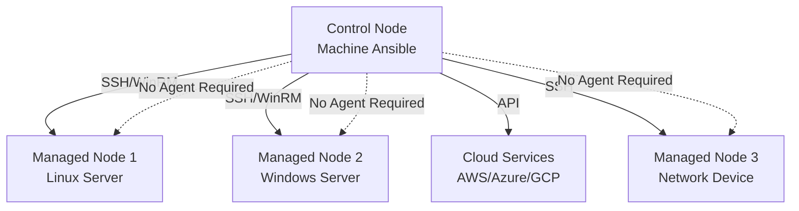
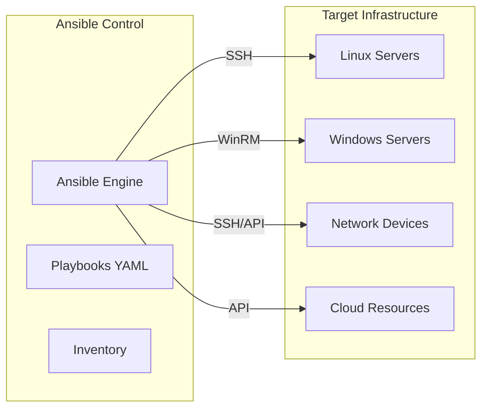
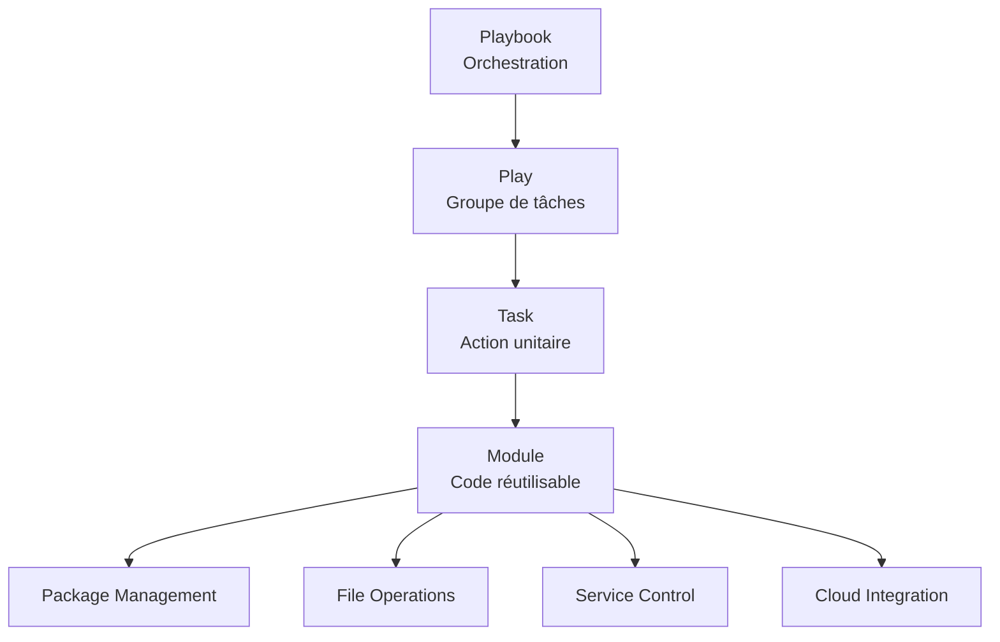
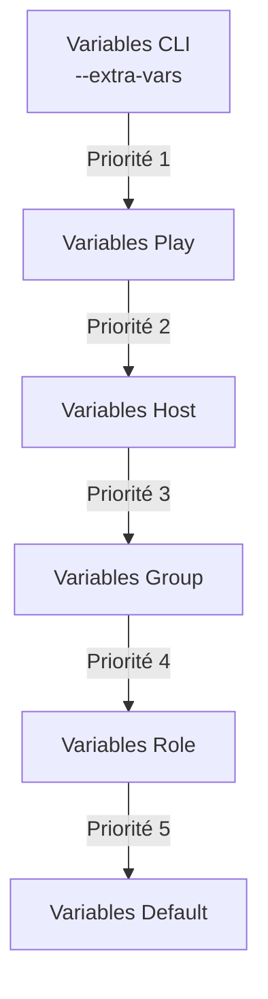

<a name="introduction-ansible" id="introduction-ansible"></a>

# Introduction à Ansible 🚀

### L'automatisation infrastructure moderne

**Ansible** est devenu l'outil de référence pour l'automatisation d'infrastructure, la gestion de configuration et le déploiement d'applications. Cette plateforme open-source révolutionne la façon dont nous gérons nos environnements IT en apportant simplicité, puissance et fiabilité.

---

# Révolution Infrastructure as Code 🔄

### Révolution de l'Infrastructure as Code

Ansible permet de décrire et gérer l'infrastructure comme du code, garantissant :
- **Reproductibilité** : Environnements identiques à chaque déploiement
- **Traçabilité** : Versioning et audit complet des changements
- **Collaboration** : Partage et révision du code d'infrastructure
- **Fiabilité** : Déploiements prédictibles et sans erreur

---

# Qu'est-ce qu'Ansible exactement ? 🔍

### Définition et philosophie

Ansible est un **outil d'automatisation** basé sur une approche déclarative qui permet de :
- **Configurer des systèmes** de manière cohérente
- **Déployer des applications** de façon automatisée
- **Orchestrer des workflows** complexes
- **Gérer des configurations** à grande échelle

---

# Philosophie "Simple, Powerful, Agentless" 🎯

### Philosophie "Simple, Powerful, Agentless"



---

# Aucun agent requis ✅

**Aucun agent requis** : Ansible utilise SSH, WinRM ou les APIs natives, éliminant la complexité de déploiement d'agents.

---

# Avantages révolutionnaires d'Ansible 💡

### 1. Simplicité sans compromis

- **Syntaxe YAML lisible** : Configuration en langage naturel
- **Courbe d'apprentissage douce** : Prise en main rapide
- **Documentation auto-générée** : Playbooks auto-documentés
- **Pas de DSL complexe** : YAML standard uniquement

---

# Architecture sans agent 🏗️

### 2. Architecture sans agent



---

# Avantages architecture 💪

**Avantages** :
- Pas de overhead de gestion d'agents
- Sécurité renforcée (connexions standard)
- Maintenance simplifiée
- Performance optimale

---

# Concepts fondamentaux 📚

### Idempotence - Le super-pouvoir d'Ansible

L'**idempotence** garantit qu'exécuter un playbook plusieurs fois produit toujours le même résultat.

```yaml
# Exemple d'idempotence
- name: S'assurer que Nginx est installé
  apt:
    name: nginx
    state: present
```

---

# Résultat idempotence 🔄

```
# Résultat :
# 1ère exécution : Installation de Nginx
# 2ème exécution : Aucun changement (déjà installé)
# 3ème exécution : Aucun changement (déjà installé)
```

---

# Architecture modulaire 🧩

### Architecture modulaire



---

# Installation Ansible 2025 ⚙️

### Installation recommandée via pip

```bash
# Installation via pip (méthode recommandée)
pip install ansible

# Installation avec collections communautaires
pip install ansible-core

# Vérification de l'installation
ansible --version
ansible-config --version
```

---

# Installation par distribution 🐧

### Installation par distribution

```bash
# Ubuntu/Debian (méthode officielle)
sudo apt update
sudo apt install software-properties-common
sudo add-apt-repository --yes --update ppa:ansible/ansible
sudo apt install ansible

# CentOS/RHEL 8+
sudo dnf install ansible

# macOS avec Homebrew
brew install ansible

# Arch Linux
sudo pacman -S ansible
```

---

# Installation avancée 🔧

### Installation avancée avec environnement virtuel

```bash
# Créer un environnement virtuel dédié
python3 -m venv ansible-env
source ansible-env/bin/activate

# Installation avec dépendances cloud
pip install ansible[azure,aws,gcp]

# Installation de collections spécifiques
ansible-galaxy collection install community.general
ansible-galaxy collection install ansible.posix
```

---

# Configuration initiale optimisée 🔧

### Structure de projet professionnelle

```
ansible-project/
├── ansible.cfg                 # Configuration Ansible
├── inventory/
│   ├── production/
│   │   ├── hosts.yml           # Inventaire production
│   │   └── group_vars/         # Variables par groupe
│   ├── staging/
│   │   ├── hosts.yml           # Inventaire staging
│   │   └── group_vars/
│   └── development/
├── playbooks/
│   ├── site.yml                # Playbook principal
│   ├── deploy.yml              # Déploiement
│   └── maintenance.yml         # Maintenance
├── roles/                      # Rôles réutilisables
├── group_vars/                 # Variables globales
├── host_vars/                  # Variables par hôte
├── files/                      # Fichiers statiques
├── templates/                  # Templates Jinja2
└── vault/                      # Secrets chiffrés
```

---

# Configuration ansible.cfg 📝

### Configuration ansible.cfg optimisée

```ini
[defaults]
# Configuration de base
inventory = ./inventory
remote_user = ansible
host_key_checking = False
retry_files_enabled = False
gathering = smart
fact_caching = jsonfile
fact_caching_connection = ./facts_cache
fact_caching_timeout = 3600

# Performance
forks = 20
poll_interval = 1
timeout = 30
```

---

# Suite configuration ansible.cfg 📝

```ini
# Callbacks et logging
stdout_callback = yaml
bin_ansible_callbacks = True
log_path = ./ansible.log

# Sécurité
vault_password_file = ~/.ansible/vault_pass

[ssh_connection]
ssh_args = -o ControlMaster=auto -o ControlPersist=60s
pipelining = True
control_path_dir = ~/.ansible/cp
```

---

# Inventaire moderne et dynamique 📋

### Inventaire YAML structuré

```yaml
# inventory/production/hosts.yml
all:
  vars:
    ansible_user: ansible
    ansible_python_interpreter: /usr/bin/python3

  children:
    webservers:
      hosts:
        web-01.example.com:
          ansible_host: 10.0.1.10
        web-02.example.com:
          ansible_host: 10.0.1.11
      vars:
        nginx_port: 80
        app_env: production
```

---

# Configuration databases et monitoring 📊

```yaml
    databases:
      hosts:
        db-01.example.com:
          ansible_host: 10.0.2.10
          mysql_role: master
        db-02.example.com:
          ansible_host: 10.0.2.11
          mysql_role: slave
      vars:
        mysql_port: 3306

    monitoring:
      hosts:
        prometheus.example.com:
          ansible_host: 10.0.3.10
        grafana.example.com:
          ansible_host: 10.0.3.11
```

---

# Inventaire dynamique (Cloud) ☁️

### Inventaire dynamique (Cloud)

```python
#!/usr/bin/env python3
# inventory/aws_inventory.py - Inventaire dynamique AWS

import boto3
import json

def get_ec2_instances():
    ec2 = boto3.client('ec2')
    instances = ec2.describe_instances()

    inventory = {
        '_meta': {'hostvars': {}},
        'webservers': {'hosts': []},
        'databases': {'hosts': []}
    }
```

---

# Traitement des instances AWS 🖥️

```python
    for reservation in instances['Reservations']:
        for instance in reservation['Instances']:
            if instance['State']['Name'] == 'running':
                name = instance.get('Tags', [{}])[0].get('Value', instance['InstanceId'])
                role = next((tag['Value'] for tag in instance.get('Tags', [])
                           if tag['Key'] == 'Role'), 'unknown')

                inventory['_meta']['hostvars'][name] = {
                    'ansible_host': instance['PublicIpAddress'],
                    'instance_type': instance['InstanceType'],
                    'instance_id': instance['InstanceId']
                }

                if role in inventory:
                    inventory[role]['hosts'].append(name)

    return inventory

if __name__ == '__main__':
    print(json.dumps(get_ec2_instances(), indent=2))
```

---

# Playbooks : L'orchestration intelligente 🎭

### Anatomie d'un playbook moderne

```yaml
# playbooks/webserver-setup.yml
---
- name: Configuration complète des serveurs web
  hosts: webservers
  become: true
  gather_facts: true

  vars:
    packages_to_install:
      - nginx
      - python3-pip
      - git
      - htop
      - fail2ban

  pre_tasks:
    - name: Mise à jour du cache des paquets
      apt:
        update_cache: true
        cache_valid_time: 3600
      tags: ['setup']
```

---

# Tasks et handlers du playbook 🎭

```yaml
  tasks:
    - name: Installation des paquets essentiels
      apt:
        name: '{{ packages_to_install }}'
        state: present
      tags: ['packages']

    - name: Configuration de Nginx
      template:
        src: nginx.conf.j2
        dest: /etc/nginx/nginx.conf
        backup: true
        mode: '0644'
      notify: restart nginx
      tags: ['config']

    - name: Démarrage et activation des services
      systemd:
        name: '{{ item }}'
        state: started
        enabled: true
      loop:
        - nginx
        - fail2ban
      tags: ['services']
```

---

# Handlers et post-tasks 🎭

```yaml
  handlers:
    - name: restart nginx
      systemd:
        name: nginx
        state: restarted

  post_tasks:
    - name: Vérification du statut Nginx
      uri:
        url: 'http://{{ ansible_default_ipv4.address }}'
        method: GET
        status_code: 200
      tags: ['verify']
```

---

# Variables et Templates avancés 🔧

### Hiérarchie des variables



---

# Configuration des variables Nginx 🔧

```yaml
# group_vars/webservers.yml
nginx_config:
  user: www-data
  worker_processes: auto
  error_log: /var/log/nginx/error.log
  access_log: /var/log/nginx/access.log

  sites:
    - name: default
      port: 80
      root: /var/www/html
      index: index.html index.htm

ssl_config:
  enabled: true
  cert_path: /etc/ssl/certs
  key_path: /etc/ssl/private
  protocols:
    - TLSv1.2
    - TLSv1.3
```

---

# Template Jinja2 intelligent 🔧

```nginx
# templates/nginx.conf.j2
user {{ nginx_config.user }};
worker_processes {{ nginx_config.worker_processes }};
pid /run/nginx.pid;

events {
    worker_connections 1024;
    multi_accept on;
    use epoll;
}

http {
    sendfile on;
    tcp_nopush on;
    tcp_nodelay on;
    keepalive_timeout 65;
    types_hash_max_size 2048;

    include /etc/nginx/mime.types;
    default_type application/octet-stream;
```

---

# Configuration SSL et logging 🔧

```nginx
    
    # SSL Configuration
    ssl_protocols {{ ssl_config.protocols | join(' ') }};
    ssl_ciphers ECDHE-RSA-AES128-GCM-SHA256:ECDHE-RSA-AES256-GCM-SHA384;
    ssl_prefer_server_ciphers on;
    

    # Logging
    log_format main '$remote_addr - $remote_user [$time_local] "$request" '
                    '$status $body_bytes_sent "$http_referer" '
                    '"$http_user_agent" "$http_x_forwarded_for"';

    access_log {{ nginx_config.access_log }} main;
    error_log {{ nginx_config.error_log }};
```

---

# Virtual hosts configuration 🔧

```nginx
    # Virtual Hosts
    
    server {
        listen {{ site.port }};
        root {{ site.root }};
        index {{ site.index }};

        location / {
            try_files $uri $uri/ =404;
        }
    }
    
}
```

---

# Rôles Ansible : Réutilisabilité maximale 🏗️

### Structure complète d'un rôle

```
roles/webapp/
├── README.md                   # Documentation du rôle
├── meta/
│   └── main.yml               # Métadonnées et dépendances
├── defaults/
│   └── main.yml               # Variables par défaut
├── vars/
│   └── main.yml               # Variables du rôle
├── tasks/
│   ├── main.yml               # Tâches principales
│   ├── install.yml            # Installation
│   ├── configure.yml          # Configuration
│   └── security.yml           # Sécurisation
├── handlers/
│   └── main.yml               # Handlers du rôle
├── templates/
│   ├── app.conf.j2            # Templates de configuration
│   └── systemd.service.j2     # Service systemd
├── files/
│   └── scripts/               # Scripts statiques
└── tests/
    ├── inventory              # Inventaire de test
    └── test.yml               # Playbook de test
```

---

# Rôle webapp complet 🏗️

### Rôle webapp complet

```yaml
# roles/webapp/tasks/main.yml
---
- name: Include OS-specific variables
  include_vars: '{{ ansible_os_family }}.yml'
  tags: ['always']

- import_tasks: install.yml
  tags: ['install']

- import_tasks: configure.yml
  tags: ['configure']

- import_tasks: security.yml
  tags: ['security']

- name: Ensure webapp service is started
  systemd:
    name: '{{ webapp_service_name }}'
    state: started
    enabled: true
    daemon_reload: true
  tags: ['service']
```

---

# Utilisation avancée des rôles 🎯

### Utilisation avancée des rôles

```yaml
# Installation de paquets
- name: Installer des paquets
  apt:
    name: '{{ packages }}'
    state: present
  vars:
    packages:
      - nginx
      - python3
      - git
```

---

# Gestion des fichiers 📁

```yaml
# Création de fichiers
- name: Créer un fichier de configuration
  copy:
    content: |
      server {
          listen 80;
          server_name example.com;
      }
    dest: /etc/nginx/sites-available/default
    mode: '0644'
```

---

# Variables et templates 🔧

```yaml
# group_vars/webservers.yml
nginx_port: 80
nginx_root: /var/www/html
nginx_user: www-data
```

---

# Utilisation de templates 📝

```yaml
# playbooks/templates/nginx.conf.j2
server {
    listen {{ nginx_port }};
    root {{ nginx_root }};
    user {{ nginx_user }};
}
```

---

# Handlers 🔄

```yaml
# playbooks/webserver.yml
tasks:
  - name: Modifier la configuration
    template:
      src: nginx.conf.j2
      dest: /etc/nginx/nginx.conf
    notify: restart nginx

handlers:
  - name: restart nginx
    service:
      name: nginx
      state: restarted
```

---

# Rôles 📦

### Structure d'un rôle
```
roles/
└── webserver/
    ├── defaults/
    │   └── main.yml
    ├── handlers/
    │   └── main.yml
    ├── tasks/
    │   └── main.yml
    ├── templates/
    │   └── nginx.conf.j2
    └── vars/
        └── main.yml
```

---

# Utilisation des rôles 🎭

```yaml
# playbooks/site.yml
---
- name: Configuration des serveurs
  hosts: all
  roles:
    - webserver
    - database
```

---

# Bonnes pratiques 📋

### Organisation
- Structure de projet claire
- Rôles réutilisables
- Variables bien organisées
- Documentation complète

### Sécurité
- Vault pour les secrets
- Permissions minimales
- Inventaire sécurisé
- Logs et audit

---

# Exemples avancés 🚀

```yaml
# playbooks/deploy.yml
---
- name: Déploiement de l'application
  hosts: webservers
  become: yes
  tasks:
    - name: Cloner le repository
      git:
        repo: '{{ git_repo }}'
        dest: '{{ app_path }}'
        version: '{{ app_version }}'

    - name: Installer les dépendances
      pip:
        requirements: '{{ app_path }}/requirements.txt'
        virtualenv: '{{ venv_path }}'

    - name: Configurer l'application
      template:
        src: config.j2
        dest: '{{ app_path }}/config.yml'
```

---

# Intégration continue 🔄

```yaml
# .github/workflows/ansible.yml
name: Ansible Playbook
on: [push]
jobs:
  build:
    runs-on: ubuntu-latest
    steps:
    - uses: actions/checkout@v2
    - name: Run Ansible Playbook
      uses: dawidd6/action-ansible-playbook@v2
      with:
        playbook: playbooks/deploy.yml
        requirements: requirements.yml
        inventory: inventory/production
```

---

# Monitoring et maintenance 📊

```bash
# Vérifier la syntaxe
ansible-playbook --syntax-check playbook.yml

# Mode check
ansible-playbook --check playbook.yml

# Mode verbose
ansible-playbook -vvv playbook.yml

# Limiter aux hôtes
ansible-playbook --limit webservers playbook.yml
``` 