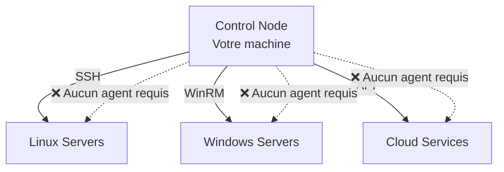

# Ansible - Les Fondamentaux 🎯

---
routeAlias: 'fondamentaux-ansible'
---

<a name="fondamentaux-ansible" id="fondamentaux-ansible"></a>

# Ansible - Les Fondamentaux 🎯

### Maîtriser l'automatisation d'infrastructure moderne

Ansible est l'outil d'automatisation de référence qui révolutionne la gestion d'infrastructure. **Simple, puissant, sans agent** - découvrez pourquoi 89% des entreprises l'utilisent en 2025.

---

# Qu'est-ce qu'Ansible ? 🤔

### Infrastructure as Code simplifiée



**Révolutionnaire** : Aucun agent à installer ! Juste SSH, WinRM ou APIs.

---

# Pourquoi Ansible ? 💡

### Les super-pouvoirs d'Ansible

🎯 **Simple** : Configuration en YAML lisible  
🔄 **Idempotent** : Même résultat à chaque exécution  
🚀 **Rapide** : Parallélisation automatique  
🔒 **Sécurisé** : Utilise vos connexions existantes  
📈 **Scalable** : De 1 à 10,000 serveurs  

---

# Installation rapide 2025 ⚙️

### Installation en 2 minutes

```bash
# Méthode recommandée : pip
python3 -m pip install --user ansible

# Vérification
ansible --version
# ansible [core 2.16.2] - Python 3.11.6

# Collections essentielles
ansible-galaxy collection install community.general ansible.posix
```

---

# Configuration de base 🔧

### Configuration optimisée

```ini
# ansible.cfg (optionnel)
[defaults]
inventory = ./inventory
remote_user = ansible
host_key_checking = False
timeout = 30
gathering = smart
```

---

# Inventaire : Lister vos serveurs 📋

### Inventaire YAML simple

```yaml
# inventory/hosts.yml
all:
  vars:
    ansible_user: ubuntu
    ansible_python_interpreter: /usr/bin/python3
    
  children:
    webservers:
      hosts:
        web-01:
          ansible_host: 10.0.1.10
        web-02:
          ansible_host: 10.0.1.11
    
    databases:
      hosts:
        db-01:
          ansible_host: 10.0.1.20
```

---

# Test de connectivité ✅

### Vérifier la connexion

```bash
# Ping tous les serveurs
ansible all -m ping

# Résultat attendu :
# web-01 | SUCCESS => {"ping": "pong"}
# web-02 | SUCCESS => {"ping": "pong"}
# db-01 | SUCCESS => {"ping": "pong"}

# Commande simple sur tous les serveurs
ansible all -a "uptime"
```

---

# Premier Playbook 🎭

### Structure d'un playbook

```yaml
# site.yml
---
- name: Installation serveur web 🌐
  hosts: webservers
  become: true

  tasks:
    - name: Installation Nginx
      apt:
        name: nginx
        state: present
        update_cache: true

    - name: Démarrage du service
      systemd:
        name: nginx
        state: started
        enabled: true
```

---

# Exécution du playbook 🚀

```bash
# Exécuter le playbook
ansible-playbook site.yml

# Avec options utiles
ansible-playbook site.yml --check --diff --verbose

# Options expliquées :
# --check : Mode dry-run (teste sans appliquer)
# --diff : Montre les changements
# --verbose : Plus de détails
```

---

# Modules essentiels 📦

### Les modules indispensables

```yaml
# Gestion des packages
- name: Installer des packages
  apt:  # ou yum, dnf selon la distrib
    name: [nginx, git, curl]
    state: present

# Gestion des fichiers
- name: Copier un fichier
  copy:
    src: nginx.conf
    dest: /etc/nginx/nginx.conf
    backup: true
  notify: restart nginx

# Gestion des services
- name: Gérer un service
  systemd:
    name: nginx
    state: restarted
    enabled: true
```

---

# Variables : La puissance 💪

### Variables dans les playbooks

```yaml
---
- name: Déploiement avec variables
  hosts: webservers
  vars:
    app_name: "mon-app"
    app_version: "1.2.3"
    nginx_port: 80

  tasks:
    - name: Créer le répertoire {{ app_name }}
      file:
        path: /opt/{{ app_name }}
        state: directory
    
    - name: Template de configuration
      template:
        src: app.conf.j2
        dest: /etc/nginx/sites-available/{{ app_name }}.conf
      notify: reload nginx
```

---

# Templates Jinja2 📝

### Templates pour la configuration

```yaml
# templates/app.conf.j2
server {
    listen {{ nginx_port }};
    server_name {{ ansible_fqdn }};
    
    location / {
        proxy_pass http://127.0.0.1:8080;
        proxy_set_header Host $host;
    }
    
    # Configuration générée pour {{ app_name }} v{{ app_version }}
}
```

Templates = Configuration dynamique ! 🎯

---

# Handlers : Actions conditionnelles 🔄

### Déclencher des actions en cas de changement

```yaml
tasks:
  - name: Modifier la config Nginx
    template:
      src: nginx.conf.j2
      dest: /etc/nginx/nginx.conf
    notify: 
      - restart nginx
      - reload firewall

handlers:
  - name: restart nginx
    systemd:
      name: nginx
      state: restarted
      
  - name: reload firewall
    ufw:
      rule: allow
      port: 80
```

---

# Loops : Automatiser les répétitions 🔁

### Boucles pour éviter la répétition

```yaml
- name: Installer plusieurs packages
  apt:
    name: "{{ item }}"
    state: present
  loop:
    - nginx
    - git
    - htop
    - curl

- name: Créer plusieurs utilisateurs
  user:
    name: "{{ item.name }}"
    groups: "{{ item.groups }}"
  loop:
    - { name: "alice", groups: "sudo,www-data" }
    - { name: "bob", groups: "www-data" }
```

---

# Conditionals : Logique intelligente 🧠

### Conditions pour adapter aux environnements

```yaml
- name: Installation selon la distribution
  package:
    name: "{{ item }}"
    state: present
  loop:
    - "{{ 'nginx' if ansible_os_family == 'Debian' else 'httpd' }}"
  when: ansible_os_family in ['Debian', 'RedHat']

- name: Configuration spécifique production
  template:
    src: prod.conf.j2
    dest: /etc/app/config.yml
  when: environment == "production"
```

---

# Ansible Vault : Sécurité 🔐

### Chiffrer les données sensibles

```bash
# Créer un fichier chiffré
ansible-vault create secrets.yml

# Éditer un fichier chiffré
ansible-vault edit secrets.yml

# Chiffrer un fichier existant
ansible-vault encrypt passwords.txt
```

```yaml
# secrets.yml (exemple)
database_password: "super_secret_password"
api_key: "sk-1234567890abcdef"
ssl_certificate: |
  -----BEGIN CERTIFICATE-----
  ...
```

---

# Utiliser Vault dans les playbooks 🔑

```yaml
# Charger les secrets
- name: Déploiement avec secrets
  hosts: all
  vars_files:
    - secrets.yml

  tasks:
    - name: Configuration DB
      template:
        src: database.conf.j2
        dest: /etc/app/db.conf
      vars:
        db_pass: "{{ database_password }}"
```

```bash
# Exécuter avec mot de passe Vault
ansible-playbook site.yml --ask-vault-pass
```

---

# Rôles : Organiser son code 📁

### Structure d'un rôle Ansible

```
roles/
  nginx/
    ├── tasks/main.yml      # Tâches principales
    ├── handlers/main.yml   # Actions conditionnelles
    ├── templates/          # Templates Jinja2
    ├── files/              # Fichiers statiques
    ├── vars/main.yml       # Variables du rôle
    └── defaults/main.yml   # Variables par défaut
```

---

# Exemple de rôle Nginx 📋

```yaml
# roles/nginx/tasks/main.yml
---
- name: Installation Nginx
  apt:
    name: nginx
    state: present
    update_cache: true

- name: Configuration personnalisée
  template:
    src: nginx.conf.j2
    dest: /etc/nginx/nginx.conf
  notify: restart nginx

- name: Démarrage du service
  systemd:
    name: nginx
    state: started
    enabled: true
```

---

# Utiliser le rôle 🎯

```yaml
# site.yml
---
- name: Configuration serveurs web
  hosts: webservers
  become: true
  
  roles:
    - nginx
    - { role: php, php_version: "8.2" }
    - ssl-certificates
```

Rôles = Réutilisabilité et organisation ! 📦

---

# Collections : L'écosystème 🌐

### Collections populaires 2025

```bash
# Collections essentielles
ansible-galaxy collection install community.general
ansible-galaxy collection install ansible.posix
ansible-galaxy collection install community.crypto

# Collections cloud
ansible-galaxy collection install amazon.aws
ansible-galaxy collection install azure.azcollection
ansible-galaxy collection install google.cloud
```

---

# Exemple avec collections 🚀

```yaml
- name: Gestion Docker avec collections
  hosts: docker_hosts
  tasks:
    - name: Installation Docker
      community.general.docker_container:
        name: webapp
        image: nginx:alpine
        ports:
          - "80:80"
        state: started
```

---

# Stratégies d'exécution 🎭

### Contrôler l'exécution

```yaml
---
- name: Déploiement progressif
  hosts: webservers
  strategy: free  # Exécution parallèle libre
  serial: 2       # 2 serveurs à la fois
  max_fail_percentage: 25  # Arrêt si 25% d'échecs

  tasks:
    - name: Mise à jour application
      git:
        repo: https://github.com/company/webapp.git
        dest: /opt/webapp
        version: "{{ app_version | default('main') }}"
```

---

# Debug et troubleshooting 🔍

### Techniques de débogage

```yaml
- name: Debug des variables
  debug:
    var: ansible_facts

- name: Debug conditionnel
  debug:
    msg: "Le serveur {{ inventory_hostname }} a {{ ansible_memtotal_mb }}MB de RAM"
  when: ansible_memtotal_mb < 2048

- name: Assertion pour validation
  assert:
    that:
      - ansible_os_family == "Debian"
      - ansible_distribution_version is version('20.04', '>=')
    fail_msg: "Ubuntu 20.04+ requis"
```

---

# Tags : Exécution sélective 🏷️

### Organiser avec des tags

```yaml
- name: Configuration complète
  hosts: all
  tasks:
    - name: Installation packages
      apt:
        name: [nginx, git]
      tags: [install, nginx]

    - name: Configuration Nginx
      template:
        src: nginx.conf.j2
        dest: /etc/nginx/nginx.conf
      tags: [config, nginx]

    - name: Backup databases
      shell: mysqldump --all-databases > /backup/db.sql
      tags: [backup, never]
```

```bash
# Exécuter seulement certains tags
ansible-playbook site.yml --tags "nginx,config"
ansible-playbook site.yml --skip-tags "backup"
```

---

# Ansible en production 🏭

### Bonnes pratiques

```yaml
# ansible.cfg production
[defaults]
host_key_checking = False
callback_whitelist = timer, profile_tasks
stdout_callback = yaml
timeout = 60
forks = 20

[inventory]
enable_plugins = ini, yaml, auto

[ssh_connection]
ssh_args = -o ControlMaster=auto -o ControlPersist=60s
pipelining = True
```

---

# Structure projet recommandée 📂

### Organisation professionnelle

```
ansible-project/
├── ansible.cfg
├── inventory/
│   ├── production/
│   └── staging/
├── group_vars/
│   ├── all.yml
│   └── webservers.yml
├── host_vars/
├── playbooks/
│   ├── site.yml
│   └── deploy.yml
├── roles/
└── collections/
    requirements.yml
```

---

# CI/CD avec Ansible 🔄

### Intégration GitLab CI

```yaml
# .gitlab-ci.yml
deploy_staging:
  stage: deploy
  image: ansible/ansible-runner:latest
  script:
    - ansible-playbook -i inventory/staging playbooks/deploy.yml
  only:
    - develop

deploy_production:
  stage: deploy
  image: ansible/ansible-runner:latest
  script:
    - ansible-playbook -i inventory/production playbooks/deploy.yml --check
    - ansible-playbook -i inventory/production playbooks/deploy.yml
  only:
    - master
  when: manual
```

---

# Monitoring et logging 📊

### Callbacks utiles

```yaml
# ansible.cfg
[defaults]
callback_whitelist = timer, profile_tasks, log_plays

# Exemple de callback personnalisé
stdout_callback = json
```

```bash
# Exécution avec logs détaillés
ansible-playbook site.yml -vvv | tee deploy.log

# Métriques de performance
ANSIBLE_CALLBACKS_ENABLED=profile_tasks ansible-playbook site.yml
```

---

# Sécurité avancée 🔒

### Hardening et sécurité

```yaml
- name: Sécurisation serveurs
  hosts: all
  become: true
  tasks:
    - name: Désactiver SSH root
      lineinfile:
        path: /etc/ssh/sshd_config
        regexp: '^PermitRootLogin'
        line: 'PermitRootLogin no'
      notify: restart ssh

    - name: Configuration fail2ban
      apt:
        name: fail2ban
        state: present

    - name: Mise à jour sécurité auto
      unattended_upgrades:
        unattended_upgrades_automatic_reboot: true
```

---

# Performance et optimisation ⚡

### Ansible rapide et efficace

```yaml
# ansible.cfg
[defaults]
forks = 50                    # Parallélisme
gathering = smart             # Cache des facts
fact_caching = jsonfile       # Mise en cache
fact_caching_connection = /tmp/ansible_facts_cache

[ssh_connection]
pipelining = True             # Réduction des connexions SSH
ssh_args = -o ControlMaster=auto -o ControlPersist=300s
```

---

# 🎯 Récapitulatif des fondamentaux

### Ce que vous maîtrisez maintenant

✅ **Installation et configuration** Ansible 2025  
✅ **Inventaires** et gestion des serveurs  
✅ **Playbooks** et syntaxe YAML  
✅ **Modules** essentiels pour l'administration  
✅ **Variables et templates** Jinja2  
✅ **Rôles** pour l'organisation du code  
✅ **Vault** pour la sécurité  
✅ **Bonnes pratiques** de production  

---

# 🚀 Prochaines étapes

Vous êtes maintenant prêt(e) pour :
- **Ansible + Docker** : Orchestrer des containers
- **Ansible + Kubernetes** : Déploiements cloud-native  
- **Ansible Tower/AWX** : Interface graphique d'entreprise
- **Ansible + Terraform** : Infrastructure complète IaC

**Pro tip** : Commencez petit, automatisez progressivement ! 🌟 