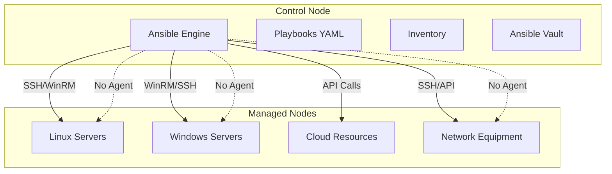

<a name="fondamentaux-ansible" id="fondamentaux-ansible"></a>

# Ansible - Les Fondamentaux 🎯

### Maîtriser l'automatisation d'infrastructure moderne

Ansible est l'outil d'automatisation de référence qui révolutionne la gestion d'infrastructure. Cette formation couvre les aspects essentiels pour devenir autonome avec Ansible.

---

# Pourquoi cette formation ? 💡

### Pourquoi cette formation est essentielle ?

- **Demande du marché** : 89% des entreprises utilisent Ansible en 2025
- **Efficacité** : Réduction de 75% du temps de déploiement

---

# Bénéfices concrets 💡

- **Fiabilité** : Élimination des erreurs manuelles
- **Évolutivité** : Gestion de milliers de serveurs simultanément

---

# Historique d'Ansible 📚

### Évolution d'Ansible


---

# Adoption massive 2025 📈

### Chiffres clés

- **+50,000 contributeurs** sur GitHub
- **+2,000 entreprises** utilisatrices

---

# Adoption suite 📈

- **+30M téléchargements** par mois
- **Top 3** des outils DevOps les plus populaires

---

# Architecture Ansible 🏗️

### Architecture simple et puissante



---

# Principes fondamentaux 📋

### Les 4 piliers d'Ansible

- **Agentless** : Aucun agent à installer sur les cibles
- **Idempotent** : Même résultat à chaque exécution

---

# Principes suite 📋

- **Déclaratif** : Décrire l'état désiré, pas les étapes
- **Simple** : YAML lisible par humains et machines

---

# Installation 2025 ⚙️

### Installation recommandée

```bash
# Méthode pip (recommandée)
python3 -m pip install --user ansible
```

---

# Vérification installation ⚙️

```bash
# Installation complète avec collections
pip install ansible ansible-core

# Vérification
ansible --version
```

---

# Configuration de base 🔧

### Configuration optimisée

```ini
# ansible.cfg
[defaults]
inventory = ./inventory
remote_user = ansible
host_key_checking = False
```

---

# Inventaire simple 📋

### Inventaire statique YAML

```yaml
# inventory/hosts.yml
all:
  vars:
    ansible_user: ansible
    ansible_python_interpreter: /usr/bin/python3

  children:
    webservers:
      hosts:
        web-01:
          ansible_host: 10.0.1.10
        web-02:
          ansible_host: 10.0.1.11
```

---

# Premier playbook 🎭

### Structure d'un playbook simple

```yaml
# deploy-web.yml
---
- name: Installation serveur web
  hosts: webservers
  become: true

  tasks:
    - name: Installation Nginx
      apt:
        name: nginx
        state: present
```

---

# Exécution du playbook 🚀

```bash
# Lancer le playbook
ansible-playbook -i inventory/hosts.yml deploy-web.yml
```

---

# Variables essentielles 🔧

### Variables dans un playbook

```yaml
---
- name: Configuration avec variables
  hosts: webservers
  become: true

  vars:
    nginx_port: 80
    site_name: "mon-site"

  tasks:
    - name: Installation Nginx
      apt:
        name: nginx
        state: present
```

---

# Template simple 📝

### Template Jinja2 basique

```nginx
# templates/nginx.conf.j2
server {
    listen {{ nginx_port }};
    server_name {{ site_name }};
    root /var/www/html;
    index index.html;
}
```

---

# Utilisation du template 📝

```yaml
- name: Configuration Nginx
  template:
    src: nginx.conf.j2
    dest: /etc/nginx/sites-available/default
  notify: restart nginx
```

---

# Handlers 🔄

### Gestion des services

```yaml
handlers:
  - name: restart nginx
    systemd:
      name: nginx
      state: restarted
```

---

# Rôles - Concept 🏗️

### Qu'est-ce qu'un rôle ?

Un **rôle** Ansible est une façon d'organiser et de réutiliser du code. C'est comme une "recette" pour configurer un type de serveur.

---

# Structure d'un rôle 🏗️

```
roles/webserver/
├── tasks/
│   └── main.yml        # Actions à exécuter
├── templates/
│   └── nginx.conf.j2   # Fichiers de configuration
├── vars/
│   └── main.yml        # Variables du rôle
└── handlers/
    └── main.yml        # Services à redémarrer
```

---

# Rôle simple - Tasks 🏗️

```yaml
# roles/webserver/tasks/main.yml
---
- name: Installation Nginx
  apt:
    name: nginx
    state: present

- name: Démarrage Nginx
  systemd:
    name: nginx
    state: started
    enabled: true
```

---

# Utilisation d'un rôle 🏗️

```yaml
# site.yml
---
- name: Configuration serveurs web
  hosts: webservers
  become: true

  roles:
    - webserver
```

---

# Modules essentiels 🔧

### Module apt/yum

```yaml
# Installation de paquets
- name: Installation des paquets
  apt:
    name:
      - nginx
      - git
      - curl
    state: present
```

---

# Module systemd 🔧

```yaml
# Gestion des services
- name: Démarrage du service
  systemd:
    name: nginx
    state: started
    enabled: true
```

---

# Module copy 🔧

```yaml
# Copie de fichiers
- name: Copie du fichier
  copy:
    src: index.html
    dest: /var/www/html/index.html
    owner: www-data
    group: www-data
    mode: '0644'
```

---

# Module file 🔧

```yaml
# Création de répertoires
- name: Création du répertoire
  file:
    path: /var/www/monsite
    state: directory
    owner: www-data
    group: www-data
    mode: '0755'
```

---

# Stack LAMP simple 🚀

### Déploiement d'une application web

```yaml
---
- name: Installation stack LAMP
  hosts: webservers
  become: true

  tasks:
    - name: Installation des paquets
      apt:
        name:
          - apache2
          - mysql-server
          - php
          - php-mysql
        state: present
```

---

# Configuration MySQL 🗄️

```yaml
- name: Sécurisation MySQL
  mysql_user:
    name: root
    password: "{{ mysql_root_password }}"
    host: localhost

- name: Création base de données
  mysql_db:
    name: webapp
    state: present
```

---

# Ansible et Docker 🐳

### Installation Docker

```yaml
---
- name: Installation Docker
  hosts: docker_hosts
  become: true

  tasks:
    - name: Installation Docker
      apt:
        name:
          - docker.io
          - docker-compose
        state: present

    - name: Démarrage Docker
      systemd:
        name: docker
        state: started
        enabled: true
```

---

# Déploiement container 🐳

```yaml
- name: Lancement container web
  docker_container:
    name: webapp
    image: nginx:alpine
    ports:
      - "80:80"
    state: started
    restart_policy: always
```

---

# Bonnes pratiques 🛡️

### Sécurité SSH

```yaml
- name: Configuration SSH sécurisée
  lineinfile:
    path: /etc/ssh/sshd_config
    regexp: '^PermitRootLogin'
    line: 'PermitRootLogin no'
  notify: restart ssh
```

---

# Firewall basique 🔒

```yaml
- name: Configuration firewall
  ufw:
    rule: allow
    port: "{{ item }}"
    proto: tcp
  loop:
    - 22
    - 80
    - 443
```

---

# Tests avec check mode 🧪

```bash
# Test sans modification
ansible-playbook --check playbook.yml

# Test avec différences
ansible-playbook --check --diff playbook.yml
```

---

# Exercice pratique 🎯

### Mission : Serveur web complet

**Objectif** : Déployer un serveur web sécurisé avec Ansible

**Étapes** :
1. Installer Nginx
2. Configurer le firewall
3. Déployer un site HTML simple
4. Sécuriser SSH

---

# Contraintes de l'exercice 🎯

**Contraintes** :
- Utiliser un rôle réutilisable
- Gérer les variables proprement
- Inclure des handlers pour les services
- Tester en mode check avant application

---

# Ressources pour aller plus loin 📚

### Documentation officielle

- **Ansible Docs** : https://docs.ansible.com
- **Ansible Galaxy** : https://galaxy.ansible.com
- **Communauté** : https://github.com/ansible/ansible

---

# Formation continue 🎓

### Prochaines étapes

- **Ansible Tower/AWX** : Interface graphique
- **Ansible Vault** : Gestion des secrets
- **Ansible Collections** : Modules spécialisés
- **CI/CD avec Ansible** : Intégration continue 