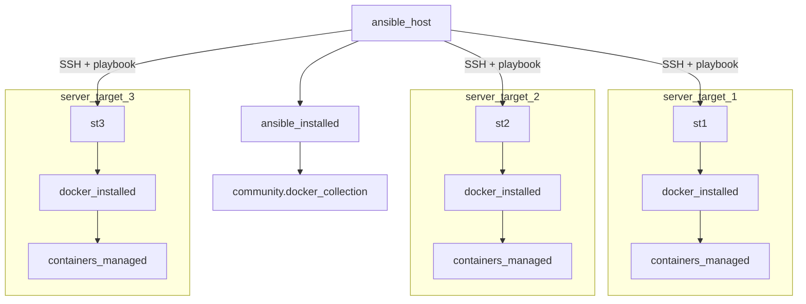
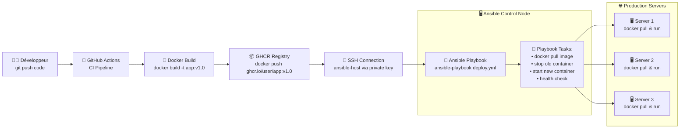

```mermaid
flowchart LR
    dev["👨‍💻 Développeur<br/>git push code"]
    ci["🦊 GitLab CI/CD<br/>Pipeline Runner"]
    img["🐳 Docker Build<br/>docker build -t app:latest"]
    reg["📦 GitLab Registry<br/>registry.gitlab.com/project/app"]
    webhook["🔔 Webhook/SSH<br/>Trigger deployment"]
    ans["🎯 Ansible Execution<br/>ansible-playbook site.yml"]
    
    dev --> ci
    ci --> img
    img --> reg
    reg --> webhook
    webhook --> ans

    subgraph "🖥️ Ansible Control Node"
        ans --> inventory["📋 Inventory Check<br/>• production servers<br/>• staging servers"]
        inventory --> tasks["📄 Deployment Tasks:<br/>• login to registry<br/>• pull new image<br/>• rolling update<br/>• rollback if failed"]
    end

    subgraph "🌐 Target Infrastructure"
        prod1["🖥️ Production 1<br/>app:latest running"]
        prod2["🖥️ Production 2<br/>app:latest running"]
        stage1["🔧 Staging<br/>testing environment"]
    end

    tasks --> stage1
    stage1 --> prod1
    stage1 --> prod2
    
    subgraph "📊 Monitoring"
        health["❤️ Health Checks<br/>• container status<br/>• application metrics<br/>• logs monitoring"]
    end
    
    prod1 --> health
    prod2 --> health
```

<a name="fondamentaux-ansible" id="fondamentaux-ansible"></a>

# Ansible - Automatisation Infrastructure 🎯

---

# Ansible - Automatisation Infrastructure 🎯

### Infrastructure as Code moderne et simple

Ansible est l'outil d'automatisation de référence : **sans agent, idempotent, déclaratif**.

> l'idempotence signifie qu'une opération a le même effet qu'on l'applique une ou plusieurs fois.

---

# Ansible - Perfect pour Docker

### Pourquoi Ansible + Docker ?

Parfait pour orchestrer Docker et automatiser l'infrastructure.

Exemple concret : Automatiser le déploiement d’une app Dockerisée sur plusieurs serveurs en une seule commande, sans se connecter manuellement à chaque machine, pour installer Docker, copier le code, builder l’image, lancer le conteneur, et gérer les mises à jour ou redémarrages.

---

# Pourquoi Ansible ? 💡

### Les avantages clés

🎯 **Simple** : Configuration YAML lisible

🔄 **Idempotent** : Même résultat à chaque exécution

🚀 **Sans agent** : SSH/WinRM/API uniquement

---

# Pourquoi Ansible ? (suite) 💡

### Plus d'avantages

📈 **Scalable** : De 1 à 10,000+ serveurs

🔒 **Sécurisé** : Utilise vos connexions existantes

---

# Installation et setup 2025 ⚙️

### Installation rapide

```bash
# Installation via pip (recommandé)
python3 -m pip install --user ansible
# Collections essentielles
# community.general : collection avec plein de modules pour gérer fichiers, paquets, services, réseau, clouds, etc.
# ansible.posix : modules spécifiques POSIX/Linux comme gestion utilisateurs, groupes, permissions, tâches cron, commandes système.
# ansible.windows : modules spécifiques Windows comme gestion services, tâches planifiées, partage de fichiers.
ansible-galaxy collection install community.general ansible.posix
# Vérification
ansible --version
```

> Si vous avez : Nothing to do. All requested collections are already installed. If you want to reinstall them, consider using `--force`.

<br/>

> Cela veut dire que vous avez déjà installé les collections ou que vous avez déjà installé ansible qui les comporte maintenant par défaut.

---

# Installation Windows

```bash
# Si Windows et pas de python :
# Installer python via chocolatey
choco install python
# Installer ansible via pip
python3 -m pip install --user ansible
# Vérification
ansible --version
```

---

# Solution environnement virtuel

Si vous avez un problème d'installation, voici une solution :

> Sur python 3 vous devez mettre en place un venv :

```bash
python3 -m venv .venv
source .venv/bin/activate
pip3 install ansible
```

> Cela créer un environnement virtuel avec ansible installé dedans. (mode sandbox par défaut de python 3 pour ne pas polluer votre environnement global)

---

Pour bien comprendre schématiquement le fonctionnement d'ansible, voici un schéma :



---

Vous pouvez avoir plusieurs buts à l'utilisation d'ansible :

- Vous voulez automatiser des tâches répétitives (installation de paquets, configuration de services, etc.)
- Vous voulez déployer des applications sur plusieurs serveurs
- Vous voulez configurer des serveurs de manière uniforme
- Vous voulez gérer des secrets de manière sécurisée

---

# Intégration d’Ansible dans un workflow CI/CD

## Option 1 — Utilisation avec GitHub Actions

<br/>

> Il est tout à fait possible d’intégrer Ansible dans un pipeline GitHub Actions afin d’automatiser le déploiement à chaque git push.
Deux approches sont possibles :

- Exécution distante : GitHub Actions peut se connecter en SSH à un serveur (via une clé privée stockée dans les secrets) pour exécuter un ansible-playbook depuis ce serveur.
- Runner auto-hébergé : Vous pouvez utiliser un runner GitHub hébergé sur un serveur interne, avec Ansible installé, afin de lancer localement les déploiements via les playbooks.

>💡 Attention : dans ce modèle, Ansible ne copie pas directement le code applicatif. Le code est packagé dans une image Docker (via GitHub Actions), poussée vers un registry (comme GHCR), puis Ansible se charge uniquement de récupérer et d’exécuter cette image sur les serveurs cibles (docker pull, docker_container…).

---



---

## 🧩 Option 2 — Intégration avec GitLab CI/CD

GitLab permet un fonctionnement similaire :

- Le pipeline CI build l’image Docker de votre application.
- Cette image est poussée automatiquement vers le GitLab Container Registry.
- Ensuite, plusieurs options sont possibles :
- Exécution Ansible depuis le pipeline, si le runner dispose d’Ansible.
- Connexion SSH à un hôte distant pour exécuter un playbook.

- Déclenchement via webhook d’un outil externe tel que Jenkins, qui se chargera lui-même de lancer Ansible.

---



---

# Qu'est-ce qu'un Inventaire ? 📋

### Le carnet d'adresses de vos serveurs

L'**inventaire** est un fichier qui liste tous vos serveurs et leurs informations :

- 📍 **Adresses IP** : Où sont vos serveurs

- 👥 **Groupes** : Organiser par fonction (web, base de données...)

- ⚙️ **Variables** : Configuration spécifique à chaque serveur

- 🔑 **Connexion** : Comment se connecter (utilisateur, clés SSH...)

**Analogie** : C'est comme un carnet d'adresses pour vos serveurs !

---

# Inventaire : Définir vos serveurs 📋

```yaml
# inventory/hosts.yml - Fichier d'inventaire principal
all:  # Groupe racine qui contient TOUS les serveurs
  vars:  # Variables globales applicables à tous les serveurs
    ansible_user: ubuntu  # Utilisateur par défaut pour se connecter via SSH
    ansible_python_interpreter: /usr/bin/python3  # Chemin vers Python sur les serveurs cibles

  children:  # Sous-groupes organisés par fonction
    docker_hosts:  # Groupe des serveurs qui hébergent Docker
      hosts:  # Liste des serveurs dans ce groupe
        docker-01: {ansible_host: 10.0.1.10}  # Nom logique : adresse IP réelle
        docker-02: {ansible_host: 10.0.1.11}  # Deuxième serveur Docker

    databases:  # Groupe des serveurs de base de données
      hosts:  # Serveurs de BDD
        db-01: {ansible_host: 10.0.1.20}  # Serveur de base de données principal

    webservers:  # Groupe des serveurs web (déclaration vide ici)
databases:  # Redéfinition du groupe databases (peut créer confusion)
  hosts:  # Liste des serveurs de BDD
    db-01: {ansible_host: 10.0.1.20}  # Même serveur que plus haut

webservers:  # Définition du groupe webservers
  hosts:  # Serveurs web avec notation de plage
    web-[01:03]: {ansible_host: '10.0.1.{{ 30 + item }}'}  # Génère web-01, web-02, web-03 avec IPs 10.0.1.31, 10.0.1.32, 10.0.1.33
```

---

# Un inventaire déjà fait pour vous en local pour s'entraîner

```yaml
all:
  children:
    local:
      hosts:
        localhost:
          ansible_connection: local
          ansible_python_interpreter: /usr/bin/python3
```

```bash
ansible-inventory --graph
```

Vous aurez un graphique qui ressemblera à ça :

```bash
@all:
  |--ungrouped: # logique, vous n'avez rien qui n'est pas dans un groupe, donc ungrouped est vide
  |--@local:
  |  |--localhost
```

---

# Qu'est-ce qu'un Playbook ? 🎭

### La recette de cuisine pour vos serveurs

Un **playbook** est un fichier qui décrit les actions à effectuer :

- 📝 **Recette** : Suite d'étapes ordonnées

- 🎯 **Cibles** : Sur quels serveurs agir

- 🔧 **Tâches** : Quoi installer, configurer, démarrer

- 🎭 **Rôles** : Qui fait quoi (utilisateur admin ou normal)

**Analogie** : C'est comme une recette de cuisine, mais pour configurer vos serveurs !

---

# Premier playbook 🎭

```yaml
- name: Configuration serveurs Docker
  hosts: local
  become: true
  vars:
    docker_compose_version: '2.24.0'
    ansible_ssh_public_key: "{{ lookup('file', '~/.ssh/id_rsa.pub') }}"

  tasks:
    - name: Installation Docker
      apt:
        name:
          - docker.io
        state: present
        update_cache: true

    - name: Creer utilisateur ansible
      user:
        name: ansible
        groups: sudo,docker
        append: true
        shell: /bin/bash
        create_home: true

    - name: Creer le dossier .ssh
      file:
        path: /home/ansible/.ssh
        state: directory
        owner: ansible
        group: ansible
        mode: '0700'

    - name: Copier la clef publique dans authorized_keys
      copy:
        content: "{{ ansible_ssh_public_key }}"
        dest: /home/ansible/.ssh/authorized_keys
        owner: ansible
        group: ansible
        mode: '0600'

    - name: Creer le dossier /etc/sudoers.d si absent
      file:
        path: /etc/sudoers.d
        state: directory
        owner: root
        group: root
        mode: '0750'

    - name: Ajouter sudo sans mot de passe pour ansible
      copy:
        dest: /etc/sudoers.d/ansible
        content: "ansible ALL=(ALL) NOPASSWD: ALL\n"
        mode: '0440'

    - name: Demarrage et activation Docker
      systemd:
        name: docker
        state: started
        enabled: true
      when: ansible_facts.virtualization_type != "docker"
```

---

# Exécution du playbook

```bash
# Exécution
ansible-playbook -i inventory/hosts.yml deploy.yml
```

---

# Qu'est-ce qu'un Module ? 📦

### Les outils prêts à l'emploi

Un **module** est une fonction prête à utiliser dans Ansible :

- 🛠️ **Outil spécialisé** : Une action précise (installer, copier, démarrer...)

- 🎛️ **Paramètres** : Options pour personnaliser l'action

- ✅ **Idempotent** : Peut être exécuté plusieurs fois sans problème

- 📚 **Bibliothèque** : Des centaines de modules disponibles

**Analogie** : C'est comme avoir une boîte à outils avec chaque outil pour une tâche précise !

---

# Modules essentiels 📦

### Les modules indispensables pour Docker/Infrastructure

```yaml
# Gestion des packages
- name: Installation packages
  apt:
    name: [nginx, git, docker.io, python3-pip]
    state: present
```

---

# Modules : Fichiers et templates

```yaml
# Gestion des fichiers/templates
- name: Configuration nginx
  template:
    src: nginx.conf.j2
    dest: /etc/nginx/nginx.conf
    backup: true
  notify: restart nginx
```

---

# Modules : Commandes et scripts

```yaml
# Commandes et scripts
- name: Build application
  shell: |
    cd /opt/app
    docker build -t myapp:{{ app_version }} .
  changed_when: true
```

---

# Modules : Containers Docker

```yaml
# Gestion des containers Docker
- name: Lancer container webapp
  community.docker.docker_container:
    name: webapp
    image: 'myapp:{{ app_version }}'
    ports:
      - '80:8080'
    state: started
    restart_policy: always
```

---

# Qu'est-ce qu'une Variable ? 🔧

### Les données personnalisables

Une **variable** permet de personnaliser vos playbooks :

- 📊 **Données** : Valeurs réutilisables (version, nom, chemin...)

- 🎯 **Flexibilité** : Même playbook pour différents environnements

- 🔄 **Réutilisabilité** : Évite la duplication de code

- 🌍 **Environnements** : Dev, test, production avec des valeurs différentes

**Analogie** : C'est comme des champs à remplir dans un formulaire !

---

# Variables et templates 🔧

### Configuration dynamique

```yaml
# group_vars/all.yml
app_version: 'v1.2.0'
db_password: '{{ vault_db_password }}'
nginx_worker_processes: '{{ ansible_processor_vcpus }}'
```

---

# Variables par environnement

```yaml
# Variables par environnement
environments:
  dev:
    domain: 'dev.myapp.com'
    replicas: 1
  prod:
    domain: 'myapp.com'
    replicas: 3
```

---

# Qu'est-ce qu'un Template ? 📄

### Les fichiers configurables automatiquement

Un **template** est un fichier modèle avec des variables :

- 📄 **Modèle** : Fichier avec des zones à remplir automatiquement

- 🔧 **Variables** : Placeholders remplacés par des vraies valeurs

- 🎯 **Génération** : Crée des fichiers personnalisés pour chaque serveur

- ⚙️ **Configuration** : Fichiers de config adaptés à chaque environnement

**Analogie** : C'est comme un document Word avec des champs à compléter automatiquement !

---

# Template : Exemple concret 📄

### De la théorie à la pratique

**Situation** : Vous devez configurer une application web sur 10 serveurs différents, chacun avec son IP et sa configuration spécifique.

**Sans template** : 10 fichiers de config différents à maintenir manuellement 😰

**Avec template** : 1 seul fichier modèle + variables = 10 configs générées automatiquement ! 🎉

---

# Template : Exemple simple 📄

### Fichier de configuration d'application

```bash
{# templates/app.conf.j2 - Le template (modèle) #}
# Configuration pour {{ inventory_hostname }}
server_name={{ inventory_hostname }}
server_ip={{ ansible_default_ipv4.address }}
database_host={{ db_host }}
database_port={{ db_port | default(5432) }}
debug_mode={{ debug | default('false') }}

# Génération conditionnelle

log_level=ERROR

log_level=DEBUG

```

---

# Template : Résultat généré 📄

### Ce que produit le template sur le serveur web-01

```bash
# Configuration pour web-01
server_name=web-01
server_ip=10.0.1.31
database_host=db-01.mondomaine.com
database_port=5432
debug_mode=false

# Génération conditionnelle
log_level=ERROR
```

**🎯 Magie** : Même template → Configs différentes selon le serveur !

---

# Template nginx avancé

```bash
{# templates/nginx.conf.j2 #}
worker_processes {{ nginx_worker_processes }};
# On peut utiliser des boucles pour générer des fichiers de config dynamiquement
upstream app {
# autant de x le nombre de replicas dans le ".env" alors on fais l'action
# (si replicas = 3 => on écrira dans la conf de nginx 3 x la commande server app-)

    server app-{{ i+1 }}:8080;

}
```

---

# Template nginx (suite)

```bash
server {
    server_name {{ environments[env].domain }};
    
    location / {
        proxy_pass http://app;
    }
}
```

---

# Template : Syntaxe Jinja2 📄

### Les éléments essentiels à retenir

```bash
{# Ceci est un commentaire (ne sera pas dans le fichier final) #}

{{ variable }}                    # Affiche la valeur d'une variable
{{ variable | default('valeur') }} # Valeur par défaut si variable vide
{{ ansible_hostname }}            # Variable automatique d'Ansible

                # Structure conditionnelle
  contenu si vrai

  contenu si faux


           # Boucle
  traiter {{ item }}

```

**💡 Astuce** : Les templates utilisent l'extension `.j2` (pour Jinja2)

---

# Qu'est-ce qu'un Handler ? 🎯

### Les actions déclenchées automatiquement

Un **handler** est une tâche qui se déclenche uniquement si nécessaire :

- 🔔 **Réaction** : Se déclenche quand quelque chose change

- ⚡ **Efficacité** : Évite les redémarrages inutiles

- 🎯 **Précision** : Action ciblée (redémarrer service, recharger config...)

- 🔄 **Idempotence** : Ne s'exécute que si vraiment nécessaire

**Analogie** : C'est comme un système d'alarme qui ne sonne que s'il y a un problème !

---

# Handlers et conditions 🎯

### Réactivité et logique

```yaml
tasks:
  - name: Configuration Docker daemon
    template:
      src: daemon.json.j2
      dest: /etc/docker/daemon.json
    notify: restart docker
    when: configure_docker_daemon | default(false)
```

---

# Handlers : Déploiement multi-réplicas

```yaml
- name: Déploiement app selon environnement
  community.docker.docker_container:
    name: 'webapp-{{ item }}'
    image: 'myapp:{{ app_version }}'
    ports:
      - '{{ 8080 + item }}:8080'
    env:
      ENV: '{{ env }}'
      REPLICA: '{{ item }}'
  loop: '{{ range(1, environments[env].replicas + 1) | list }}'
```

---

# Handlers : Définition

```yaml
handlers:
  - name: restart docker
    systemd:
      name: docker
      state: restarted

  - name: reload nginx
    systemd:
      name: nginx
      state: reloaded
```

---

# Qu'est-ce qu'un Rôle ? 📦

### Les modules réutilisables

Un **rôle** est un ensemble organisé de tâches réutilisables :

- 📁 **Organisation** : Structure claire (tâches, variables, templates...)

- 🔄 **Réutilisabilité** : Utilisable dans plusieurs playbooks

- 📚 **Bibliothèque** : Partageable avec d'autres équipes

- 🧩 **Modularité** : Combine plusieurs rôles pour une solution complète

**Analogie** : C'est comme une application mobile que vous installez pour une fonction précise !

---

# Rôles : Réutilisabilité 📦

### Structure modulaire

```yaml
# roles/docker/tasks/main.yml
---
- name: Installation Docker
  apt:
    name: [docker.io, docker-compose-plugin]
    state: present

- name: Configuration Docker daemon
  template:
    src: daemon.json.j2
    dest: /etc/docker/daemon.json
  notify: restart docker
```

---

# Utilisation des rôles

```yaml
# Utilisation dans un playbook
---
- name: Setup infrastructure
  hosts: all
  become: true

  roles:
    - docker
    - nginx
    - {role: app, app_version: 'v2.0.0'}
```

---

# Ansible + Docker : Stack complète 🐳

### Déploiement d'application containerisée

```yaml
---
- name: Déploiement stack web complète
  hosts: docker_hosts
  become: true
  vars:
    app_name: 'webapp'
    app_version: "{{ lookup('env', 'CI_COMMIT_SHA') | default('latest') }}"
```

---

# Stack Docker : Préparation

```yaml
tasks:
  - name: Création des répertoires
    file:
      path: '/opt/{{ app_name }}/{{ item }}'
      state: directory
    loop: [data, logs, config]
```

---

# Stack Docker : Déploiement

```yaml
- name: Déploiement de l'application
  community.docker.docker_compose:
    project_src: '/opt/{{ app_name }}'
    pull: true
    state: present

- name: Vérification santé des services
  uri:
    url: 'http://{{ inventory_hostname }}/health'
    method: GET
  retries: 5
  delay: 10
```

---

# Qu'est-ce qu'une Collection ? 🌐

### Les extensions spécialisées

Une **collection** est un pack d'extensions pour Ansible :

- 📦 **Pack** : Ensemble de modules spécialisés

- 🌍 **Domaine** : Cloud (AWS, Azure), containers (Docker), orchestration (Kubernetes)

- 🔄 **Évolution** : Mises à jour indépendantes d'Ansible

- 🎯 **Spécialisation** : Outils experts pour des technologies précises

**Analogie** : C'est comme des extensions dans votre navigateur pour des fonctions spéciales !

---

# Collections et écosystème 🌐

### Extensions essentielles

```bash
# Collections Docker
ansible-galaxy collection install community.docker

# Collections Cloud
ansible-galaxy collection install amazon.aws
ansible-galaxy collection install azure.azcollection

# Collections Kubernetes
ansible-galaxy collection install kubernetes.core
```

---

# Utilisation avec collections

```yaml
# Utilisation avec collections
- name: Gestion infrastructure cloud + containers
  hosts: localhost
  tasks:
    - name: Création instance AWS
      amazon.aws.ec2_instance:
        name: 'docker-host'
        image_id: ami-0abcdef1234567890
        instance_type: t3.medium
```

---

# Collections : Attente et déploiement

```yaml
- name: Attente démarrage
  wait_for:
    host: '{{ item.public_ip_address }}'
    port: 22

- name: Déploiement containers
  community.docker.docker_container:
    name: myapp
    image: nginx:alpine
    delegate_to: '{{ item.public_ip_address }}'
```

---

# Qu'est-ce qu'Ansible Vault ? 🔐

### Le coffre-fort pour vos secrets

**Ansible Vault** chiffre vos données sensibles :

- 🔒 **Chiffrement** : Mots de passe, clés API, certificats

- 🔑 **Mot de passe maître** : Un seul mot de passe pour tout déchiffrer

- 📁 **Fichiers sécurisés** : Stockage chiffré dans votre projet

- 👥 **Partage sécurisé** : Équipe peut utiliser sans voir les secrets

**Analogie** : C'est comme un coffre-fort numérique pour vos mots de passe !

---

# Ansible Vault : Secrets 🔐

### Gestion sécurisée des secrets

```bash
# Créer un fichier chiffré
ansible-vault create secrets.yml
ansible-vault edit secrets.yml

# Utilisation
ansible-playbook -i inventory deploy.yml --ask-vault-pass
```

---

# Vault : Utilisation des secrets

```yaml
# secrets.yml (chiffré)
vault_db_password: 'super_secret_password'
vault_api_key: '1234567890abcdef'

# Utilisation dans les playbooks
database:
  password: '{{ vault_db_password }}'

api:
  key: '{{ vault_api_key }}'
```

---

# Optimisation et bonnes pratiques 🚀

### Configuration production

```ini
# ansible.cfg
[defaults]
# Pour ne pas vérifier les clés SSH
host_key_checking = False
# Pour afficher le temps d'exécution de chaque tâche
callback_whitelist = timer, profile_tasks
# Pour afficher les résultats de chaque tâche
stdout_callback = yaml
# Pour configurer le nombre de forks
forks = 20
# Pour configurer le timeout
timeout = 60
```

---

# Structure projet

```
ansible-project/
├── ansible.cfg
├── inventory/
│   ├── production.yml
│   └── staging.yml
├── group_vars/
│   ├── all.yml
│   ├── docker.yml
│   └── webapp.yml
├── templates/
│   ├── nginx.conf.j2
│   ├── docker-compose.yml.j2
│   ├── daemon.json.j2
│   ├── .env.j2
│   └── README.md
├── playbooks/
│   ├── site.yml
│   └── deploy.yml
├── roles/
│   ├── docker/
│   ├── nginx/
│   └── app/
├── .env
├── .env.staging
├── .env.production
├── .env.development
└── secrets.yml (vault)
```

---

# Qu'est-ce qu'un Tag ? 🏷️

### Les étiquettes pour l'exécution sélective

Un **tag** permet d'exécuter seulement certaines parties :

- 🏷️ **Étiquette** : Marquer des tâches par fonction

- 🎯 **Sélectif** : Exécuter seulement l'installation, ou la config...

- ⚡ **Rapidité** : Éviter de rejouer tout le playbook

- 🔧 **Maintenance** : Corrections ciblées sans tout recommencer

**Analogie** : C'est comme des filtres dans une liste de courses !

---

# Tags et exécution sélective

```yaml
- name: Installation Docker
  apt: name=docker.io
  tags: [install, docker]

- name: Configuration
  template: src=config.j2 dest=/etc/app.conf
  tags: [config]
```

---

# Exécution avec tags

```bash
# Exécution sélective
ansible-playbook site.yml --tags "docker,config"
ansible-playbook site.yml --skip-tags "install"
```