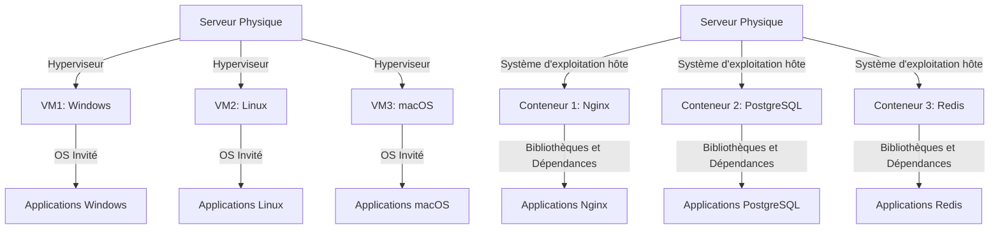
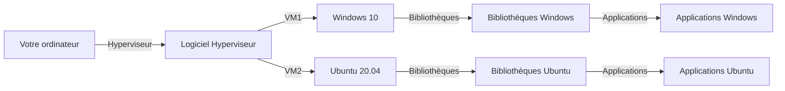
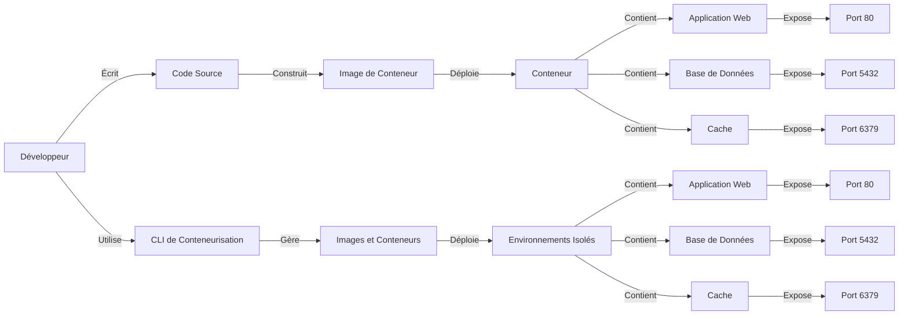

<a name="CI/CD" id="CI/CD"></a>

# Comprendre le CI/CD

> Mais avant tout ! nous devons comprendre ce qu'est le CI/CD ainsi que son utilité et nous verrons en suite les microservices.

Le CI/CD est un processus qui permet de créer, tester et déployer des applications de manière automatisée.

Une métaphore pour comprendre :

- **CI** : Imaginez que vous êtes un chef cuisinier. Vous avez une recette pour faire un gâteau. Le CI (Intégration Continue) consiste à vérifier chaque ingrédient et chaque étape de la recette au fur et à mesure que vous les ajoutez, pour s'assurer que tout est correct et que le gâteau sera réussi.

<br>

- **CD** : Une fois que tous les ingrédients sont vérifiés et que la recette est prête, le CD (Déploiement Continu) consiste à mettre le gâteau au four et à le cuire automatiquement sans intervention supplémentaire, garantissant ainsi que le gâteau sera prêt à être servi dès qu'il est cuit.

---
routeAlias: 'utiliser-des-pipelines-cicd'
---

<a name="PIPELINES" id="PIPELINES"></a>

# Utiliser des pipelines CI/CD

Un pipeline CI/CD est un processus qui permet de créer, tester et déployer des applications de manière automatisée.

Que veux dire pipeline ?

> Un pipeline est un processus qui permet de créer, tester et déployer des applications de manière automatisée.

<br>

> En clair : c'est tout la chaine de déploiement / le processus de déploiement.

---

# Pourquoi parler de CI/CD avec Docker ?

> Docker est un outil de conteneurisation.

<small>

Donc il est important de comprendre le concept de CI/CD avec cet outil.

Imaginons que nous développons une application web, nous voudrions déployer notre application.

Nous pourrions utiliser un pipeline CI/CD pour déployer notre application.

À chaque push sur le dépôt git, la pipeline se déclenche et déploie notre application.

Mais elle déploie notre application dans un container.

Dans un environnement **ISOLÉ ET PORTABLE**, c'est ça que nous voulons !.

Si on change d'environnement de travail, nous n'aurons pas besoin de refaire les mêmes étapes, via Docker.

</small>

---
routeAlias: 'comprendre-les-microservices'
---

<a name="MICROSERVICES" id="MICROSERVICES"></a>

# Comprendre les micro-services

Un micro-service est une application indépendante qui peut être créée à partir d'un système d'exploitation ou d'un environnement logiciel spécifique.

Une métaphore pour comprendre :

- **Micro-service** : Imaginez que vous êtes dans un supermarché. Chaque rayon est un micro-service qui gère un type de produit spécifique. Par exemple, le rayon des fruits s'occupe uniquement des fruits, tandis que le rayon des produits laitiers s'occupe uniquement des produits laitiers. Chaque rayon fonctionne de manière indépendante mais contribue à l'ensemble du supermarché.

---
routeAlias: 'pourquoi-utiliser-les-microservices'
---

<a name="MICROSERVICES" id="MICROSERVICES"></a>

# Pourquoi utiliser les micro-services ?

Les micro-services permettent de découper une application en plusieurs services indépendants qui peuvent être développés, déployés et gérés de manière indépendante. Cela permet de rendre l'application plus modulaire, plus facile à maintenir et plus scalable.

---

# Exemple concret et ... à quoi ça sert ?

Imaginons que nous développons une application de e-commerce.

Nous pourrions avoir les micro-services suivants :

- **Microservice de gestion de produits** : Gère la gestion des produits, les stocks, les prix, etc.
- **Microservice de gestion de commandes** : Gère la gestion des commandes, la facturation, la livraison, etc.
- **Microservice de gestion de paiement** : Gère la gestion des paiements, les transactions, etc.
- **Microservice de gestion des utilisateurs** : Gère la gestion des utilisateurs, les comptes, les permissions, etc.

J'espère que vous avez compris le concept de micro-service.

Car à vrai dire quand vous utilisez Docker/docker vous n'allez pas créer des micro-services.

Mais vous allez utiliser des containers qui eux même peuvent être des micro-services.

Et de toute façon cette architecture est utilisé dans la vie de tous les jours.

---

<small>

## QCM sur les micro-services et le CI/CD

<br>

### 1. Quel est l'avantage principal des micro-services ?

<br>

- [ ] Ils permettent de créer des applications monolithiques.
- [ ] Ils permettent de découper une application en plusieurs services indépendants.
- [ ] Ils nécessitent moins de ressources que les applications traditionnelles.
- [ ] Ils sont plus difficiles à maintenir.

<br>

### 2. Dans l'exemple d'une application de e-commerce, quel micro-service gère les transactions de paiement ?

<br>

- [ ] Microservice de gestion de produits
- [ ] Microservice de gestion de commandes
- [ ] Microservice de gestion de paiement
- [ ] Microservice de gestion des utilisateurs

</small>

---

<small>

### 3. Pourquoi utiliser les micro-services ?

<br>

- [ ] Pour rendre l'application plus modulaire, plus facile à maintenir et plus scalable.
- [ ] Pour augmenter la complexité de l'application.
- [ ] Pour réduire le nombre de développeurs nécessaires.
- [ ] Pour éviter l'utilisation de conteneurs.

<br>

</small>

---

<small>

### 4. Quel est l'objectif principal du CI/CD ?

<br>

- [ ] Augmenter la complexité du développement logiciel.
- [ ] Automatiser le processus de développement, de test et de déploiement.
- [ ] Réduire la qualité du code.
- [ ] Remplacer les développeurs par des machines.

<br>

### 5. Quel outil est couramment utilisé pour le CI/CD ?

<br>

- [ ] Docker Hub
- [ ] Jenkins
- [ ] GitHub Packages
- [ ] Quay.io

</small>

---

# Réponse(s)

<small>

1. Ils permettent de créer des applications modulaires et indépendantes.
2. Microservice de gestion de paiement
3. Pour rendre l'application plus modulaire, plus facile à maintenir et plus scalable.
4. Automatiser le processus de développement, de test et de déploiement.
5. GitHub Packages / Jenkins

</small>

---
layout: new-section
routeAlias: 'des-definitions-avant-tout'
---

# Des définitions avant tout


---

# Définition de virtualisation

La virtualisation est un processus qui permet de créer une image d'un système d'exploitation ou d'un environnement logiciel dans ce qu'on appelle une machine virtuelle.

# Définition de conteneur

Un conteneur est un environnement isolé qui permet de déployer des applications à partir d'un système d'exploitation ou d'un environnement logiciel.

# Définition de conteneurisation

La conteneurisation est un processus qui permet de créer un conteneur à partir d'un système d'exploitation ou d'un environnement logiciel.

---

<!-- pas a la bonne place -->

# Définition de machine virtuelle

Une machine virtuelle est un environnement logiciel qui permet d'exécuter des systèmes d'exploitation ou des applications de manière isolée, en simulant un matériel informatique.

---
routeAlias: 'virtualisation-vs-conteneurisation'
---

<a name="VIRTUALISATION" id="VIRTUALISATION"></a>

# Virtualisation vs conteneurisation

La virtualisation et la conteneurisation sont deux concepts liés à la gestion des ressources informatiques.

- **Virtualisation** : La virtualisation est un processus qui permet de créer une image d'un système d'exploitation ou d'un environnement logiciel dans un conteneur.
- **Conteneurisation** : La conteneurisation est un processus qui permet de créer un conteneur à partir d'un système d'exploitation ou d'un environnement logiciel.

---
routeAlias: 'schema-de-virtualisation-et-de-conteneurisation'
---

# Schéma de la Virtualisation et de la Conteneurisation

<small>
Voici un schéma qui illustre les différences entre la virtualisation et la conteneurisation.

</small>
<div class="mermaid">



</div>

---

# Comment fonctionne la virtualisation ?

La virtualisation est un processus qui permet de créer une image d'un système d'exploitation ou d'un environnement logiciel dans un conteneur.



---

# Comment fonctionne la conteneurisation ?

La conteneurisation est un processus qui permet de créer un conteneur à partir d'un système d'exploitation ou d'un environnement logiciel.



---

# Définition de Kernel

<small>

> Le kernel est le cœur du système d'exploitation qui gère les ressources matérielles et les interactions entre le matériel et les logiciels. Les conteneurs sont des environnements isolés qui partagent le même kernel mais fonctionnent indépendamment les uns des autres.

<br>

## Une petite façon simple de comprendre le kernel :

Le kernel est le cerveau du système d'exploitation.

C'est lui qui gère les ressources matérielles et les interactions entre le matériel et les logiciels.

</small>

---

# QCM sur les définitions

<small>

## Qu'est ce que la virtualisation ?

<br>

- [ ] La virtualisation est un processus qui permet de créer une image d'un système d'exploitation ou d'un environnement logiciel dans un conteneur.
- [ ] La virtualisation est un processus qui permet de créer une machine virtuelle à partir d'un système d'exploitation ou d'un environnement logiciel.
- [ ] La virtualisation est un processus qui permet de créer un conteneur à partir d'un système d'exploitation ou d'un environnement logiciel.
- [ ] La virtualisation est un processus qui permet de créer un conteneur à partir d'un système d'exploitation ou d'un environnement logiciel.

</small>

---

## Qu'est ce que la conteneurisation ?

<br>

<small>

- [ ] La conteneurisation est un processus qui permet de créer un conteneur à partir d'un système d'exploitation ou d'un environnement logiciel.
- [ ] La conteneurisation est un processus qui permet de créer une machine virtuelle à partir d'un système d'exploitation ou d'un environnement logiciel.
- [ ] La conteneurisation est un processus qui permet de créer une image d'un système d'exploitation ou d'un environnement logiciel dans un conteneur.
- [ ] La conteneurisation est un processus qui permet de créer un conteneur à partir d'un système d'exploitation ou d'un environnement logiciel.

</small>

---

<small>

## Quel est la différence entre la virtualisation et la conteneurisation ?

<br>

- [ ] La virtualisation est un processus qui permet de créer une image d'un système d'exploitation ou d'un environnement logiciel dans un conteneur alors que la conteneurisation est un processus qui permet de créer un conteneur à partir d'un système d'exploitation ou d'un environnement logiciel.

- [ ] La virtualisation est un processus qui permet de créer une machine virtuelle à partir d'un système d'exploitation ou d'un environnement logiciel alors que la conteneurisation est un processus qui permet de créer un conteneur à partir d'un système d'exploitation ou d'un environnement logiciel.

- [ ] La conteneurisation est un processus qui permet de créer un conteneur à partir d'un système d'exploitation ou d'un environnement logiciel alors que la virtualisation est un processus qui permet de créer une image d'un système d'exploitation ou d'un environnement logiciel dans un conteneur.

- [ ] La conteneurisation est un processus qui permet de créer une image d'un système d'exploitation ou d'un environnement logiciel dans un conteneur.

</small>

---
layout: text-image
reverse: true
routeAlias: 'intro-Docker'
title: 'intro-Docker'
anchor: 'intro-Docker'
media: 'https://wiki.ghr36cloud.com/docker.png'
---

<a name="DISCLAIMER" id="intro-Docker"></a>

# Introduction à Docker

Docker est un outil de gestion de conteneurs qui permet de créer, gérer et exécuter des conteneurs.

Docker offre des fonctionnalités telles que la gestion des services et une meilleure sécurité grâce à son architecture.

---
routeAlias: 'le-cli-docker'
---

<a name="le-cli-docker" id="le-cli-docker"></a>

# Le CLI Docker

Nous allons voir les commandes principales de Docker.

### Commandes principales Docker

| Commande               | Description                                    |
| ---------------------- | ---------------------------------------------- |
| <kbd>docker run</kbd>  | Exécute une commande dans un nouveau conteneur |
| <kbd>docker ps</kbd>   | Liste les conteneurs en cours d'exécution      |
| <kbd>docker stop</kbd> | Arrête un conteneur en cours d'exécution       |
| <kbd>docker rm</kbd>   | Supprime un conteneur arrêté                   |

---

<small>

| Commande                 | Description                                                 |
| ------------------------ | ----------------------------------------------------------- |
| <kbd>docker pull</kbd>   | Télécharge une image depuis un registre                     |
| <kbd>docker images</kbd> | Liste les images disponibles localement                     |
| <kbd>docker rmi</kbd>    | Supprime une ou plusieurs images                            |
| <kbd>docker exec</kbd>   | Exécute une commande dans un conteneur en cours d'exécution |
| <kbd>docker build</kbd>  | Construit une image à partir d'un Dockerfile                  |
| <kbd>docker push</kbd>   | Envoie une image à un registre                             |
| <kbd>docker tag</kbd>    | Ajoute un tag à une image                                   |
| <kbd>docker login</kbd>  | Connecte à un registre                                      |
| <kbd>docker logout</kbd> | Déconnecte d'un registre                                    |

</small>

---
routeAlias: "commandes-docker-avancees"
---

<a name="commandes-docker-avancees" id="commandes-docker-avancees"></a>

# Commandes avancées

Voici quelques commandes avancées.

### Commandes avancées

| Commande                         | Description                                       |
| -------------------------------- | ------------------------------------------------- |
| <kbd>docker network create</kbd> | Crée un nouveau réseau Docker                     |
| <kbd>docker volume create</kbd>  | Crée un nouveau volume Docker                     |
| <kbd>docker inspect</kbd>        | Affiche les détails d'un conteneur ou d'une image |
| <kbd>docker logs</kbd>           | Affiche les logs d'un conteneur                   |

---

# Encore des Commandes avancées

Voici quelques autres commandes Docker avancées.

### Commandes avancées supplémentaires

| Commande                       | Description                                                                                       |
| ------------------------------ | ------------------------------------------------------------------------------------------------- |
| <kbd>docker-compose up</kbd>   | Démarre et attache des conteneurs définis dans un fichier docker-compose                          |
| <kbd>docker-compose down</kbd> | Arrête et supprime les conteneurs, réseaux, volumes définis dans un fichier docker-compose        |
| <kbd>docker-compose logs</kbd> | Affiche les logs des services définis dans un fichier docker-compose                              |
| <kbd>docker-compose exec</kbd> | Exécute une commande dans un conteneur en cours d'exécution défini dans un fichier docker-compose |

---

> Petite astuce :

Depuis la version 2.0 de docker , vous n'êtes plus obligé d'écrire docker-compose avec le tiret du milieu mais vous pouvez faire :

```bash
docker compose up
```

<br>

> Ne vous inquiétez pas, nous verrons plus tard comment utiliser ces commandes.

<br>

## Directement !

---
layout: new-section
routeAlias: 'images-Docker'
---

<a name="images-Docker" id="images-Docker"></a>

# Images Docker


---

> Déjà reprenons ce qu'est une image.

Une image est un fichier qui contient un système d'exploitation ou un environnement logiciel.

**<u>Exemple :</u>**

```bash
docker pull ubuntu:latest
```

<small>

Cela va nous donner une image de la distribution linux Ubuntu.

Je vais donc **À PARTIR DE CETTE IMAGE** créer un **CONTENEUR**.

> Je peux récuperer des images sur des registres comme :

- Docker Hub
- Quay.io
- GitHub Packages
- etc

Mais bien sur je peux aussi créer mes images.

<div class="-mt-6">

(sois à partir de rien, sois à partir d'une autre image dont je vais créer des surcouches)

</div>

</small>

---

## Astuce en plus, on peut directement chercher des images avec la commande :

<br>

```bash
docker search <image>
```

Attention petite précision : les images sont lourdes, il faut donc les utiliser avec parcimonie.

En général, on utilise des images de base légères comme `alpine`, `ubuntu:slim`, `debian:slim`, etc...

**Je pense que vous avez compris le truc, il faut essayer d'utiliser des images de base légères.**

---
layout: new-section
routeAlias: "creer-son-premier-conteneur"
---

<a name="creer-son-premier-conteneur" id="creer-son-premier-conteneur"></a>

<!-- ps Docker -->

# Créer son premier conteneur


---

# Créer son premier conteneur

```bash
Docker run -d --name my-container -p 8080:80 nginx
```

## Explications

- `Docker run` : Commande pour créer et exécuter un conteneur.
- `-d` : Exécute le conteneur en arrière-plan.
- `--name my-container` : Nom du conteneur.
- `-p 8080:80` : Port du conteneur. (8080 sur l'host, 80 dans le conteneur)
- `nginx` : Image à utiliser.

---

# Tout petit exercice :

Créer un conteneur qui tourne une image nginx ou de votre choix et qui est accessible sur votre host.

Vous avez déjà tout ce qu'il faut dans la slide précédente.

Vous pouvez en suite utiliser les commande `Docker ps` et `Docker logs <id>` pour vérifier que tout fonctionne et que le conteneur tourne.

Vous pouvez vous amuser à créer plusieurs conteneurs à partir de la même image et de les rendre accessibles depuis votre host.

Vous pouvez aussi essayer d'accéder à l'application depuis votre host.

Et vous pouvez tout stopper avec la commande `Docker stop <id>` et le supprimer avec la commande `Docker rm <id>`.

---

### Exercice : Gestion des Conteneurs

#### Objectif :
Créer, gérer et supprimer un conteneur en utilisant des commandes CLI.

#### Étapes :

1. **Liste des images disponibles**  
   Affichez la liste des images disponibles localement sur votre machine.

   - **Commande à utiliser :**  
     ```bash
     docker images
     ```

2. **Télécharger une nouvelle image**
   Téléchargez l'image `nginx` à partir du registre Docker Hub.

   - **Commande à utiliser :**
     ```bash
     docker pull nginx
     ```

---

3. **Créer et exécuter un conteneur**
   Créez et exécutez un conteneur `nginx` avec un port exposé sur votre machine hôte (port 8080 sur l'hôte redirigé vers le port 80 du conteneur).

   - **Commande à utiliser :**
     ```bash
     docker run -d --name my-nginx -p 8080:80 nginx
     ```

4. **Vérifier le conteneur en cours d'exécution**
   Affichez la liste des conteneurs en cours d'exécution.

   - **Commande à utiliser :**
     ```bash
     docker ps
     ```

---
layout: new-section
---

# DockerFile


---

# En premier, définition d'un Dockerfile/DockerFile.

Un Dockerfile est un fichier qui contient les instructions pour créer une image de conteneur.

Un DockerFile pareil, mais pour Docker.

Par exemple, si j'ai besoin d'une image avec une version de node spécifique et quelques dépendances spécifiques à mon application, je peux créer une image avec la version de node et toutes les dépendances et mon application dont j'ai besoin.

---

# Les commandes principales

Spécifie l'image de base à partir de laquelle l'image Docker sera construite

```dockerfile
FROM <image>:<tag>
```

Définit le créateur du Dockerfile ou des métadonnées sur l'image

```dockerfile
LABEL maintainer="<nom ou email>"
```

---

Copie un fichier ou un répertoire depuis la machine locale vers l'image Docker

```dockerfile
COPY <chemin_source> <chemin_destination>
```

---

Télécharge un fichier depuis une URL vers l'image Docker

```dockerfile
ADD <source> <destination>
```

<br>

> Remarque : `ADD` peut aussi extraire des fichiers compressés, contrairement à `COPY`.

<br>

Définit le répertoire de travail (current working directory) dans l'image

```dockerfile
WORKDIR <chemin>
```

---

Exécute une commande au moment de la création de l'image Docker

<br>

```dockerfile
RUN <commande>
```

<br>

Souvent utilisé pour installer des dépendances ou configurer le système

<br>

```dockerfile
ENV <variable> <valeur>
```

<br>

```dockerfile
EXPOSE <port>
```

---

Spécifie un point d'entrée pour l'exécution d'une commande par défaut dans le conteneur

```dockerfile
ENTRYPOINT ["commande", "argument"]
```

ENTRYPOINT est souvent utilisé pour définir une commande principale qui sera toujours exécutée

Définit une commande par défaut qui peut être remplacée au moment du démarrage du conteneur

```dockerfile
CMD ["commande", "argument"]
```

<br>

> CMD est plus flexible que ENTRYPOINT et peut être écrasé par des paramètres à la ligne de commande

---

Définit une variable d'environnement dans l'image

```dockerfile
ENV <variable> <valeur>
```

Définit les ports que le conteneur va exposer

```dockerfile
EXPOSE <port>
```
Ne mappe pas les ports automatiquement, c'est pour exposer le port dans le container mais pas via votre host

---

Copie des fichiers et conserve les métadonnées de fichiers (comme permissions)
```dockerfile
COPY --chown=<utilisateur>:<groupe> <chemin_source> <chemin_destination>
```

Utile lorsque les permissions sur les fichiers sont importantes dans le conteneur

Définit les volumes que l'image va utiliser

```dockerfile
VOLUME ["/chemin/vers/volume"]
```
Permet de spécifier un ou plusieurs répertoires qui seront montés en volume

Définit l'utilisateur à utiliser dans le conteneur

```dockerfile
USER <utilisateur>
```

<br>

> Par défaut, les conteneurs tournent sous l'utilisateur `root`, ce qui n'est pas le cas sur Docker. (rootless)

---

Définit les arguments de build, qui peuvent être passés au moment de la construction de l'image

```dockerfile
ARG <nom_variable>
```

Définit un signal qui doit être utilisé pour arrêter le conteneur

```dockerfile
STOPSIGNAL <signal>
```

Définit la santé du conteneur via une commande qui s'exécute périodiquement

```dockerfile
HEALTHCHECK --interval=<durée> --timeout=<durée> --retries=<nombre> CMD <commande>
```

Permet de vérifier si le conteneur est en bon état de fonctionnement

---

Permet de spécifier une instruction Dockerfile d'une étape précédente pour obtenir des fichiers ou des couches

```dockerfile
FROM <image>:<tag> AS <alias>
```

Souvent utilisé dans des constructions multi-étapes (multi-stage builds)

Définit un répertoire temporaire ou spécifique pour les fichiers temporaires

```dockerfile
WORKDIR /path/to/directory
```

---

# Pour l'utiliser, il faut faire :

```bash
Docker build -t my-image .
```

Explications :

- `Docker build` : Commande pour créer une image à partir d'un Dockerfile.
- `-t my-image` : Nom de l'image.
- `.` : Répertoire où se trouve le Dockerfile, ici à la racine du projet.

Par contre si vous utilisez un Docker file ou un dockerfile avec un nom autre que `Dockerfile`
<br>
Il faut faire :

```bash
Docker build -t my-image -f Dockerfile.dev .
```

Dockerfile.dev est le nom du Dockerfile que j'ai utilisé comme exemple.

---

# Petit exercice : Optimisation des performances

#### Objectif :

Créer, optimiser et analyser des conteneurs Docker, avec un focus sur l'amélioration des performances et la gestion des ressources.
----

### Étape 1 : Création d'un Dockerfile simple et lancement du conteneur

<br>

1. **Objectif** : Créer un Dockerfile pour une application simple et lancer un conteneur.
2. **Tâches** :
- Créez un Dockerfile pour une application minimale qui utilise une image de base légère.
- Lancez le conteneur de manière à ce qu'il soit accessible sur le port 8080.
- Installez un serveur web et faites-le démarrer lorsque le conteneur est lancé.
3. **Indications** :
- Vous pouvez choisir une image de base comme `alpine` ou une autre qui semble adaptée à vos besoins.
- Trouvez la manière d'exposer le port du conteneur vers l'extérieur.

---

# Un mauvais dockerfile

```dockerfile
# Utilisation d'une image de base lourde et non nécessaire pour l'application
FROM ubuntu:latest

# Ne pas spécifier de mainteneur - manque de clarté sur qui a créé cette image
MAINTAINER "someone@example.com"

# Exécution d'une seule commande apt-get sans update, peut conduire à des paquets obsolètes ou vulnérables
RUN apt-get install -y curl
```

<br>

> ps : suite sur la deuxieme slide

---

```dockerfile
# Le code de l'application est copié avant d'installer les dépendances, ce qui casse la mise en cache Docker
COPY . /app

# Exécution de plusieurs commandes RUN dans une seule instruction, rendant difficile le débogage et la maintenance
RUN cd /app && \
    mkdir temp && \
    touch temp/file.txt && \
    echo "Creating a temporary file"

# Mauvais usage de l'utilisateur root, les applications ne devraient pas tourner avec ces privilèges par sécurité
USER root

# Utilisation d'un port non nécessaire pour l'application
EXPOSE 1234

# Commande CMD incorrecte et inutile, l'application ne se lance pas réellement ici
CMD ["echo", "Hello World"]
```

---

### Explication des erreurs :

<small>

1. **FROM ubuntu:latest** : L'image Ubuntu est lourde pour la plupart des applications, préférer une image plus légère comme Alpine ou une image spécifique à l'environnement d'exécution (par exemple, `node:alpine`, `python:slim`). De plus, utiliser `:latest` peut introduire des problèmes de version instable, mieux vaut utiliser une version spécifique.

2. **MAINTAINER** : Cette instruction est obsolète dans les versions récentes de Docker. Utilisez `LABEL maintainer="someone@example.com"` à la place.

3. **RUN apt-get install -y curl** : Il manque une commande `apt-get update` avant l'installation des paquets, ce qui peut entraîner des paquets obsolètes. De plus, l'installation de `curl` pourrait ne pas être nécessaire, cela ajoute du poids à l'image inutilement.

4. **COPY . /app** : Le code est copié avant d'installer les dépendances, ce qui casse la mise en cache de Docker. Pour une meilleure optimisation, les dépendances doivent être installées avant de copier l'ensemble du code source, surtout si elles sont rarement modifiées.

</small>

---

<small>

5. **RUN cd /app && \ mkdir temp && \ touch temp/file.txt** : Il y a plusieurs commandes dans une seule instruction `RUN`, ce qui rend le débogage difficile. Si une seule partie échoue, il sera compliqué d'identifier laquelle. En plus, la création d'un fichier temporaire dans une étape de build n'a aucun sens si l'application ne l'utilise pas directement.

6. **USER root** : Utiliser l'utilisateur root pour exécuter des applications n'est pas recommandé pour des raisons de sécurité. Il vaut mieux créer un utilisateur non privilégié et l'utiliser pour exécuter l'application.

7. **EXPOSE 1234** : Exposer un port qui n'est pas utilisé par l'application est inutile et peut prêter à confusion.

8. **CMD ["echo", "Hello World"]** : Cette commande ne démarre pas réellement une application. Elle ne fait qu'afficher un message, ce qui ne reflète pas le comportement attendu pour une application Docker.

</small>

---

# Un bon dockerfile

Voyons ici un bon Dockerfile.

```dockerfile
# Utilisation d'une image de base légère et adaptée à l'application
FROM alpine:3.16

# Déclaration du mainteneur via l'instruction LABEL (plus moderne que MAINTAINER)
LABEL maintainer="someone@example.com"

# Mise à jour des paquets et installation de curl proprement
# Combine apt-get update et install pour réduire les couches et garder l'image à jour
RUN apk update && apk add --no-cache curl

# Installation des dépendances avant de copier le code source pour optimiser le cache Docker
# Cela garantit que les dépendances sont réutilisées si le code source change
WORKDIR /app
```

<br>

> ps : suite sur la deuxieme slide

---

```dockerfile
# Copie du fichier de dépendances uniquement (si applicable, par ex: package.json pour Node.js, requirements.txt pour Python)
# COPY package.json /app  <-- Exemple de bonne pratique pour Node.js ou Python

# Installation des dépendances (si applicable)
# RUN npm install ou pip install -r requirements.txt

# Copie du code de l'application dans le conteneur
COPY . .

# Création d'un utilisateur non root pour éviter les risques de sécurité liés à l'exécution en tant que root
RUN adduser -D -g '' appuser
USER appuser

# Exposer uniquement le port nécessaire par l'application
EXPOSE 8080

# Démarrage de l'application (commande finale appropriée pour l'application)
# Assurez-vous de définir la commande qui démarre l'application réelle (par exemple, Node, Python, etc.)
CMD ["./start-app.sh"]
```

---

# Pouquoi est-ce un bon Dockerfile ?

<small>

1. **FROM alpine:3.16** : Alpine est une image de base très légère (seulement quelques Mo) par rapport à Ubuntu, ce qui réduit la taille globale de l'image Docker. En spécifiant une version précise (`3.16`), on garantit la stabilité.

2. **LABEL maintainer="someone@example.com"** : La commande `LABEL` est la méthode recommandée pour spécifier le mainteneur de l'image, car elle est plus moderne et flexible que l'ancienne instruction `MAINTAINER`.

3. **RUN apk update && apk add --no-cache curl** : L'utilisation de `apk update` permet de s'assurer que les paquets sont à jour avant l'installation. L'option `--no-cache` évite de stocker des fichiers temporaires inutiles, ce qui optimise l'image en la rendant plus petite.

4. **WORKDIR /app** : `WORKDIR` définit le répertoire de travail où toutes les actions suivantes auront lieu, au lieu d'utiliser des commandes `cd`. C'est plus propre et plus lisible.

</small>

---

<small>

5. **COPY package.json /app** et **RUN npm install / pip install** : Installer les dépendances avant de copier tout le code source permet de tirer parti du cache Docker. Si le code source change fréquemment mais que les dépendances restent les mêmes, cette étape ne sera pas réexécutée à chaque build.

6. **COPY . .** : Copie l'ensemble du code source de l'application dans le répertoire de travail. Cela se fait après l'installation des dépendances pour préserver le cache.

7. **RUN adduser -D -g '' appuser** : Créer un utilisateur non root permet d'éviter d'exécuter l'application avec des privilèges élevés, ce qui est une bonne pratique pour renforcer la sécurité.

8. **USER appuser** : Le conteneur s'exécute désormais en tant qu'utilisateur non privilégié.

9. **EXPOSE 8080** : L'application doit seulement exposer les ports réellement nécessaires. Le port `8080` est souvent utilisé pour des applications web.

10. **CMD ["./start-app.sh"]** : Assurez-vous que la commande de démarrage correspond à ce qui est attendu pour lancer l'application (par exemple un script ou une commande pour lancer le serveur).

</small>

---

# Maintenant c'est à vous ! Exercice :

### Étape 2 : Réécrire un Dockerfile très mal optimisé

1. **Objectif** : Prendre un Dockerfile mal optimisé et le réécrire pour réduire la taille de l'image et améliorer les temps de démarrage.

2. **Tâches** :
	- Voici un Dockerfile qui pourrait être mieux écrit :

---

```dockerfile
FROM ubuntu:20.04
# Update and install tools
RUN apt-get update && apt-get install -y vim
RUN apt-get install -y git
RUN apt-get install -y curl
RUN apt-get install -y wget
# Installing nodejs and npm
RUN apt-get update && apt-get install -y nodejs
RUN apt-get install -y npm
# Installing web server
RUN apt-get install -y apache2
RUN service apache2 start
RUN apt-get install -y nginx
CMD ["service", "nginx", "start"]
# Setup application
RUN mkdir /app
RUN mkdir /app/tmp
RUN mkdir /app/static
COPY index.html /app/static/
COPY styles.css /app/static/
RUN mv /app/static/* /var/www/html/
# Cleanup
RUN rm -rf /var/lib/apt/lists/* /tmp/* /var/tmp/*
CMD ["apache2ctl", "-D", "FOREGROUND"]
```

---

Voici la correction :

```dockerfile
FROM ubuntu:20.04
# Mettez à jour et installez tous les outils en une seule couche, supprimez WGET (non nécessaire)
RUN apt-get update && apt-get install -y vim git curl nodejs npm apache2 nginx && \
    rm -rf /var/lib/apt/lists/*
# Configuration de l'application en moins d'étapes
WORKDIR /app
COPY index.html /var/www/html/
COPY styles.css /var/www/html/
# Exposer les ports nécessaires (si nécessaire pour le serveur Web)
EXPOSE 80
# Utiliser un seul serveur Web, supprimer les commandes de service (laisser CMD gérer le démarrage)
CMD ["nginx", "-g", "daemon off;"]
```

---

# Dockerfile , exemple avec Node.js

```dockerfile
# Utiliser une image de base officielle de Node.js
FROM node:14

# Définir le répertoire de travail dans le conteneur
WORKDIR /app

# Copier le fichier package.json et package-lock.json dans le répertoire de travail
COPY package*.json ./

# Installer les dépendances du projet
RUN npm install

# Copier le reste des fichiers de l'application dans le répertoire de travail
COPY . .

# Exposer le port sur lequel l'application va s'exécuter
EXPOSE 3000

# Démarrer l'application
CMD ["npm", "start"]
```

---

# Dockerfile , exemple avec React

```dockerfile
# Utiliser une image de base officielle de Node.js
FROM node:14

# Définir le répertoire de travail dans le conteneur
WORKDIR /app

# Copier le fichier package.json et package-lock.json dans le répertoire de travail
COPY package*.json ./

# Installer les dépendances du projet
RUN npm install

# Copier le reste des fichiers de l'application dans le répertoire de travail
COPY . .

# Exposer le port sur lequel l'application va s'exécuter
EXPOSE 3000

# Démarrer l'application
CMD ["npm", "start"]
```

---

# Dockerfile , exemple avec Python

```dockerfile
# Utiliser une image de base officielle de Python
FROM python:3.9

# Définir le répertoire de travail dans le conteneur
WORKDIR /app

# Copier le fichier requirements.txt dans le répertoire de travail
COPY requirements.txt ./

# Installer les dépendances du projet
RUN pip install -r requirements.txt

# Copier le reste des fichiers de l'application dans le répertoire de travail
COPY . .

# Exposer le port sur lequel l'application va s'exécuter
EXPOSE 8000

# Démarrer l'application
CMD ["python", "app.py"]
```

---

# Dockerfile , exemple avec Ruby

```dockerfile
# Utiliser une image de base officielle de Ruby
FROM ruby:2.7

# Définir le répertoire de travail dans le conteneur
WORKDIR /app

# Copier le fichier Gemfile et Gemfile.lock dans le répertoire de travail
COPY Gemfile Gemfile.lock ./

# Installer les dépendances du projet
RUN bundle install

# Copier le reste des fichiers de l'application dans le répertoire de travail
COPY . .

# Exposer le port sur lequel l'application va s'exécuter
EXPOSE 3000

# Démarrer l'application
CMD ["ruby", "app.rb"]
```

---

# Dockerfile , exemple avec Java

```dockerfile
# Utiliser une image de base officielle de Java
FROM openjdk:8

# Définir le répertoire de travail dans le conteneur
WORKDIR /app  

# Copier le fichier jar dans le répertoire de travail
COPY target/my-application.jar /app

# Exposer le port sur lequel l'application va s'exécuter
EXPOSE 8080

# Démarrer l'application
CMD ["java", "-jar", "my-application.jar"]
```

---

# DISCLAIMER

<small>
Les Dockerfiles ci-dessus sont des exemples et ne sont pas entièrement complets , je précise cela en me basant sur un Dockerfile que j'utilise personnellement dans un projet Next.js.

</small>

<small>

```dockerfile
# Étape de dépendances
FROM node:22-alpine AS deps
RUN apk add --no-cache \
  libc6-compat \
  python3 \
  make \
  g++ \
  cairo-dev \
  pango-dev \
  jpeg-dev \
  giflib-dev \
  librsvg-dev \
  openssl3

WORKDIR /app
COPY package.json package-lock.json ./
RUN npm install canvas --build-from-source && npm install --frozen-lockfile
```

</small>

---

<small>

```dockerfile
# Étape de construction
FROM node:22-alpine AS builder
WORKDIR /app
COPY --from=deps /app/node_modules ./node_modules
COPY --from=deps /app/package.json ./package.json
COPY tsconfig.json server.js .env ./
COPY . .

USER root
RUN npx prisma generate && npm run build

# Étape de production
FROM node:22-alpine AS runner
WORKDIR /app

ENV NODE_ENV production

RUN addgroup -g 1001 -S nodejs && adduser -S nextjs -u 1001
RUN npm i -g next

COPY --from=builder /app/package.json ./package.json
COPY --from=builder /app/node_modules ./node_modules
COPY --from=builder /app/public ./public
COPY --from=builder /app/.env ./.env
COPY --from=builder /app/server.js ./server.js
COPY --from=builder --chown=nextjs:nodejs /app/.next/ ./.next

USER nextjs

EXPOSE 3000
ENV PORT 3000

CMD ["node", "server.js"]
```

</small>

---

En fait c'est un Dockerfile un peu plus réaliste que les précédents.

> Il y a 3 etapes :

<br>

1. **deps : installation des dépendances**
2. **builder : build de l'application**
3. **runner : execution de l'application**

<br>

> Mais comme vous le voyez , j'ai utiliser alpine linux pour reduire la taille de l'image.

Donc je n'ai pas accès a dnf install , pacman install ou apt-get install.

Mais j'ai accès a apk add pour ajouter mes dépendances.

<br>

> Et aussi , j'ai utilisé un multi-stage build pour séparer les étapes de build et de runtime.

<br>

---

# Dockerfile 

J'ai aussi créer un utilisateur non root pour exécuter l'application.

<div class="text-red-500">

**Pour plus de sécurité.**

</div>

Pourquoi ? : l'utilisateur root est trop puissant.

Donc la j'ai créer un utilisateur non root pour exécuter l'application qui a uniquement les droits nécessaires.

---
layout: new-section
routeAlias: 'reseaux-docker'
---

<a name="reseaux-docker" id="reseaux-docker"></a>

# Les réseaux Docker


---

# Les réseaux dans Docker

## Introduction aux réseaux Docker

Les réseaux dans Docker permettent aux conteneurs de communiquer entre eux et avec le monde extérieur. Ils jouent un rôle crucial dans l'isolation, la sécurité et la performance des conteneurs.

---

## Types de réseaux dans Docker (1/2)

1. **Bridge Network** : Le réseau par défaut qui permet aux conteneurs de communiquer entre eux sur le même hôte.
   Exemple : Les conteneurs sur un réseau "bridge" peuvent se connecter entre eux en utilisant leurs adresses IP internes.
   Métaphore : Un pont qui relie tous les bateaux dans un port.

2. **Host Network** : Utilise directement le réseau de l'hôte, ce qui peut améliorer les performances mais réduit l'isolation.
   Exemple : 
   ```bash
   docker run --network host nginx
   ```
   Métaphore : Un bateau qui utilise directement les infrastructures du port.

---

## Types de réseaux dans Docker (2/2)

3. **None Network** : Désactive tout accès réseau pour le conteneur.
   Exemple :
   ```bash
   docker run --network none busybox
   ```
   Métaphore : Un bateau isolé sans connexion.

4. **User-defined Network** : Réseau personnalisé pour isoler des groupes de conteneurs.
   Exemple :
   ```bash
   docker network create mon-reseau
   docker run --network mon-reseau nginx
   ```
   Métaphore : Un port privé pour un groupe spécifique de bateaux.

---

## Configuration des réseaux Docker

### Exemple avec Docker Compose :

```yaml
version: '3.8'
services:
  frontend:
    image: nginx
    networks:
      - frontend-network

  backend:
    image: node
    networks:
      - frontend-network
      - backend-network

  db:
    image: postgres
    networks:
      - backend-network

networks:
  frontend-network:
  backend-network:
```

---

## Commandes utiles pour la gestion des réseaux

```bash
# Lister les réseaux
docker network ls

# Créer un réseau
docker network create mon-reseau

# Inspecter un réseau
docker network inspect mon-reseau

# Connecter un conteneur à un réseau
docker network connect mon-reseau mon-conteneur

# Déconnecter un conteneur d'un réseau
docker network disconnect mon-reseau mon-conteneur
```

---

## Bonnes pratiques pour les réseaux Docker

1. Utilisez des réseaux personnalisés pour isoler les groupes de conteneurs
2. Évitez d'exposer des ports inutilement
3. Utilisez des alias réseau pour faciliter la communication entre conteneurs
4. Configurez des règles de sécurité appropriées
5. Documentez votre architecture réseau

---

# Docker Compose


---

# Avant de commencer

Qu'est ce que le Docker-compose ?

C'est un outil qui permet de déployer des conteneurs avec des fichiers YAML.

Docker compose est un outil qui permet de déployer des conteneurs avec des fichiers YAML.

> Attention : je parle bien de conteneurs et pas d'images, vous pouvez utiliser des images existantes ou des images personnalisées pour vos conteneurs.

---

# Syntaxe YAML

> Deuxieme chose : Le YAML est un langage de configuration très simple à prendre en main mais qui demande une indentation parfaite (comme par exemple du python), si vous ne respectez pas l'indentation, vous aurez une erreur.

---

# Exemple concret avec Next.js et PostgreSQL

**Exemple avec un projet next qui veut utiliser postgreSQL comme base de données, pourquoi l'installer en local et galérer à devoir recommencer ces étapes si on voudrais changer de serveur ou pour un autre developpeur sur le projet qui devrais donc refaire les memes étapes en local sur sa machine ?**

> Parce que oui vous l'avez compris, mais on installe pas pareil postgresql sur windows que sur linux et que sur macOS, donc si un développeur arrive sur le projet bonjour la galère.

---

# Déploiement avec Docker Compose

Ou : On utilise un dockerfile/Dockerfile , et un docker-compose.yml pour deployer nos conteneurs dans des environnements de prod, le docker-compose lancera donc dans ce cas les builds de nos images personnalisées et en suite lancera les conteneurs dans des "pods" ou "services".

---

# SCHEMA DE Docker COMPOSE ET Docker FILE

Nous allons voir ici un schéma de Docker Compose et Docker File.
Comment nous pouvons faire pour déployer nos conteneurs avec des fichiers YAML.
Mais comment aussi pour déployer des conteneurs avec des fichiers JSON.

<div class="mermaid">
graph TD
    A[Dockerfile] --> B[Image Docker]
    B --> C[Conteneur]
    D[docker-compose.yml] --> E[Services]
    E --> C
</div>

---

# Exemple de configuration Docker Compose

```yaml
version: '3.8'
services:
  web-app:
    # Utilisation d'une image adaptée avec une version spécifique pour plus de stabilité
    image: httpd:2.4

    # Ports correctement mappés entre l'hôte et le conteneur
    ports:
      - "8080:80"

    # Volume correctement défini avec un chemin hôte et un chemin conteneur
    volumes:
      - ./web-app:/usr/local/apache2/htdocs/

    # Déclaration explicite d'un réseau pour une meilleure communication entre services
    networks:
      - webnet

  database:
    # Utilisation d'une version spécifique de MySQL pour garantir une compatibilité et une stabilité
    image: mysql:5.7

    # Définition explicite des variables d'environnement pour la configuration de MySQL
    environment:
      MYSQL_ROOT_PASSWORD: rootpassword
      MYSQL_DATABASE: mydb
      MYSQL_USER: myuser
      MYSQL_PASSWORD: mypassword

    # Volume correctement défini pour la persistance des données de MySQL
    volumes:
      - mysql-data:/var/lib/mysql

    # Dépendance correctement définie avec un healthcheck pour vérifier que web-app est prêt avant de démarrer
    depends_on:
      web-app:
        condition: service_healthy

    # Vérification de santé pour s'assurer que la base de données est prête avant que d'autres services ne tentent de s'y connecter
    healthcheck:
      test: ["CMD", "mysqladmin", "ping", "-h", "localhost"]
      interval: 10s
      retries: 5

# Déclaration du réseau personnalisé pour une communication sécurisée
networks:
  webnet:

# Déclaration des volumes persistants
volumes:
  mysql-data:
```

---

### Explication des améliorations (1/2)

1. **`version: '3.8'`** : Utilisation d'une version plus récente et stable de la spécification Compose.

2. **`image: httpd:2.4` et `mysql:5.7`** : Spécifier une version pour chaque image assure la stabilité des builds, évitant ainsi des surprises lors de mises à jour.

3. **`ports: "8080:80"`** : Correctement configuré pour rediriger le port 8080 de l'hôte vers le port 80 du conteneur.

4. **Volumes correctement définis** : Les volumes sont montés avec des chemins explicites entre l'hôte et le conteneur, garantissant que les données et fichiers sources sont correctement synchronisés.

---

### Explication des améliorations (2/2)

5. **`networks`** : Création d'un réseau personnalisé pour garantir que les services peuvent communiquer correctement tout en isolant le trafic du réseau hôte.

6. **`healthcheck`** : Vérifications de santé pour garantir que les services démarrent correctement et sont prêts à être utilisés avant de lancer d'autres services dépendants.

7. **`depends_on`** avec condition de santé : Le conteneur "web-app" doit être prêt avant que la base de données ne démarre, avec une vérification via un healthcheck pour éviter des erreurs de démarrage.

Avec ces corrections, le fichier `Docker-compose.yml` est beaucoup plus robuste, sécurisé et efficace.

---
layout: new-section
routeAlias: 'volumes-persistants'
---

# Les volumes persistants

<a name="volumes-persistants" id="volumes-persistants"></a>


---

# Les volumes persistants

### Qu'est-ce qu'un volume persistant ?

Un volume persistant est un espace de stockage partagé entre le conteneur et le host (votre ordinateur).

### Pourquoi utiliser un volume persistant ?

Un volume persistant est utile pour stocker des données de manière permanente.

---

### Comment utiliser un volume persistant ?

Pour utiliser un volume persistant, vous devez le déclarer dans votre fichier de configuration et le monter dans votre conteneur. Voici un exemple concret avec un container Nginx :

```yaml
volumes:
  - nginx-data:/var/www/html
```

---

## Explication

- `nginx-data` est le nom du volume persistant.
- `/var/www/html` est le chemin dans le conteneur où le volume sera monté.

## En clair :

Je créer un volume persistant qui va être monté dans le conteneur sur le chemin `/var/www/html`.

Sur mon pc je pourrais y acceder à cet endroit dans mon filesystem :

```bash
~/nginx-data
```

---

## Création d'un volume en CLI

Vous pouvez le faire en cli via la commande :

```bash
docker run -v my-volume:/data
```

Nous verrons plus tard que vous pouvez aussi le faire directement dans le docker-compose

---

# Exemple concret !

```bash
docker run -d \
  --name mysql-container \
  -v mysql-data:/var/lib/mysql \
  -v mysql-logs:/var/log/mysql \
  -v mysql-config:/etc/mysql \
  mysql:latest
```

---

# Explications de l'exemple :

- `mysql-data` est un volume persistant qui stocke les données de la base de données.
- `mysql-logs` est un volume persistant qui stocke les logs de la base de données.
- `mysql-config` est un volume persistant qui stocke la configuration de la base de données.

---

### Exercice : Utilisation d'un volume Docker

1. **Objectif** : Utiliser un volume Docker pour persister les fichiers de l'application.

2. **Tâches** :
   - Modifiez le conteneur que vous avez créer précedemment pour qu'il utilise un volume Docker, de sorte que les fichiers de l'application web puissent être partagés entre l'hôte et le conteneur.
   - Lancez le conteneur avec ce volume et vérifiez que les modifications de fichiers sur l'hôte se reflètent bien dans le conteneur.

3. **Indications** :
   - Trouvez comment utiliser un volume pour monter un dossier de l'hôte dans le conteneur.

---
layout: new-section
routeAlias: 'pods-et-reseau'
---

<a name="pods-et-reseau" id="pods-et-reseau"></a>

# Les Pods et le réseau


---

# Les pods dans Docker

## Introduction aux pods dans Docker

Les pods sont des groupes de conteneurs partageant le même réseau et l'espace de noms. Ils permettent une meilleure isolation et communication entre les conteneurs.

> Une métaphore : Un bateau qui contient plusieurs conteneurs.

**Une comparaison avec Docker** : Un pod est similaire à un groupe de conteneurs dans Docker (et le groupe de conteneurs s'appelle un "service" dans Docker).

**Une comparaison avec Kubernetes** : Un pod est similaire à un groupe de conteneurs dans Kubernetes (et le groupe de conteneurs s'appelle un pod dans Kubernetes).

---

## Utilisation des pods dans Docker

1. **Création d'un pod** :

```bash
Docker pod create --name my-pod
```

2. **Ajout de conteneurs au pod** :

```bash
Docker run --pod my-pod --name my-container my-image
```

3. **Inspection du pod** :

```bash
Docker inspect my-pod
```

4. **Suppression du pod** :

```bash
Docker pod rm --force my-pod
```

le `--force` est optionnel, il permet de forcer la suppression du pod.

---

## Conclusion

Les pods dans Docker offrent une meilleure isolation et communication entre les conteneurs, facilitant la gestion des applications conteneurisées.

---

### Petit exercice sur les pods

1. **Objectif** : Créer un pod avec deux conteneurs et vérifier que les deux conteneurs peuvent communiquer.
2. **Tâches** :
   - Créez un pod avec un conteneur Nginx et un conteneur Redis.
   - Vérifiez que les deux conteneurs peuvent communiquer.
3. **Indications** :
   - Utilisez la commande `Docker pod create` pour créer un pod.
   - Utilisez la commande `Docker run` pour ajouter les conteneurs au pod.
   - Utilisez la commande `Docker inspect` pour vérifier que les conteneurs sont dans le même pod.

Utilisez la commande ping ou curl pour vérifier que les deux conteneurs peuvent communiquer.

---

# Correction :

### Comment vérifier que les deux conteneurs peuvent communiquer ?

Avec ping :

```bash
Docker exec -it my-pod-redis redis-cli ping
```

Avec curl :

```bash
Docker exec -it my-pod-nginx curl http://my-pod-redis:6379
```
---

### Exercice plus complexe :

Nous allons faire ensemble en live l'exercice suivant :

Je vais vous fournir un back en nodejs et un front en reactjs.

Vous allez devoir les mettre dans un service Docker et faire en sorte que le front puisse accéder au back.

En suite vous allez devoir ajouter un conteneur mysql dans ce service et faire en sorte que le front puisse accéder au back et à la base de données.

Voici la structure du projet :

```bash
.
├── frontend/
│   ├── Dockerfile
│   └── src/
├── backend/
│   ├── Dockerfile
│   └── src/
└── docker-compose.yml
```

---

Commençons par créer le `docker-compose.yml` :

```yaml
version: '3.8'
services:
  frontend:
    build: ./frontend
    ports:
      - "3000:3000"
    depends_on:
      - backend
    networks:
      - app-network

  backend:
    build: ./backend
    ports:
      - "5000:5000"
    depends_on:
      - db
    networks:
      - app-network

  db:
    image: mysql:8.0
    environment:
      MYSQL_ROOT_PASSWORD: rootpassword
      MYSQL_DATABASE: mydb
      MYSQL_USER: user
      MYSQL_PASSWORD: password
    ports:
      - "3306:3306"
    volumes:
      - mysql-data:/var/lib/mysql
    networks:
      - app-network

networks:
  app-network:
    driver: bridge

volumes:
  mysql-data:
```

// ... existing code ...

---

# Checkpoint/Restore

- **Docker** : Peut sauvegarder et restaurer l'état d'un conteneur.
  ```bash
  Docker container checkpoint
  Docker container restore
  ```
- **Docker** : Pas de fonctionnalité native pour cela.

---

# Compatibilité OCI (Open Container Initiative)

- Docker suit les standards **OCI** pour les images et les runtime des conteneurs.

  **Exemple : Exporter une image conforme à OCI**

  ```bash
  docker save --output=myimage.tar myapp:latest
  Docker save --format oci-archive --output=myimage.tar myapp:latest
  ```

---

# Support des images signées et sécurité

- Docker offre des fonctionnalités avancées pour signer et vérifier les images à l'aide de **sigstore** et **GPG**.

  **Exemple : Signer une image avec Docker**

  ```bash
  Docker push --sign-by user@example.com myapp:latest
  Docker image trust set --pubkeyfile mykey.pub --type signed
  ```

  C'est à titre d'information, personnellement je n'ai pas encore essayé cette fonctionnalité mais je vous laisse le lien de la documentation officielle pour l'essayer chez vous.

  [Documentation officielle de Docker](https://docs.Docker.io/en/latest/markdown/Docker-push.1.html)

---

# Mode détaché avec rétentions spécifiques

- Docker permet de configurer des conteneurs en mode détaché tout en imposant des politiques de redémarrage spécifiques.

  **Exemple : Docker restart policy**

  ```bash
  docker run --restart=always -d nginx
  ```

  **Exemple : Docker restart policy**

  ```bash
  Docker run --restart=on-failure -d nginx
  ```

<br>

---

# Docker Compose : Cas d'usage avec scaling

### Cas pratique : Scaler l'application backend pour plusieurs instances

```yaml
version: "3.8"
services:
  backend:
    build: ./backend
    environment:
      DATABASE_URL: postgres://myuser:mypassword@db:5432/mydatabase
    ports:
      - "5000:5000"
    deploy:  # Déploiement des services
      replicas: 3  # Nombre de réplicas
      resources:  # Ressources allouées
        limits:  # Limites des ressources
          cpus: "0.5"  # Limite de CPU sur une base de 1 CPU
          memory: "256M"  # Limite de mémoire sur une base de 512M
    networks:
      - backend
```

---

### Explication :

- Le service backend est scalé en trois réplicas pour gérer plus de trafic.
- Les ressources sont limitées pour chaque conteneur avec un maximum de **0.5 CPU** et **256MB de RAM**.

---

### Étape 3 : Limitation des ressources des conteneurs

1. **Objectif** : Limiter les ressources (CPU, mémoire) allouées à un conteneur et observer l'impact sur les performances.
2. **Tâches** :
 - Lancez un conteneur avec des limites strictes de mémoire et de CPU.
 - Chargez le serveur avec des requêtes pour tester son comportement sous contrainte de ressources.
 - Comparez l'utilisation des ressources avant et après l'application de ces limites.
3. **Indications** :
 - Cherchez comment spécifier les limites de CPU et de mémoire lors du lancement d'un conteneur.

---

# Gestion avancée des volumes avec Docker Compose

- Parfois, vous devez utiliser des volumes nommés pour des besoins spécifiques en termes de performance ou de persistance.

```yaml
services:
  db:
    image: postgres:13
    volumes:
      - db-data:/var/lib/postgresql/data

volumes:
  db-data:
    driver: local
    driver_opts:
      type: "tmpfs"
      o: "size=100m"
```

---

### Explication :

- Ici, on utilise un volume **tmpfs** pour stocker les données en mémoire, ce qui peut améliorer les performances, mais ne permet pas la persistance après un redémarrage.

---

# Conclusion

- Avec **Docker Compose** et **Docker Compose**, il est possible d'orchestrer des conteneurs complexes de manière efficace.
- Les fichiers **Dockerfile**/**Dockerfile** peuvent être optimisés pour la production en utilisant des techniques avancées comme les **multi-stage builds**.
- **Docker** offre une alternative rootless et compatible avec Kubernetes, ce qui en fait un excellent choix pour les environnements où la sécurité est primordiale.

---

# Bonus : Support des images et des registries

## Support des images et des registries

- **Docker** : Offre des commandes supplémentaires pour signer et gérer les images.

<br>

```bash
  Docker image sign
  Docker image trust
```

<br>

- **Docker** : Pas d'équivalents pour ces commandes.

---

# Bonus : extensions des conteneurs avec CRIU (Checkpoint/Restore)

- **Docker** supporte nativement **CRIU** pour la sauvegarde/restauration de l'état d'un conteneur.
  Cela permet de migrer des conteneurs en cours d'exécution d'un hôte à un autre.

  **Exemple : Checkpoint d'un conteneur**

  ```bash
  Docker container checkpoint --export=mycontainer.tar mycontainer
  ```

---

# Pourquoi Utiliser Git avec Docker ?

<br>

- **Versioning** : Git permet de versionner et de suivre les modifications dans les fichiers de configuration ou Dockerfiles.
- **Collaboration** : Partager des images et configurations via des dépôts Git facilite la collaboration entre les équipes.
- **Automatisation** : Git peut être intégré dans des pipelines CI/CD pour déclencher automatiquement des actions sur Docker (builds, déploiements).

---

# Étapes pour Gérer les Images avec Git

1. **Stocker les Dockerfiles dans un dépôt Git**
   - Vous pouvez maintenir vos Dockerfiles et fichiers de configuration dans un dépôt Git pour un suivi des modifications et des révisions.

2. **Cloner le Dépôt et Builder l'Image**
   - Clonez votre dépôt Git localement :
     ```bash
     git clone https://github.com/votre-repo.git
     cd votre-repo
     ```
   - Utilisez Docker pour builder l'image à partir du Dockerfile :
     ```bash
     Docker build -t mon-image .
     ```

---

3. **Push de l'Image dans un Registre**
   - Une fois l'image construite, vous pouvez la pousser dans un registre Docker ou OCI pour la partager :
     ```bash
     Docker push mon-image docker://mon-registre/mon-image:latest
     ```

---

# Avantages
- **Suivi** : Un historique complet des modifications.
- **Déploiement rapide** : Mise à jour et déploiement automatisés via Git.
- **Sécurité** : Des versions d'images bien documentées et traçables.

---

Cela permet d'introduire les concepts clés de l'utilisation de Git avec Docker, avec un focus sur les avantages pratiques et les étapes techniques.

---
routeAlias: "kubernetes"
---

<a name="kubernetes" id="kubernetes"></a>

# Intégration avec Kubernetes

- Docker était historiquement utilisé comme runtime dans Kubernetes, mais est maintenant remplacé par **containerd**.
- **Docker** a une compatibilité directe avec Kubernetes en exportant des pods au format YAML.

  **Exemple : Exporter un pod vers Kubernetes avec Docker**

  ```bash
  Docker generate kube mypod > mypod.yaml
  kubectl apply -f mypod.yaml
  ```

---

> Je vous parle rapidement de kubernetes car c'est ce qui est utilisé dans la plupart des entreprises.

# Qu'est ce que Kubernetes ?

Kubernetes est un système d'orchestration de conteneurs open-source.

C'est un système de gestion de conteneurs qui permet de gérer des clusters de conteneurs.

Même si sur la doc officiel il disent que ce n'est pas un orchestrateur mais un systeme de gestion de conteneurs.

---

# Architecture de Kubernetes

Kubernetes utilise un système de master et de workers.

Le master est en général un serveur qui gère les workers.

Les workers sont les serveurs qui exécutent les conteneurs.

Pour l'utiliser il faut donc un cluster de serveurs et être sur linux.

[Kubernetes sur Windows](https://learn.microsoft.com/fr-fr/virtualization/windowscontainers/kubernetes/getting-started-kubernetes-windows)

---

# Exemple de manifeste Kubernetes

```yaml
apiVersion: v1
kind: Pod
metadata:
  name: my-pod
```

---

# Exemple de manifeste Kubernetes (suite)

```yaml
spec:
  containers:
    - name: my-container
      image: my-image:latest
```

Explication :

- `apiVersion: v1` : Version de l'API Kubernetes.
- `kind: Pod` : Type de ressource à créer.
- `metadata: name: my-pod` : Metadonnées du pod.
- `spec: containers: - name: my-container image: my-image:latest` : Spécification du conteneur à démarrer.

<small class="!-mt-4 text-red-500">

**Attention nous n'allons pas rentrer dans le détail de kubernetes, juste pour vous donner un exemple de manifeste.**

</small>

---

# CNAME et CGroup avec Docker

## Introduction

- Présentation des concepts CNAME et CGroup
- Leur rôle dans la gestion des conteneurs avec Docker

---

## CNAME - Qu'est-ce que c'est ?

**Définition du CNAME (Canonical Name)**

- En DNS, CNAME est un enregistrement qui mappe un nom de domaine à un autre nom de domaine.
- Utilisé pour rediriger les sous-domaines ou noms alternatifs vers un domaine principal.
- Exemple : `www.exemple.com` → `exemple.com`

---

### Utilisation de CNAME dans les conteneurs
**CNAME et Docker**

- Docker n'utilise pas directement les CNAME dans la gestion des conteneurs.
- Cependant, les concepts DNS comme CNAME peuvent être utiles pour diriger les requêtes réseau entre conteneurs.

En effet, Docker ne gère pas directement les enregistrements DNS de type **CNAME** (Canonical Name), car ce type d'enregistrement est spécifique au système de **Domain Name System (DNS)** sur Internet, et non aux réseaux internes ou à la gestion de conteneurs.

---

Cependant, il existe des alternatives pour configurer des noms et gérer la communication réseau entre conteneurs dans un environnement Docker. 

Il existe plusieurs solutions pour résoudre les noms entre conteneurs :

### 1. **Fichier `/etc/hosts`**
   - **Docker** crée automatiquement un fichier `/etc/hosts` à l'intérieur de chaque conteneur pour la résolution de noms locaux.
   - Tu peux éditer manuellement ce fichier pour ajouter des correspondances de noms entre conteneurs.
   Exemple : ajouter une entrée dans le fichier `/etc/hosts` pour mapper un nom de domaine à une adresse IP locale.

   ```bash
   echo "172.17.0.2 backend" >> /etc/hosts
```

---

### 2. **DNS interne de Docker**
   - Docker configure des réseaux internes pour permettre aux conteneurs de communiquer entre eux. Chaque conteneur peut être référencé par son **nom de conteneur**.
   - Si les conteneurs sont dans le même réseau Docker (par défaut), ils peuvent se résoudre par nom directement, sans besoin de DNS externe.

   Exemple : Si vous avez un conteneur nommé `backend`, un autre conteneur dans le même réseau peut accéder à `backend` par son nom sans configuration supplémentaire.

   Ça nous l'avons déjà vu dans les slides précédents.

---

### 3. **Alias DNS avec `--network-alias` (via Docker Compose/Docker Compose)**
   - Si vous utilisez **Docker Compose** pour orchestrer plusieurs conteneurs, vous pouvez utiliser l'option **`network-alias`** pour attribuer des alias DNS aux conteneurs dans le même réseau.

   Exemple avec Docker Compose :
   ```yaml
   version: '3'
   services:
     frontend:
       image: mon_frontend
       networks:
         app_net:
           aliases:
             - www.monsite.com
     backend:
       image: mon_backend
       networks:
         app_net:
   networks:
     app_net:
       driver: bridge
   ```
---

   Ici, `frontend` aura l'alias DNS `www.monsite.com`, que les autres conteneurs pourront utiliser pour le contacter.

---

### 4. **Serveur DNS personnalisé**
   - Si vous avez besoin d'une gestion DNS plus avancée (par exemple, utiliser des CNAME), vous pouvez déployer un serveur **DNS** dans votre réseau de conteneurs et le configurer pour gérer les enregistrements DNS.
   - Vous pouvez configurer Docker pour utiliser ce serveur DNS à l'aide de l'option `--dns` lors du lancement des conteneurs.

   Exemple :
   ```bash
   Docker run --dns 10.88.0.10 --name mon_conteneur mon_image
   ```

   Ici, `10.88.0.10` serait l'adresse IP de votre serveur DNS personnalisé.

---

### Conclusion
Bien que **CNAME** ne soit pas utilisable directement avec Docker pour les conteneurs, vous pouvez utiliser les alternatives suivantes :

- Résolution par nom de conteneur dans le même réseau.
- Ajout d'alias avec Docker Compose.
- Utilisation d'un serveur DNS personnalisé pour gérer des noms plus complexes.

Ces solutions permettent d'obtenir une gestion efficace des noms et de la communication réseau entre conteneurs.

---

## CGroup - Qu'est-ce que c'est ?

- Les CGroup sont des fonctionnalités du noyau Linux permettant de limiter et surveiller l'utilisation des ressources par des groupes de processus (CPU, mémoire, disque, etc.).
- Docker utilise les CGroup pour gérer les ressources des conteneurs.

---

## CGroup et Docker
**Comment Docker utilise CGroup**

- Lorsqu'un conteneur est lancé avec Docker, il est encapsulé dans un CGroup.
- Cela permet de contrôler les ressources disponibles pour chaque conteneur.
- Exemple : Limiter l'utilisation CPU d'un conteneur avec `--cpus`.

---

## Exemple d'utilisation avec Docker
**Exemple de gestion des CGroup avec Docker**

```bash
Docker run --rm -d --name mon_conteneur --cpus=1 --memory=512m mon_image
```

- Ici, on limite le CPU à 1 et la mémoire à 512 MB pour le conteneur.
- Le conteneur est isolé grâce aux CGroup.

---

## Avantages des CGroup dans Docker
**Pourquoi utiliser les CGroup ?**

- Meilleure gestion des ressources.
- Prévention des débordements de ressources par des conteneurs.
- Surveillance des performances et ajustement des limites.

---

## Conclusion

- CNAME : utilisé principalement en DNS, moins directement pertinent pour Docker mais utilisable avec des solutions de "contournement".
- CGroup : un composant essentiel pour la gestion des ressources avec Docker.

---
class: 'grid text-center align-self-center justify-self-center'
---

# Merci à vous pour votre attention.

[Documentations](https://Docker.io/)

---

# Les services Docker

## Introduction aux services Docker

Les services dans Docker permettent de gérer des groupes de conteneurs qui travaillent ensemble. Ils sont particulièrement utiles avec Docker Compose pour orchestrer plusieurs conteneurs.

> Une métaphore : Un orchestre où chaque musicien (conteneur) joue sa partition dans l'harmonie du groupe.

**Une comparaison avec Kubernetes** : Un service Docker est similaire à un service Kubernetes, mais avec une portée plus simple et plus directe.

---

## Utilisation des services dans Docker

1. **Création d'un service avec Docker Compose** :

```yaml
version: '3.8'
services:
  web:
    image: nginx
    ports:
      - "80:80"
  db:
    image: postgres
    environment:
      POSTGRES_PASSWORD: example

  backend:
    build: ./backend
    environment:
      DATABASE_URL: postgres://myuser:mypassword@db:5432/mydatabase
    ports:
      - "5000:5000"
    deploy:
      replicas: 3
      resources:
        limits:
          cpus: "0.5"
          memory: "256M"
    networks:
      - backend
```

---

2. **Démarrage des services** :

```bash
docker-compose up -d
```

3. **Inspection des services** :

  ```bash
docker-compose ps
```

4. **Arrêt des services** :

     ```bash
docker-compose down
```

---

## Conclusion

Les services dans Docker offrent une façon simple et efficace de gérer des groupes de conteneurs, particulièrement utile pour les applications multi-conteneurs.

---

# Différences entre Docker et autres solutions

<div class="text-[8px]">

| Fonctionnalité       | Docker                                                                 | Autres solutions                                                                 |
|----------------------|------------------------------------------------------------------------|-----------------------------------------------------------------------|
| **Démon**            | Nécessite un démon pour fonctionner                                    | Certaines solutions n'ont pas besoin de démon                              |
| **Services**         | Gère les services via Docker Compose                                   | Utilise des pods ou d'autres concepts similaires |
| **Sécurité**         | Fonctionne avec un démon, ce qui peut poser des problèmes de sécurité  | Certaines solutions sont conçues pour une meilleure sécurité |
| **Compatibilité**    | Standard de facto pour la conteneurisation                             | Compatibilité variable selon la solution |

</div>

---

# Différences entre Docker et autres solutions (suite)

<div class="text-[8px]">

| Fonctionnalité       | Docker                                                                 | Autres solutions                                                                 |
|----------------------|------------------------------------------------------------------------|-----------------------------------------------------------------------|
| **Rootless**         | Nécessite des privilèges root pour certaines opérations                | Certaines solutions permettent l'exécution rootless par défaut |
| **Outils standards** | Utilise des outils standards de Linux pour la gestion des conteneurs   | Utilise des outils spécifiques à chaque solution |
| **Images**           | Nécessite un démon d'arrière-plan pour créer des images                | Certaines solutions permettent de créer des images sans démon |

</div>

---
src: './pages/ansible.md'
---