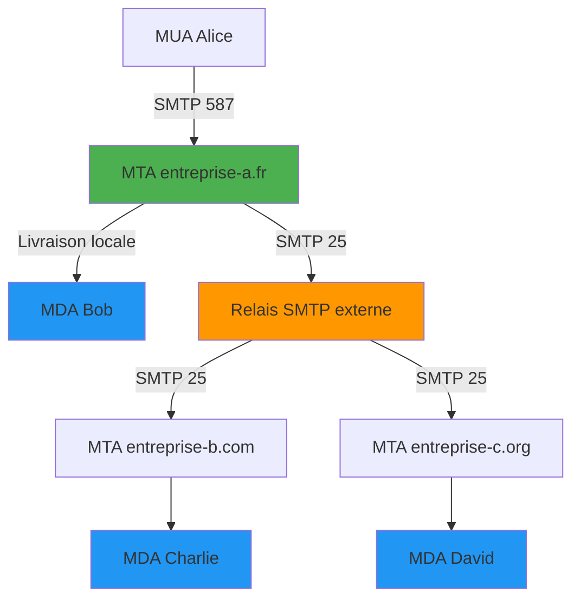

---

# QCM - Module 1 : Introduction à Postfix

## Question 1

Quel est le rôle principal d'un MTA (Mail Transfer Agent) ?

A) Lire les emails (comme Thunderbird)

B) Acheminer et délivrer les emails

C) Stocker les emails pour consultation

D) Afficher les emails dans un navigateur

---

## Question 2

Qui a créé Postfix et pourquoi ?

A) Linus Torvalds - Pour remplacer Exchange  

B) Wietse Venema - Pour avoir une alternative plus sécurisée à Sendmail  

C) Mark Zuckerberg - Pour Facebook  

D) Apache Foundation - Pour le serveur web

---

## Question 3

Quel est le principe de sécurité principal de Postfix ?

A) Tout dans un seul gros processus  

B) Séparation des privilèges et architecture modulaire  

C) Authentification par mot de passe uniquement  

D) Chiffrement obligatoire

---

## Question 4

Quel composant remet les emails dans la boîte de réception du destinataire ?

A) MTA  

B) MDA  

C) MUA  

D) LDA

---

## Question 5

Quel port TCP standard Postfix utilise-t-il pour accepter les connexions SMTP non chiffrées ?

A) 25  

B) 110  

C) 143  

D) 587

---

## Réponses - Module 1

<small>

**Question 1 : Réponse B** - Le MTA (comme Postfix) **achemine et délivre** les emails entre serveurs. Le MUA lit les emails, le MDA les stocke.

**Question 2 : Réponse B** - **Wietse Venema** (IBM) a créé Postfix dans les années 1990 comme alternative **plus sécurisée, rapide et simple** à Sendmail.

**Question 3 : Réponse B** - Postfix utilise la **séparation des privilèges** : chaque processus a un rôle unique et les droits minimum nécessaires.

**Question 4 : Réponse B** - Le **Mail Delivery Agent (MDA)** dépose le message dans la boîte du destinataire (via un MDA local ou `dovecot-lda`). Le MTA transporte, le MUA lit.

**Question 5 : Réponse A** - Le **port 25/TCP** est le port SMTP historique utilisé entre MTAs. Le port 587 est dédié aux clients authentifiés (submission).

</small>

---

## Exercice pratique - Module 1

### 🎯 Objectif
Comprendre le flux d'emails dans un environnement professionnel réel

### 📋 Scénario
Alice (`alice@entreprise-a.fr`) envoie un email avec 3 destinataires :
- `bob@entreprise-a.fr` (même domaine)
- `charlie@entreprise-b.com` (domaine externe)
- `david@entreprise-c.org` (domaine externe)

Le serveur de `entreprise-a.fr` utilise un **relais SMTP** externe pour les emails sortants.

### 📝 Questions

1. Identifiez tous les MTAs impliqués dans cette communication

2. Quel(s) email(s) ne passeront PAS par le relais SMTP externe ?

3. Dans quel ordre les composants seront-ils sollicités ?

4. Combien de connexions SMTP différentes seront établies au total ?

**Temps** : 10 minutes  
**Travail** : Individuel puis mise en commun

---

## Exercice pratique - Module 1 (Suite)

### ✅ Réponse détaillée

**1. MTAs impliqués :**
- MTA de `entreprise-a.fr` (Postfix local)
- Relais SMTP externe (pour sortie)
- MTA de `entreprise-b.com`
- MTA de `entreprise-c.org`

**2. Email(s) sans relais externe :**
- L'email pour `bob@entreprise-a.fr` reste **interne** (livraison locale)
- Les emails pour `charlie` et `david` passent par le relais

**3. Ordre chronologique :**
1. MUA d'Alice → MTA entreprise-a.fr (port 587/SMTP submission)
2. MTA entreprise-a.fr → Livraison locale pour Bob (MDA)
3. MTA entreprise-a.fr → Relais SMTP externe
4. Relais SMTP → MTA entreprise-b.com
5. Relais SMTP → MTA entreprise-c.org
6. MTAs destinataires → MDAs respectifs

---

## Exercice pratique - Module 1 (Schéma)

### ✅ Schéma de la solution

**4. Connexions SMTP totales :** 4 connexions
- Alice → MTA entreprise-a.fr (1)
- MTA → Relais externe (1)
- Relais → MTA entreprise-b.com (1)
- Relais → MTA entreprise-c.org (1)
