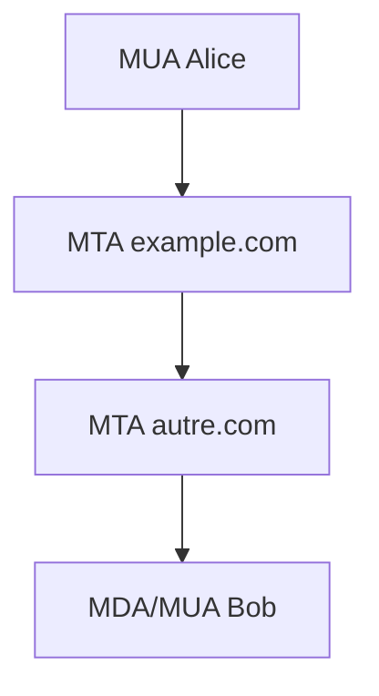

---

# QCM - Module 1 : Introduction à Postfix

## Question 1

Quel est le rôle principal d'un MTA (Mail Transfer Agent) ?

A) Lire les emails (comme Thunderbird)

B) Acheminer et délivrer les emails

C) Stocker les emails pour consultation

D) Afficher les emails dans un navigateur

---

### ✅ Réponse : B

Le MTA (comme Postfix) **achemine et délivre** les emails entre serveurs. Le MUA lit les emails, le MDA les stocke.

---

## Question 2

Qui a créé Postfix et pourquoi ?

A) Linus Torvalds - Pour remplacer Exchange  

B) Wietse Venema - Pour avoir une alternative plus sécurisée à Sendmail  

C) Mark Zuckerberg - Pour Facebook  

D) Apache Foundation - Pour le serveur web

---

### ✅ Réponse : B

**Wietse Venema** (IBM) a créé Postfix dans les années 1990 comme alternative **plus sécurisée, rapide et simple** à Sendmail.

---

## Question 3

Quel est le principe de sécurité principal de Postfix ?

A) Tout dans un seul gros processus  

B) Séparation des privilèges et architecture modulaire  

C) Authentification par mot de passe uniquement  

D) Chiffrement obligatoire

---

### ✅ Réponse : B

Postfix utilise la **séparation des privilèges** : chaque processus a un rôle unique et les droits minimum nécessaires.

---

## Question 4

Quel composant remet les emails dans la boîte de réception du destinataire ?

A) MTA  

B) MDA  

C) MUA  

D) LDA

---

### ✅ Réponse : B

Le **Mail Delivery Agent (MDA)** dépose le message dans la boîte du destinataire (via un MDA local ou `dovecot-lda`). Le MTA transporte, le MUA lit.

---

## Question 5

Quel port TCP standard Postfix utilise-t-il pour accepter les connexions SMTP non chiffrées ?

A) 25  

B) 110  

C) 143  

D) 587

---

### ✅ Réponse : A

Le **port 25/TCP** est le port SMTP historique utilisé entre MTAs. Le port 587 est dédié aux clients authentifiés (submission).

---

## Exercice pratique - Module 1

### 🎯 Objectif
Identifier les composants d'une architecture email

### 📋 Tâche
Sur papier ou tableau, dessinez le parcours d'un email de `alice@example.com` vers `bob@autre.com` en identifiant :

1. Le MUA d'Alice

2. Le MTA d'example.com (Postfix)

3. Le MTA d'autre.com

4. Le MDA/MUA de Bob

**Temps** : 5 minutes
**Correction** : Discussion collective

---

### ✅ Réponse :

